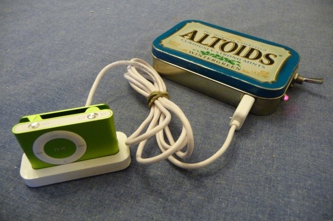
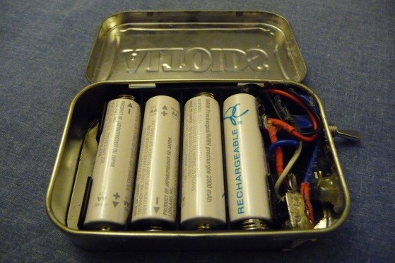

+++
date = "2009-04-16T22:52:25-07:00"
title = "A Minty-Fresh Power Pack"
summary = "Before the ubiquity of powerbanks, there was nothing on the market to provide longer battery life for portable electronics. Connecting a female USB connector to four rechargable AA batteries opened up a new world of extended iPod playback."
tagline = "Making a portable battery charger before they were cool."
type = "project"
image = "Altoids-charger_1.jpg"
clickable = true
draft = false
layout = "single"
tags = ["electrical"]
+++

Before the ubiquity of powerbanks, there was nothing on the market to provide longer battery life for portable electronics. Connecting a female USB connector to four rechargable AA batteries opened up a new world of extended iPod playback. I built a simple, rechargable battery pack to keep the tunes playing on long road trips.

