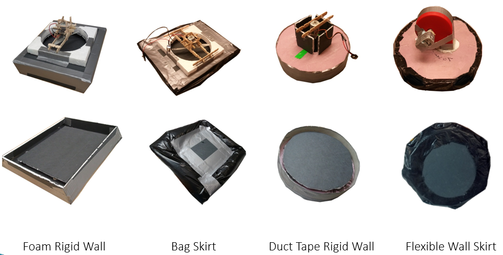
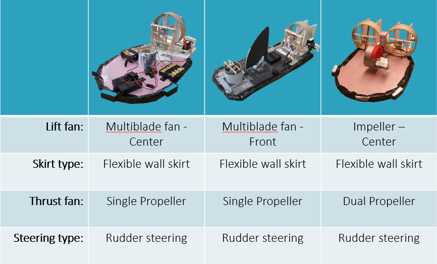
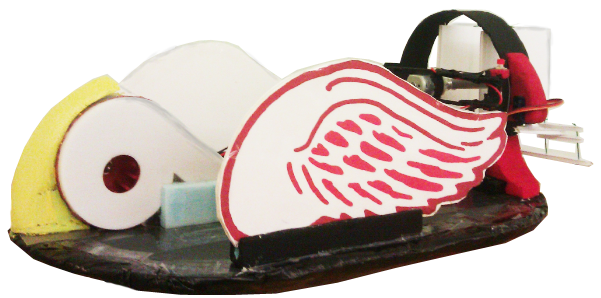
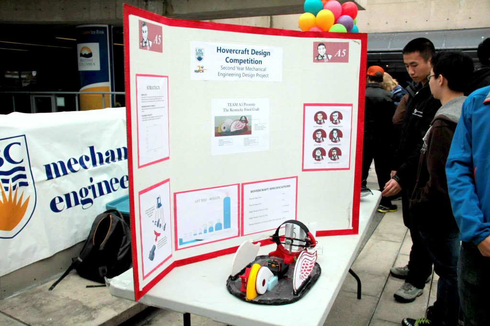
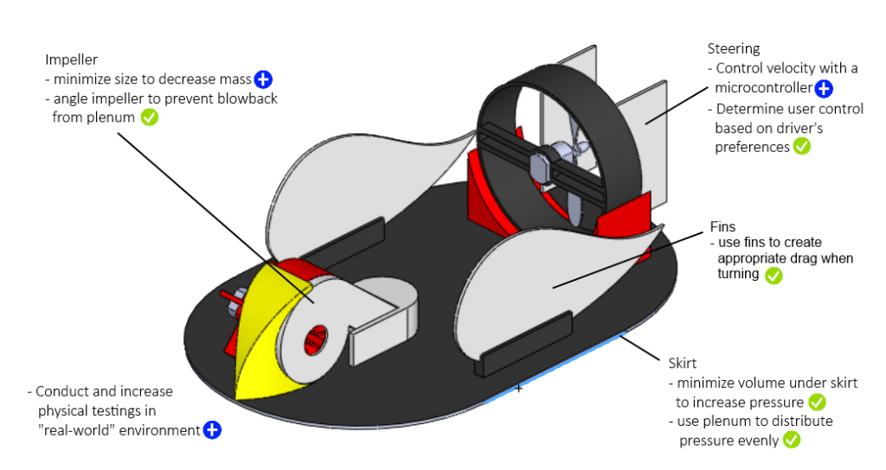

+++
clickable = true
date = "2013-04-20T12:22:15-07:00"
hidden = false
image = "hovercraft.jpg"
summary = "Teams were given 3 weeks to research, conceptualize, test, and refine their hovercrafts to compete in a class-wide battle of speed, cargo capacity, and maneuverability."
tagline = "Racing a remote-controlled hovercraft made of cardboard, plastic bags, and pink foam."
title = "MECH 223: Hovercraft Competition"
type = "blog"
draft = false
layout = "single"
tags = ["school"]
+++

For our final MECH2 design project at UBC, we were given three weeks to research, conceptualize, test, and build a functional hovercraft. The end goal was a class-wide competition of speed, cargo capacity, maneuverability, and driving skill. Budget was limited since costs came out of our own pockets, so we set out to build an inexpensive hovercraft using parts from the hardware and dollar store.

Our result: 5th place out of 30 teams. Not too shabby for a hovercraft made with foam and garbage bags!

