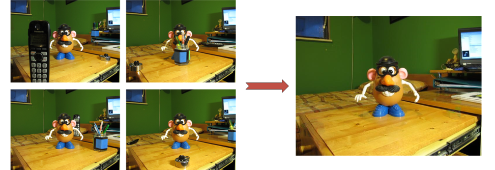
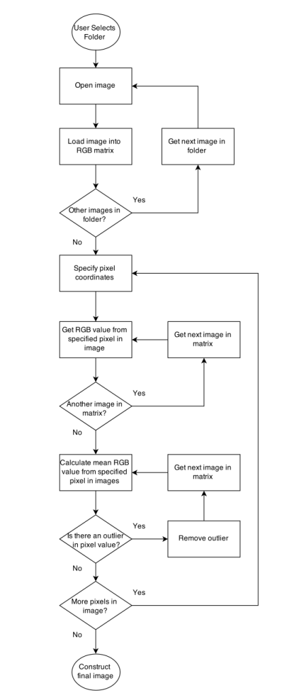

+++
layout =    "single"
type =      "project"

date =      2014-01-12T11:45:14-07:00
draft =     false

tagline = "Automagically removing obstructions in an image."
title = "MATLAB Photo Editing Script"
image =     "Image-test_all.png"
tags =      ["programming"]

aliases =   ["/projects/software/photo-editing/"]
+++

__Objective:__ Develop a script to find and remove any differences in a series of photos.

__Motivation:__ [How to Remove People From Your Travel Using Photoshop](http://toomanyadapters.com/how-to-remove-people-travel-photos-photoshop/)

__Framework:__ MATLAB

