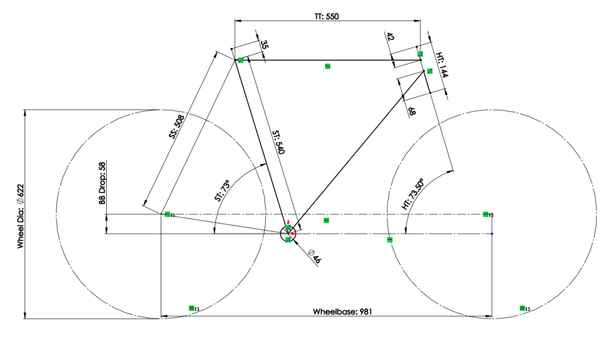
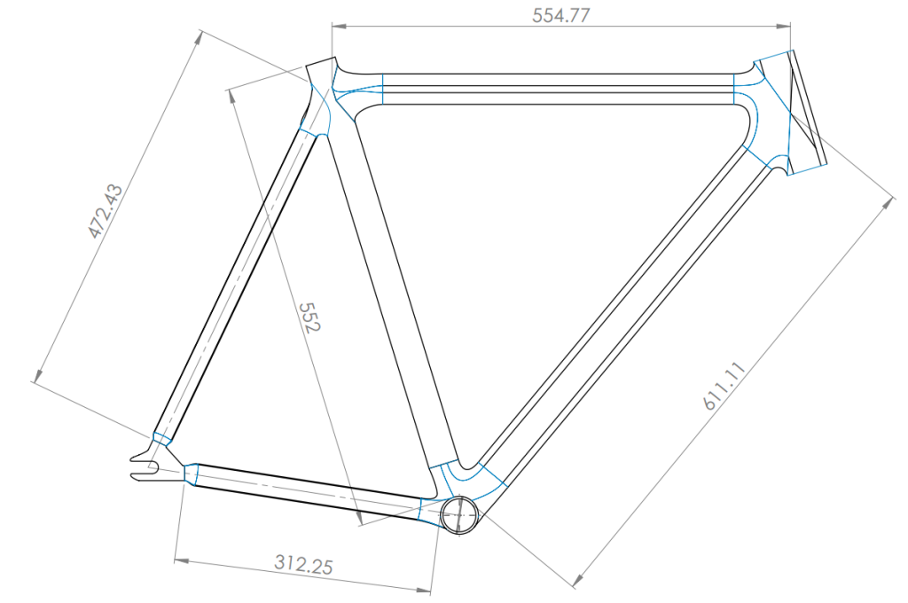
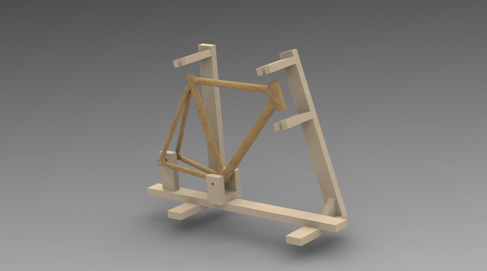
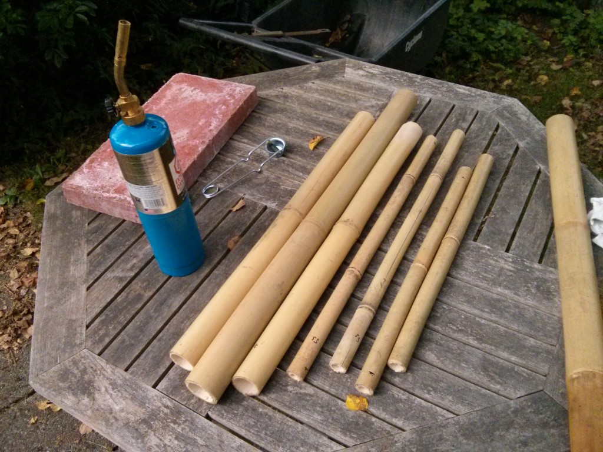
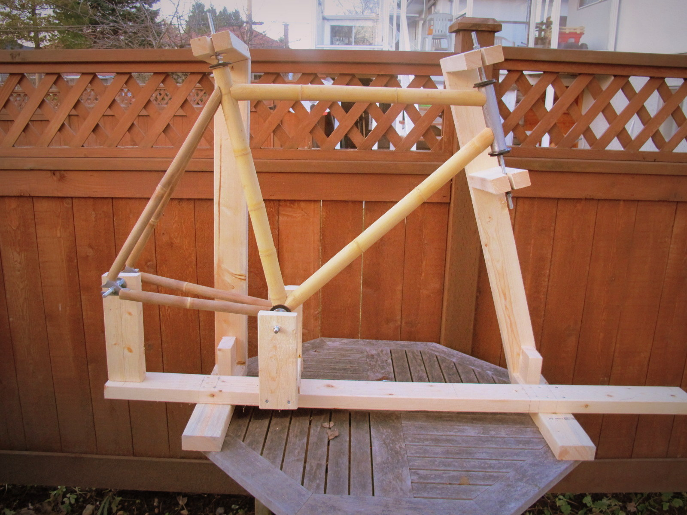
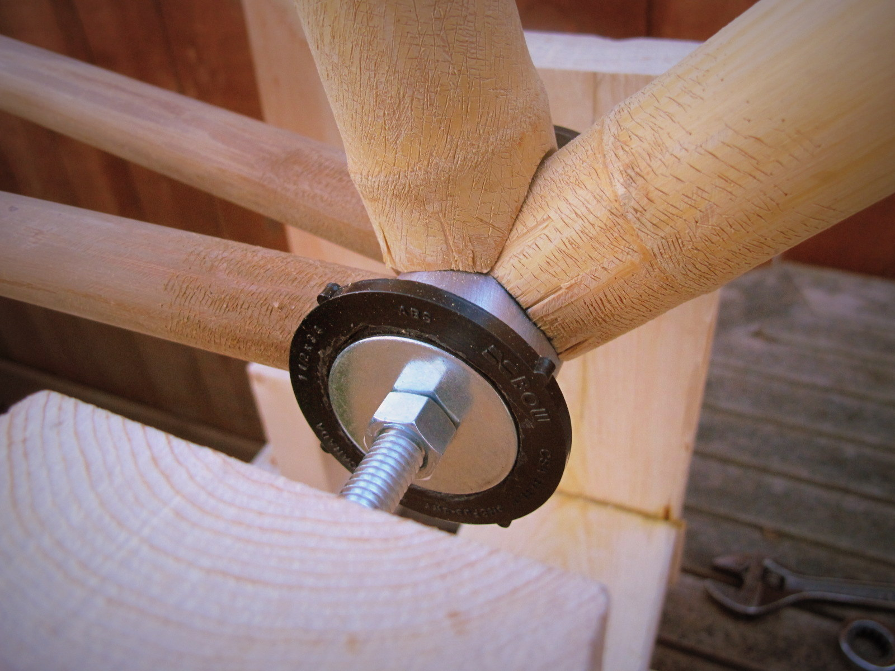
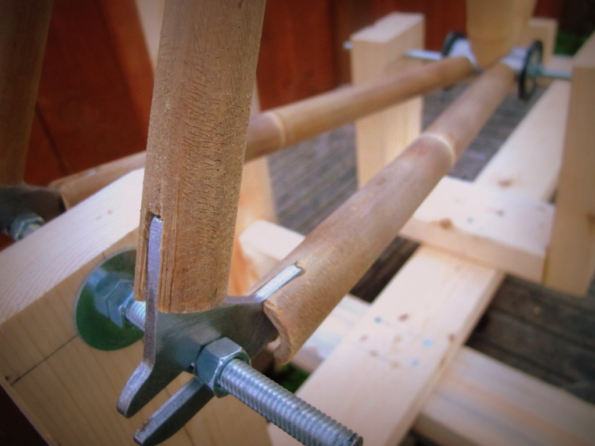
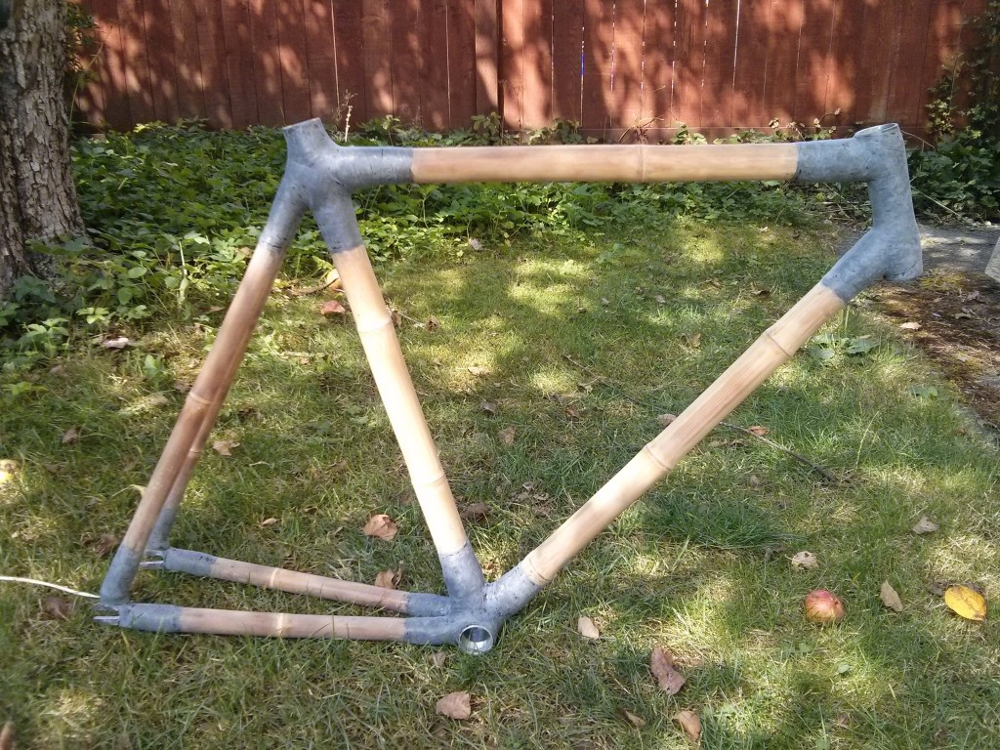
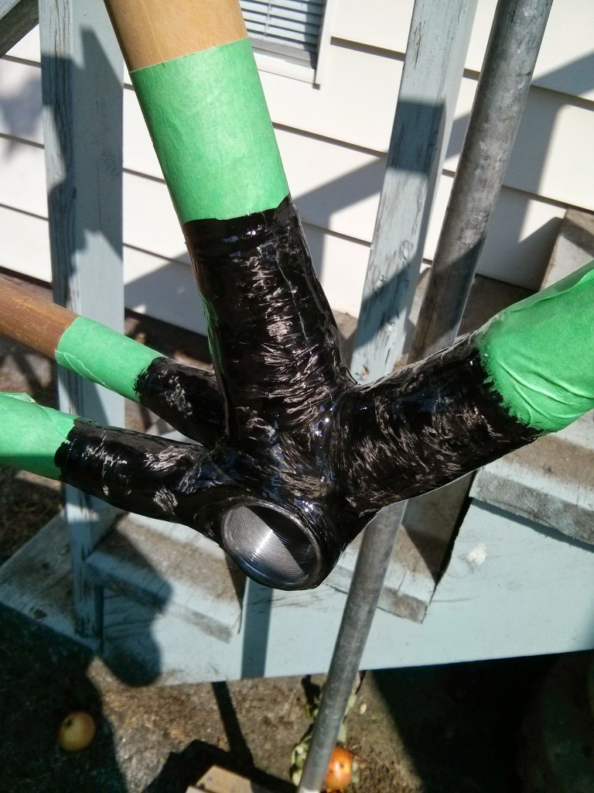
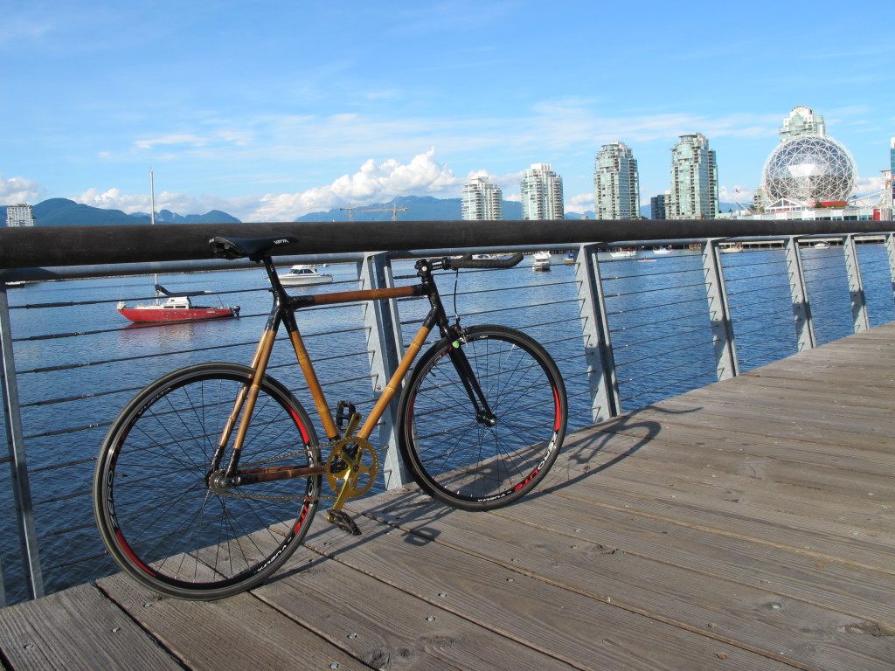

+++
layout =    "single"
type =      "blog"

date = "2014-08-18T22:12:57-07:00"
draft =     false

title = "Award Winning Bamboo Bike"
tagline = "An organic, gluten-free mode of transportation."

image =     "IMG_5359-e1424407598804.jpg"
tags =      ["design", "woodworking"]

aliases =   ["/projects/mech/bamboo-bike/"]
+++

<strong>Objective</strong>: Exceed the Vancourite-hipster threshold by building a fixed-gear bicycle using bamboo and carbon fibre.

<strong>Challenges</strong>:

<ul>
	<li style="text-align: left;">Constructing a frame jig to allow freedom around joints for carbon-fibre layup</li>
	<li style="text-align: left;">Accounting for the non-uniformity of bamboo poles at the frame lugs</li>
	<li style="text-align: left;">Maintaining compatibility with standard bicycle components</li>
	<li style="text-align: left;">Ensuring the frame is treated for typical"Wet" Coast weather</li>
</ul>

<strong>Awards:</strong>

<ul>
	<li>First Prize - <a href="http://www.instructables.com/contest/handtoolsonly/" target="_blank">Hand Tools Only Instructables Contest</a></li>
	<li>First Prize - <a href="http://www.instructables.com/contest/teachit/" target="_blank">Teach It! Instructables Contest, Sponsored by Dremel</a></li>
</ul>

 

For a detailed step-by-step guide, head over to my <a href="http://www.instructables.com/id/Building-a-Carbon-Fibre-Bamboo-Bicycle-From-Scratc/" target="_blank">Instructable</a>.

