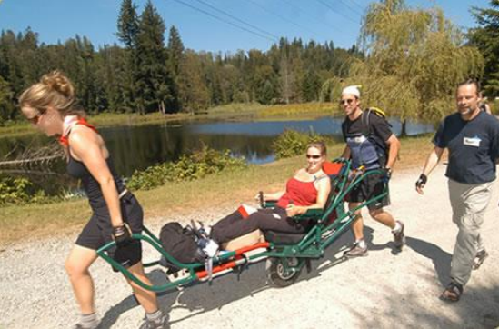
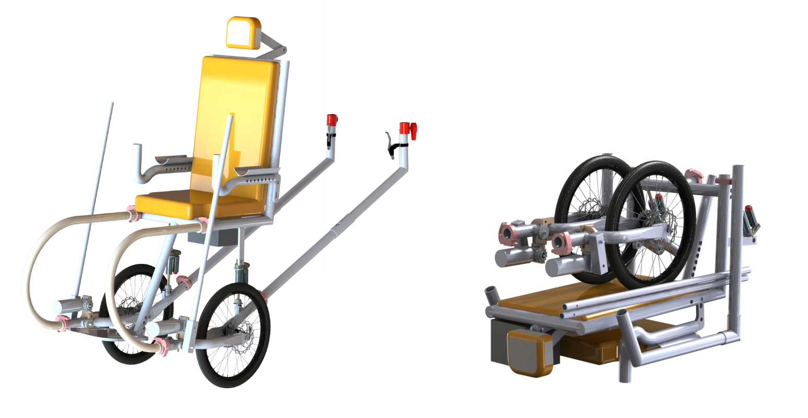
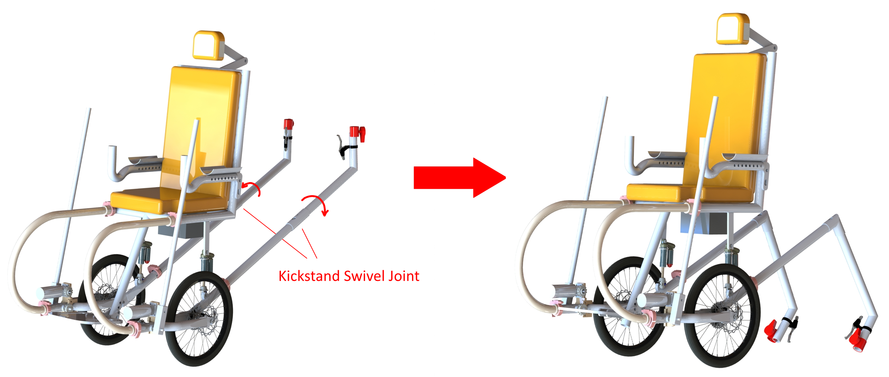
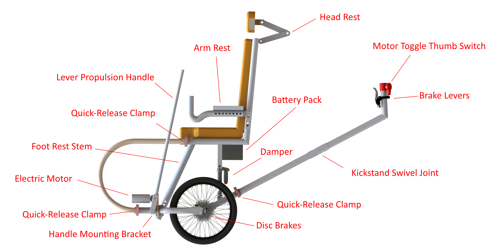
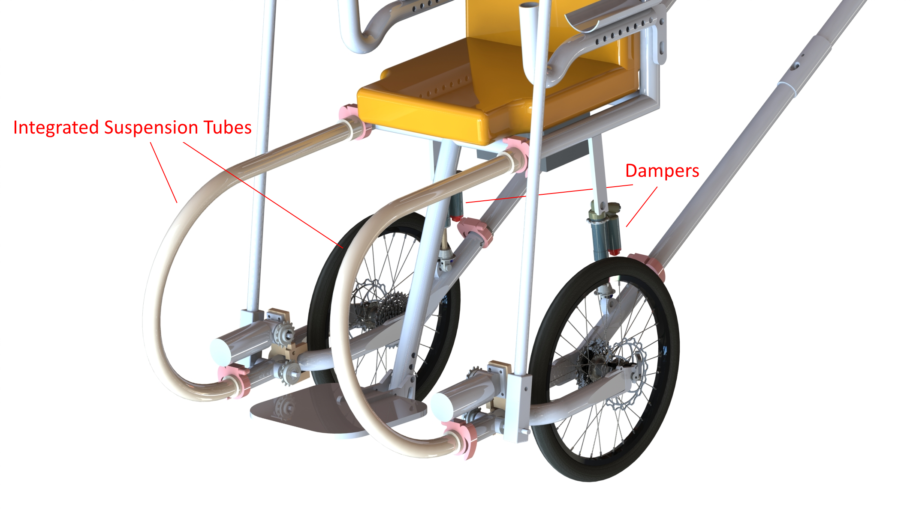

+++
layout =    "single"
type =      "project"

date = "2014-11-24T12:37:55-07:00"
draft =     false

tagline = "Designing a next-generation, offroad wheelchair."
title = "MECH 328: TrailRider Design Project"
image =     "Side-view_annotated-large.png"
tags =      ["design", "school"]

aliases =   ["/projects/mech/mech-328-trailrider.md"]
+++

__Background:__ The TrailRider™ is a specialized device to provide accessibility to the wilderness for those with limited mobility.  It is intended for a seated rider propelled and balanced by assistants.

__Objective:__ Expand the range of both riders and assistants who can ride safely use the Black Diamond TrailRider™.

__How:__ As a team of seven mechanical engineering undergrads, we explored a range of areas for improvement and developed a new design to incorporate these features.

__Existing Problems:__

<ul style="text-align: left;">
	<li>Device relies entirely on assistants for balance, which may be physically demanding for some assistants</li>
	<li>Riders generally find the current device too passive</li>
	<li>Single-wheel design provides difficulty in rolling over abrupt trail features</li>
	<li>Single-wheel provides limited cushioning over rough terrain</li>
	<li>Device is difficult to transport and store when space is limited</li>
</ul>

__Our Improvements:__

<ul>
	<li style="text-align: left;">Incorporation of a 255 W electric power assist feature</li>
	<li style="text-align: left;">Implementation of lever-propulsion handles for rider engagement</li>
	<li style="text-align: left;">Integrated frame and suspension design for increased shock absorption</li>
	<li style="text-align: left;">Increased portability</li>
</ul>

__Client:__ British Columbia Mobility Opportunities Society (BCMOS)

