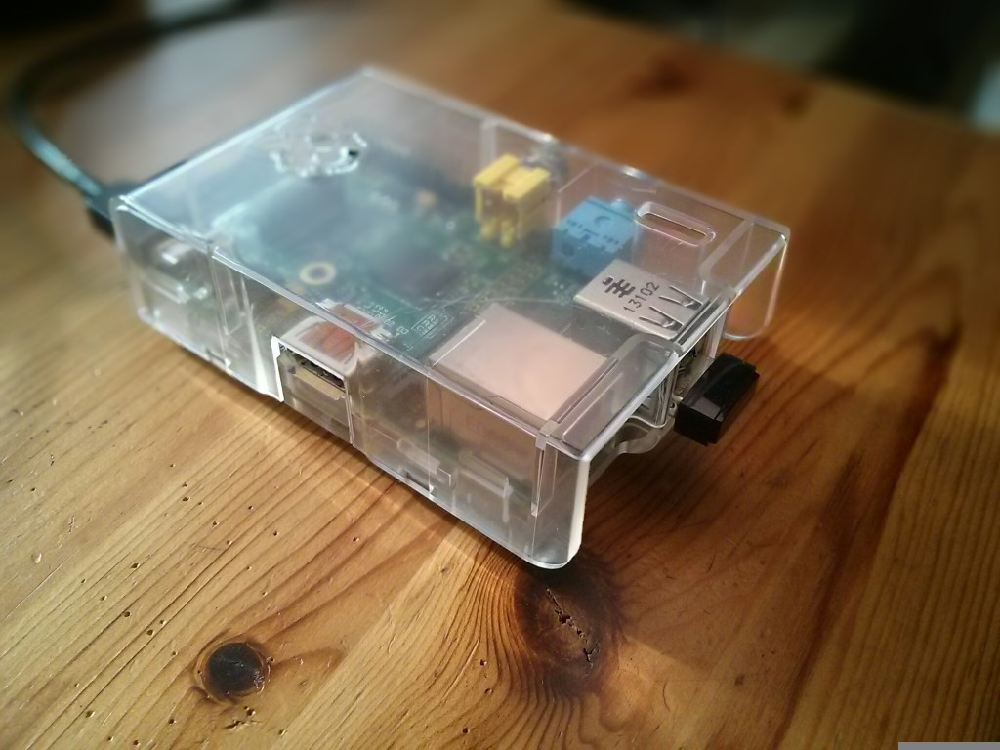

+++
layout =    "single"
type =      "project"

date =      2015-07-10T11:42:26-07:00
draft =     false

title = "Project Haikuza"
tagline = "Contributing to society with an interactive, Twitter-based haiku generator."
image =     "Haikuza twitter screencap v4.png"
tags =      ["programming"]

aliases =   ["/projects/software/haikuza"]
+++

__Objective:__ Develop an algorithm to generate haikus using song lyrics.

__Motivation:__ Because computational linguistics are cool.

__Project:__ [twitter.com/thehaikuza](https://twitter.com/thehaikuza)

__Features:__

+ Scrapes [Virgin Radio's broadcast history](http://www.vancouver.virginradio.ca/broadcasthistory.aspx) to find recently played songs
+ Creates a song-based haiku queue in [Google Sheets](https://docs.google.com/spreadsheets/d/1HazfuywY_MrmQ49fxSpHOMA8QXBUYVhEDx1e4qhjbqU/edit?usp=sharing)
+ Generates a haiku using the queue as a reference and posts it on Twitter
+ Checks for new tweets every 5 minutes and generates a relevant haiku, if requested
+ Finds all song lyrics from [Lyrics Wikia](http://lyrics.wikia.com/Lyrics_Wiki)
+ Runs on a Raspberry Pi

__Challenges:__

+ Formulaically counting syllables
+ Developing a context-free language model
+ Creating phrases that actually make sense

__Framework:__ Python 2.7.9

__Source:__ [Github](https://github.com/justinmklam/project-haikuza)

Interested about the development of @thehaikuza? Follow it on [The Making of Project Haikuza: Part 1](/posts/2015/making-haikuza-i)!
