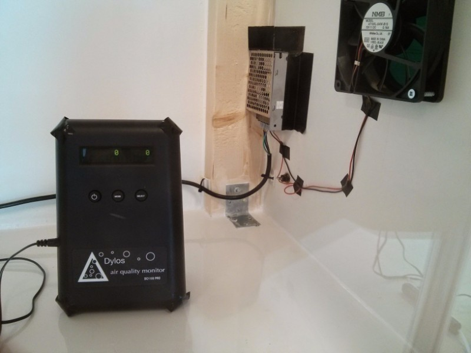
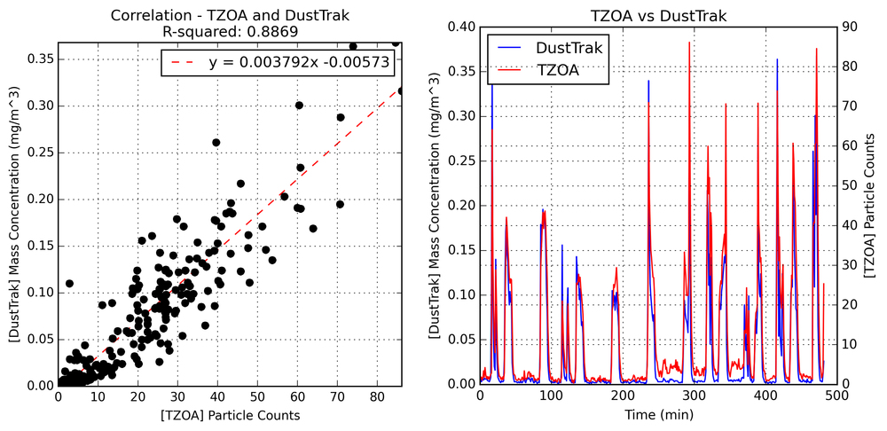

+++
date = "2015-06-23T21:30:17-07:00"
draft = false
image = "Enclosure overview.JPG"
layout = "single"
tagline = "Building a clean-room enclosure for testing air quality monitors."
tags = ["work"]
title = "Co-op: Air Quality Calibration Chamber"
type = "blog"
+++

__Background:__ Welcome to TZOA (pronounced 'zoa') - the world's most advanced environment tracker. TZOA uses internal sensors to measure your air quality, temperature, humidity, atmospheric pressure, ambient light, and UV (sun) exposure, all in one wearable device.

__Objective:__ Design and build a purified test chamber with zero air particulate to calibrate the TZOA devices against the DusTrak DRX 8533. An aerosolized cloud of ultrafine (0.3 - 20 μm) test dust was used to create the particle events.

__Source:__ [Indiegogo Campaign Page](https://www.indiegogo.com/projects/tzoa-wearable-air-quality-tracker#/)

__Client:__ [TZOA](https://www.tzoa.com/)

__Acknowledgements:__ This project was completed under MistyWest with the guidance of Taylor Cooper.

.JPG)
.jpg)
.jpg)

