+++
clickable = true
date = "2016-10-22T20:58:10-07:00"
draft = false
image = "bandsaw-banner.jpg"
summary = "It's generally known that cheap tools are usually not worth the trouble, but the deal on this bandsaw was simply too hard to pass up. With only a missing table, it was merely a quick woodworking project away from restoring its full functionality."
tagline = "Sometimes you can get more than what you pay for."
title = "Making Do With a Bargain Bin Bandsaw"
type = "project"
layout = "single"
tags = ["woodworking"]
+++

I've always wanted a bandsaw. Being able to cut wood, plastics, etc. quickly and with flexibility has been a dream in my home shop. When I found an ad on Craigslist for a portable bandsaw for $50, I just couldn't resist. The main caveat was that it was missing a table, but that wasn't a big enough issue to turn me away from this killer deal.

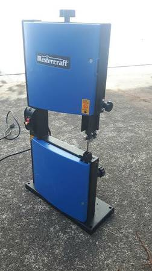

Due to the lack of proper tools in my garage suitable to make a decent table, I needed to improvise with what I had. Enter the inverted jigsaw. Sure, I could have just used the jigsaw by itself, but it's always easier to move the material instead of moving the tool. More importantly, this allowed me to easily cut smaller parts out.

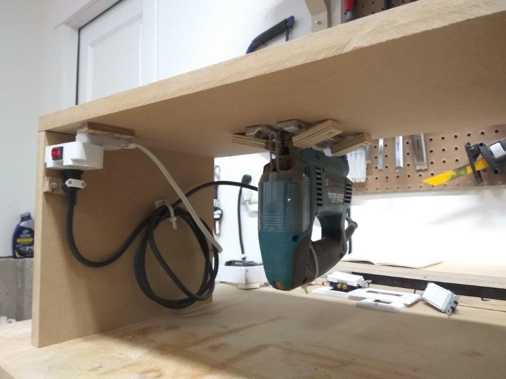

Cutting the blade insert was much easier with the inverted jigsaw.

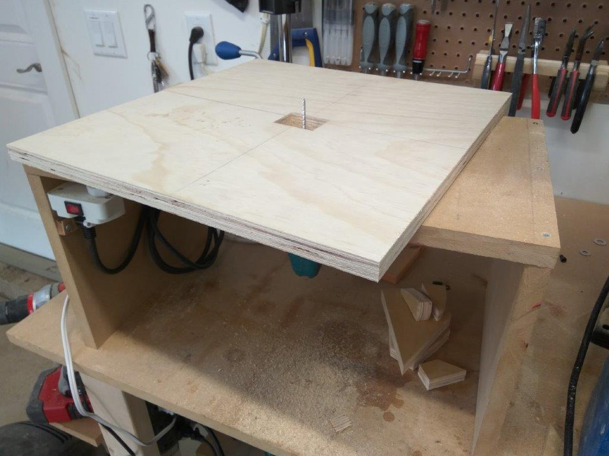

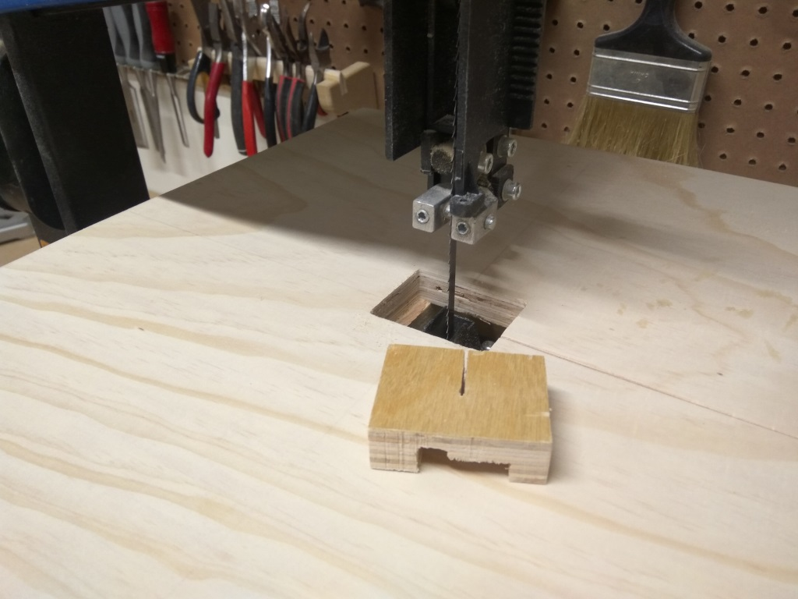

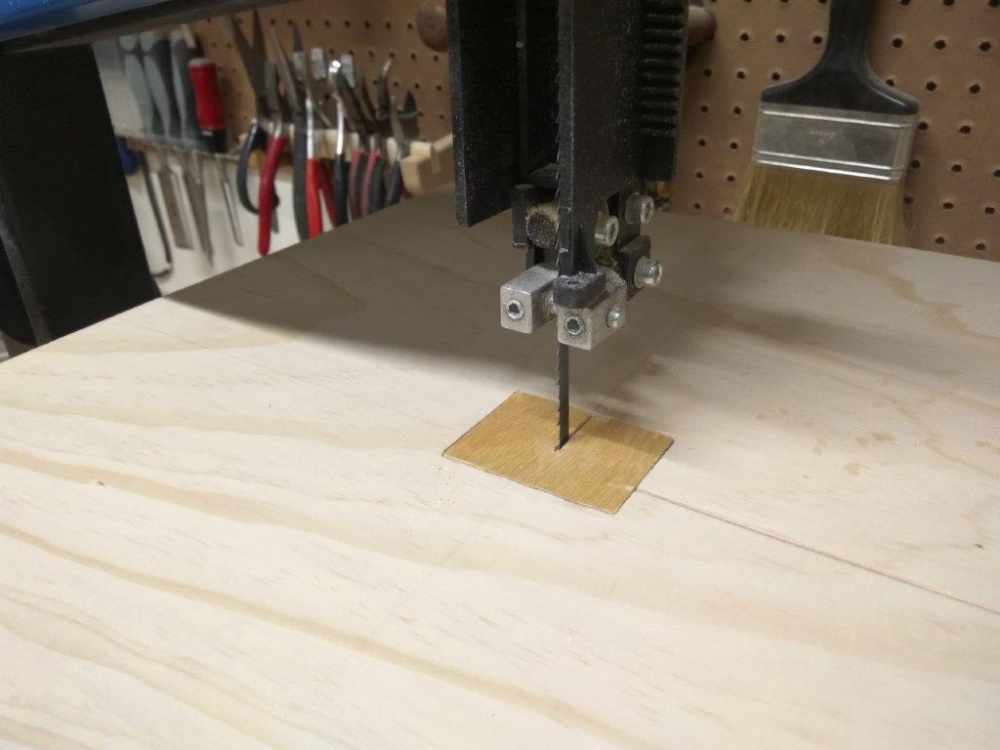

The first set of brackets I cut out weren't great, but they did the job. However, it was good enough to get the bandsaw rolling and cut a second, revised set of brackets for better stability.

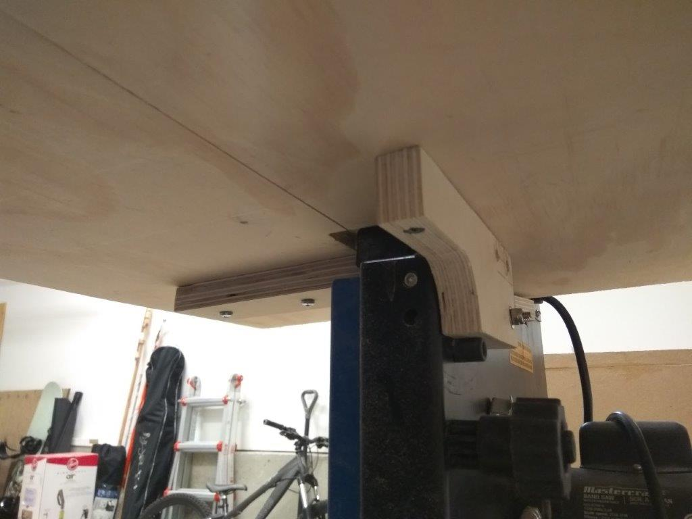

The second set was much beefier and even included angle adjustment. Unfortunately it doesn't work well since bandsaw tables typically use [trunion brackets](https://woodgears.ca/bandsaw/trunions.html) to keep the pivot point at the center of the blade. I didn't envision myself using this bandsaw to cut angles (since the thing can't even cut a damn straight 2x4..., which I'll get to later), so I didn't bother with it this time around.

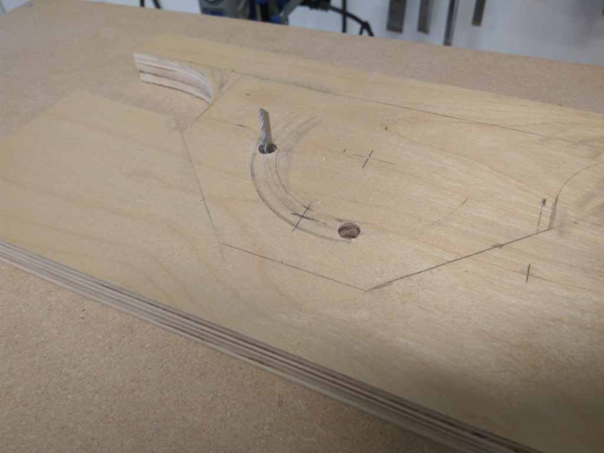

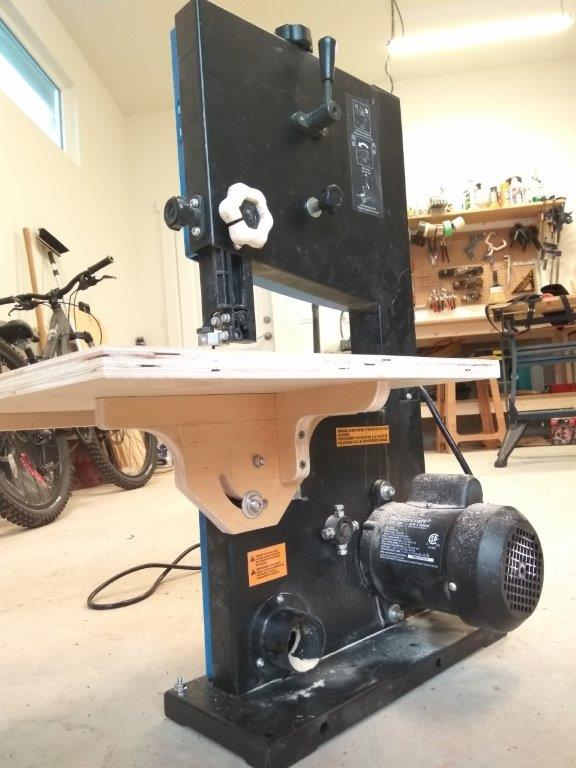

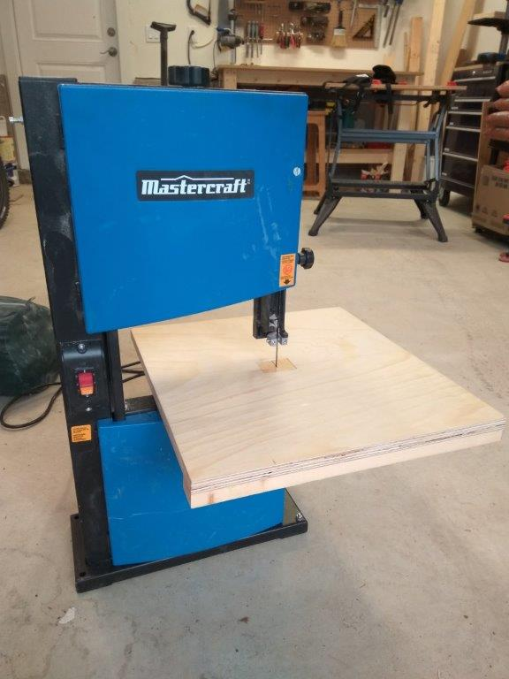

Below are a few woodworking projects I used the bandsaw for. Turns out you get what you pay for, with this bandsaw being no exception. It retails for [$249 at Canadian Tire](http://www.canadiantire.ca/en/pdp/mastercraft-120v-9-in-bandsaw-0556748p.html), and many reviewers complained that cutting straight is virtually impossible without the blade bowing, likely due to the inadequately designed blade tensioner. It performs okay for cutting thin stock like plywood, but I wouldn't rely on this for any mating joints.

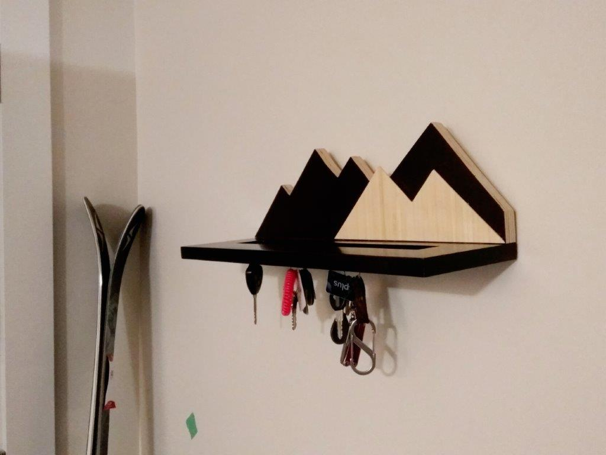

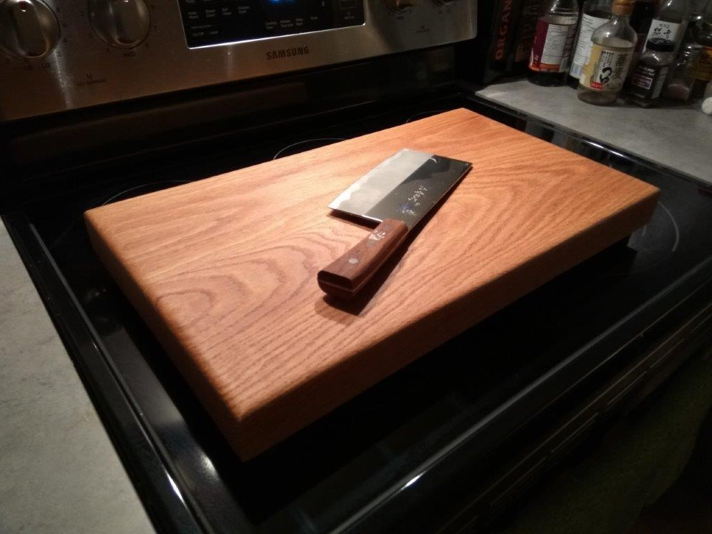

Stay tuned for more woodworking projects!
