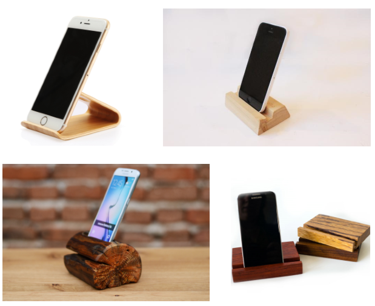
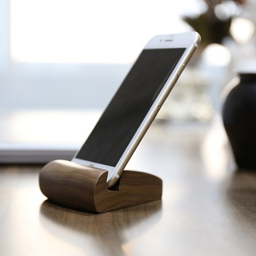
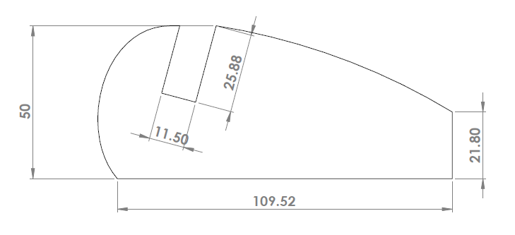
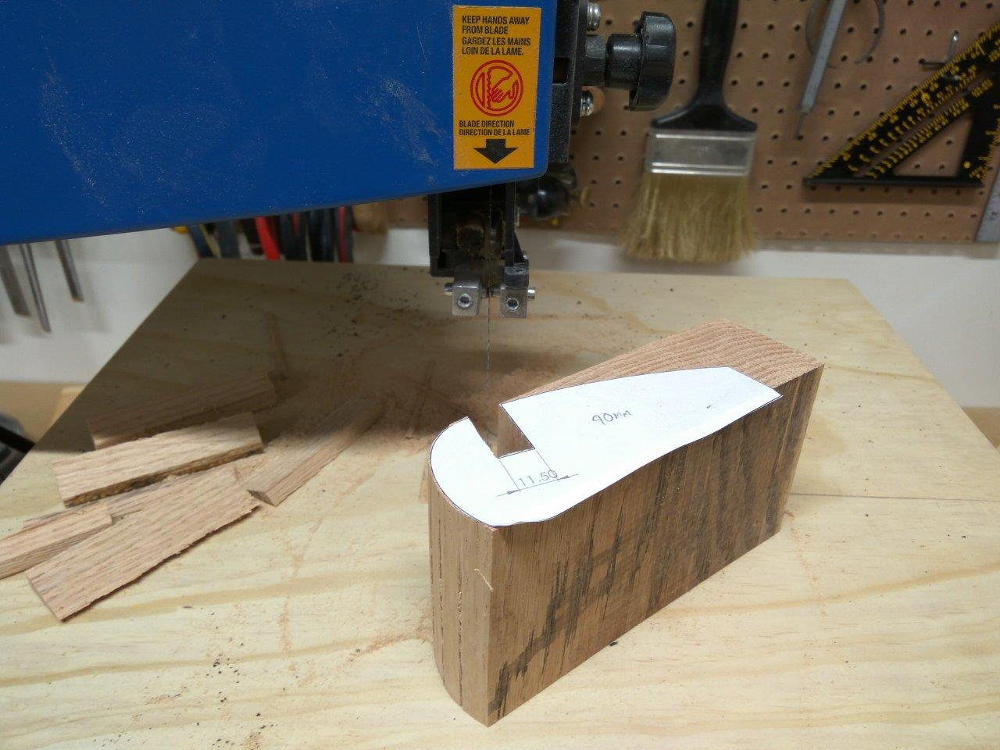
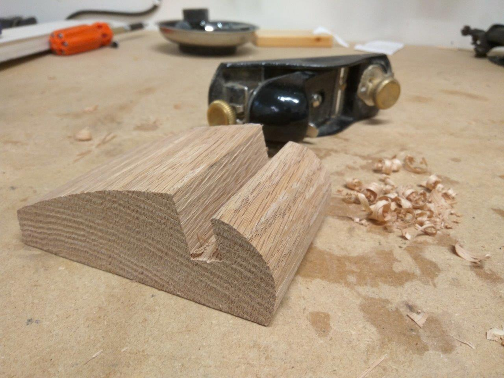
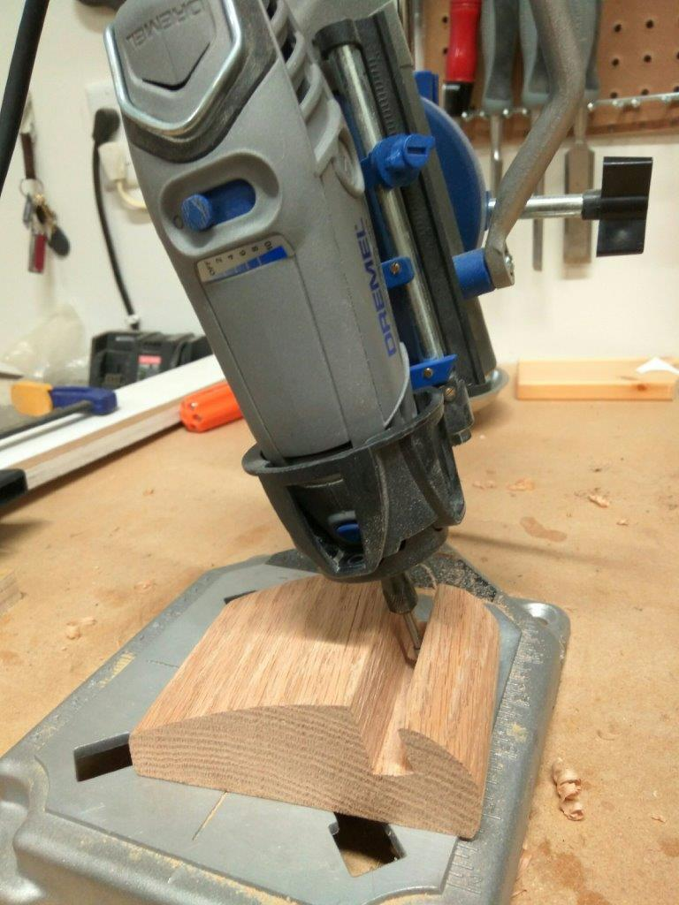
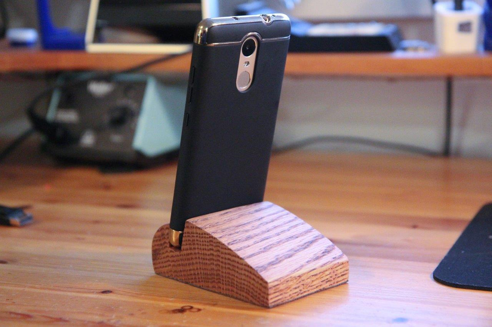

+++
date = "2016-11-13T21:35:28-07:00"
draft = false
image = "IMG_8724.jpg"
layout = "single"
tagline = "Turning a hunk of wood into a hunky tech holder."
tags = ["woodworking"]
title = "Wooden Phone Stand"
type = "project"

+++

Phone stands are something that seem a little unnecessary, but once you have one then you'll wonder how your desk lived without one. I'm a firm believer in having a dedicated place for everything as a solution to keep things tidy, so making a phone stand for my desk at work just made sense.

I started off on Google to look for existing designs I could imitate, but most fell short of not fitting my aesthetic needs. I wanted a balance between simplicity and form, without requiring too much effort to make. I eventually came across one design by [Woodenlife on Artfire](https://www.artfire.com/ext/shop/product_view/woodenlife/12640827/creative_wood_phone_stand_handmade/handmade/woodworking/other) and deemed it the winner for my copy-cat woodworking. I sketched out the side profile in SolidWorks, pasted it on to the wood block, and proceeded to cut it out on my bandsaw.

For such a simple hunk of wood, I'm quite pleased with how it turned out.
