+++
date = "2017-03-07T15:56:53-07:00"
draft = false
image = "mp-select-mini-product.jpg"
layout = "single"
title = "New Toy Tuesday: Monoprice Select Mini 3D Printer"
tagline = "Giving in to temptation for a tool that can make other tools."
type = "blog"
tags = ["3d printing"]
+++

I've been bit by the 3D printing bug.

Like any tech-enthusiast, I have toyed with the idea of owning a 3D printer for quite some time. For my final year mechatronics design project, my partner and I designed an extravagent contraption to measure the yolk done-ness of a soft-boiled egg, which we called [The PerfEGGct](http://justinmklam.com/projects/mecha/perfeggct/). We borrowed my roommate's 3D printer to create the enclosure, and it turned out to be an indispensable tool during our prototyping process. At the time, reliable 3D printers were upwards of $500 which was just out of my threshold for nice-to-have gadgets.

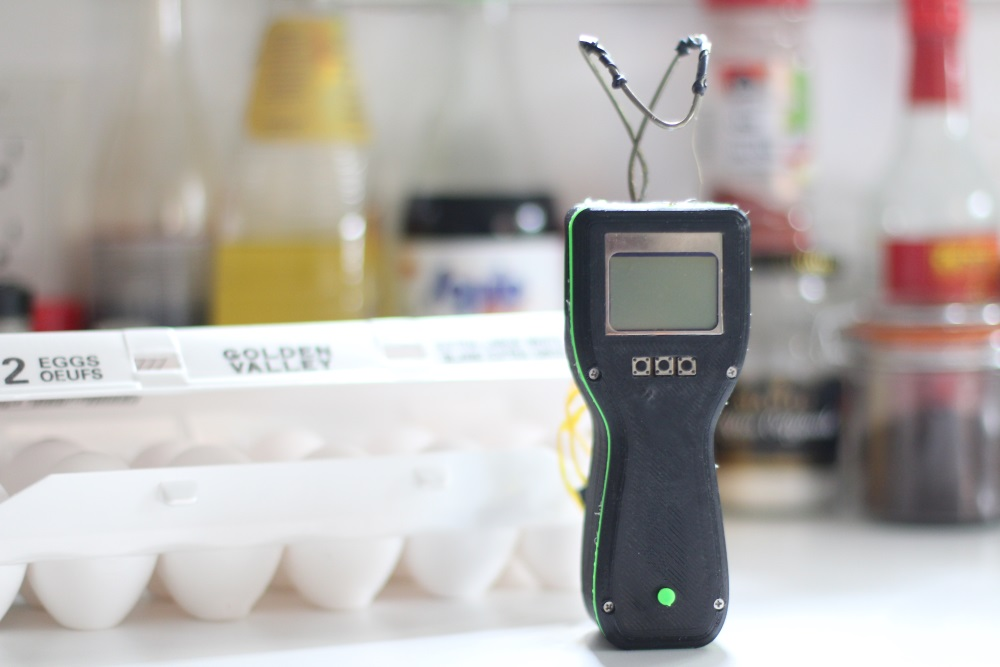

Fast forward to today, and we have the [Monoprice Select Mini 3D printer](https://www.monoprice.com/product?p_id=15365). This bad boy is a mere $200 USD, putting it right into impulse buy territory. This price range of sub-$500 printers typically puts you with Chinese clones that are inconsistent, unreliable, and dangerous (no thermal regulation = setting fire to your house/rental suite). However, Monoprice is a reputable company in the electronics industry, putting ease to the reliability concern. More notably, just look at the thing: sheet metal enclosure and no assembly required. No muss, no fuss. At the time of writing, this is the best entry-level 3D printer due to its great price to performance ratio.

Let's get printing! See below for a collection of printed models off [Thingiverse](https://www.thingiverse.com/).

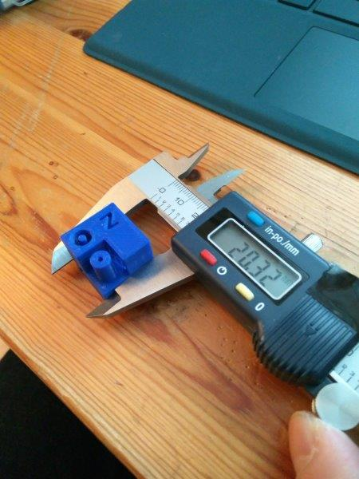

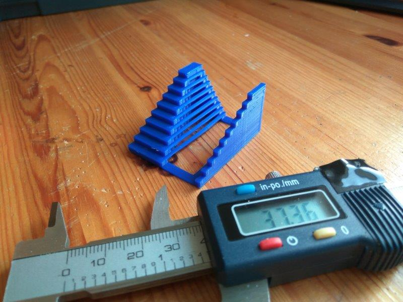

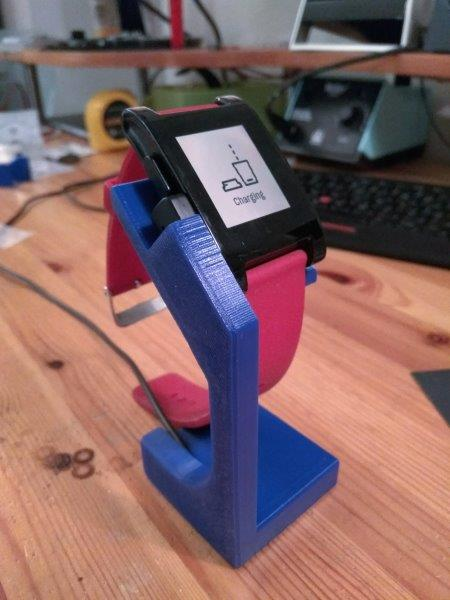

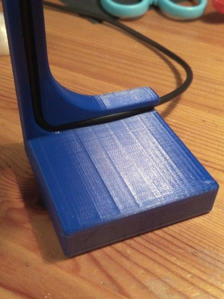

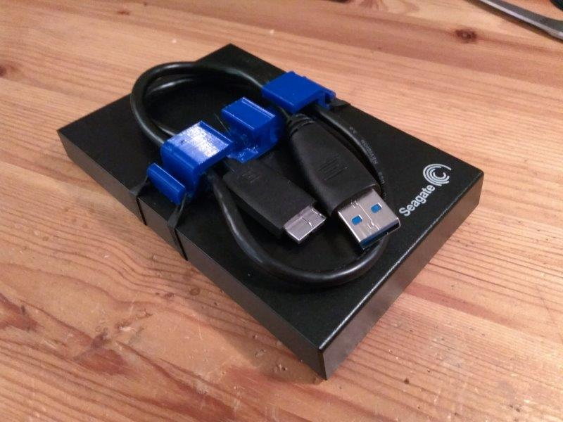

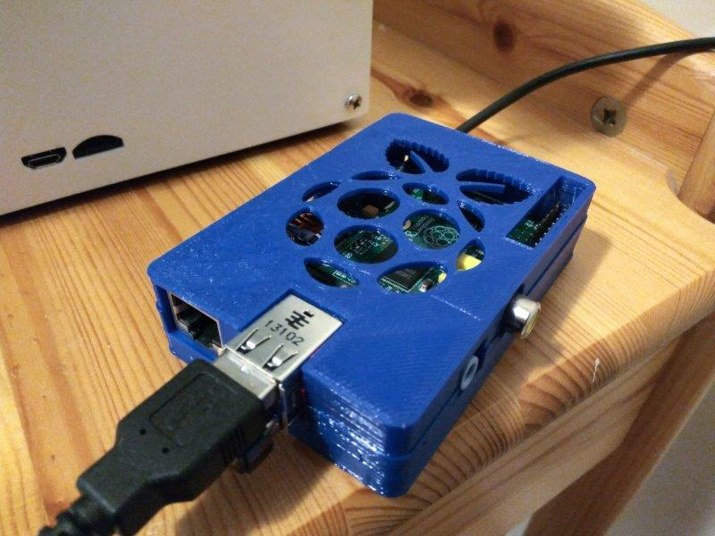

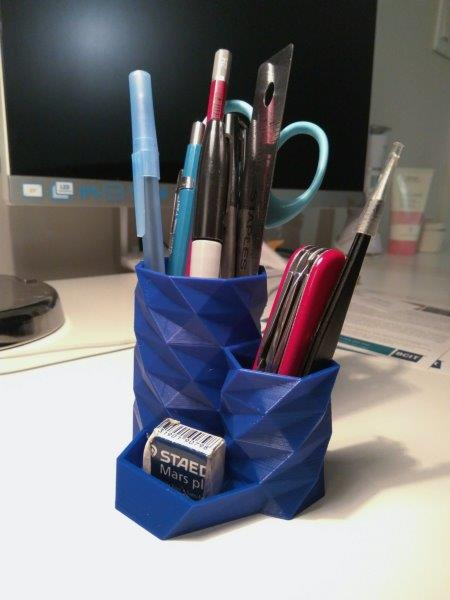

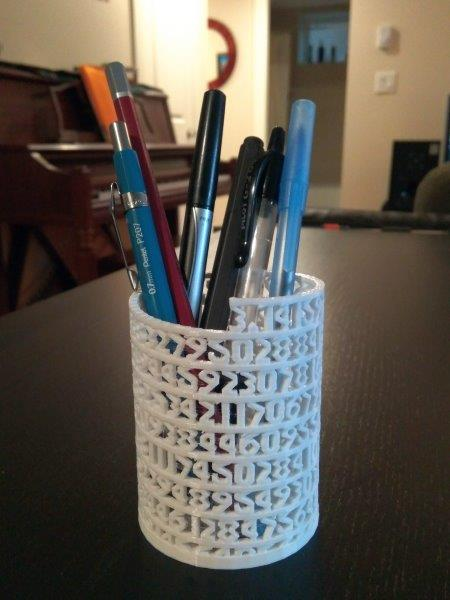

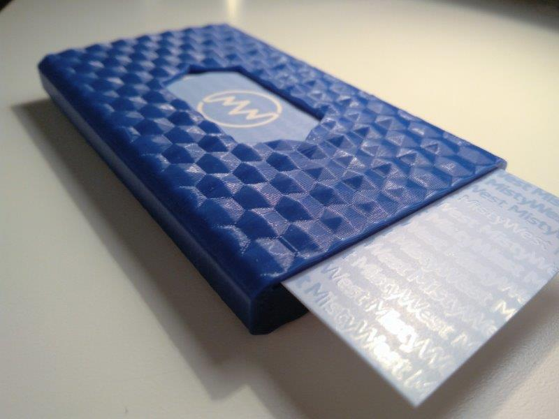

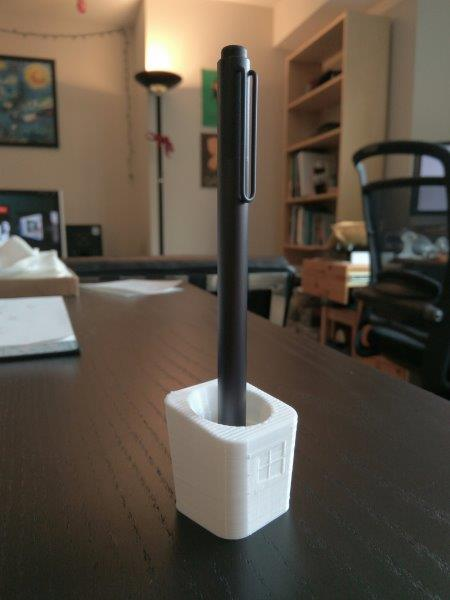

Overall, I'm quite impressed with this little guy. Setting up was a breeze, and it printed well right out of the box. Fun times ahead with this 3D printer.
