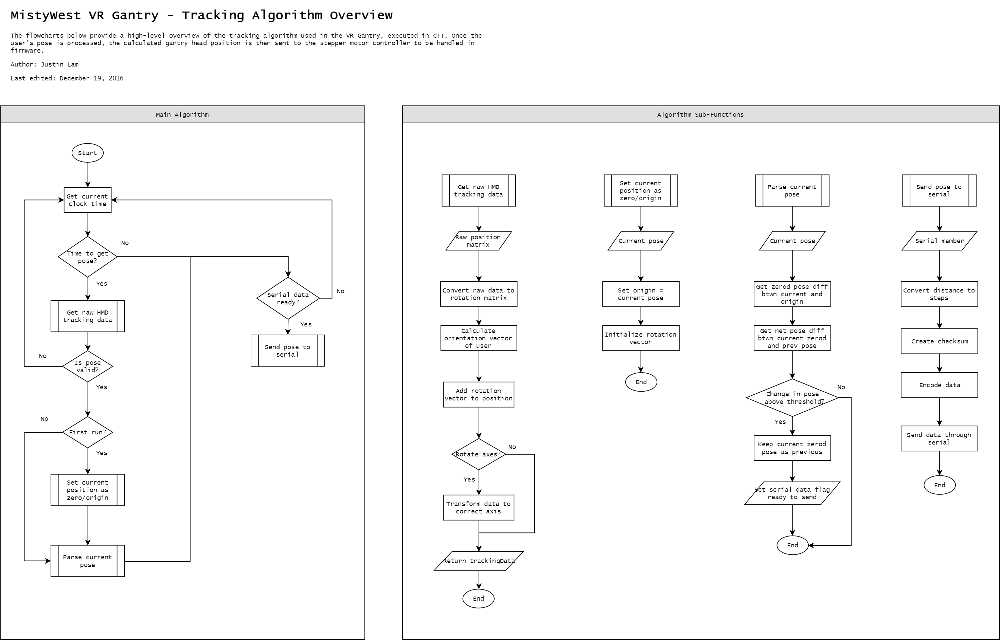
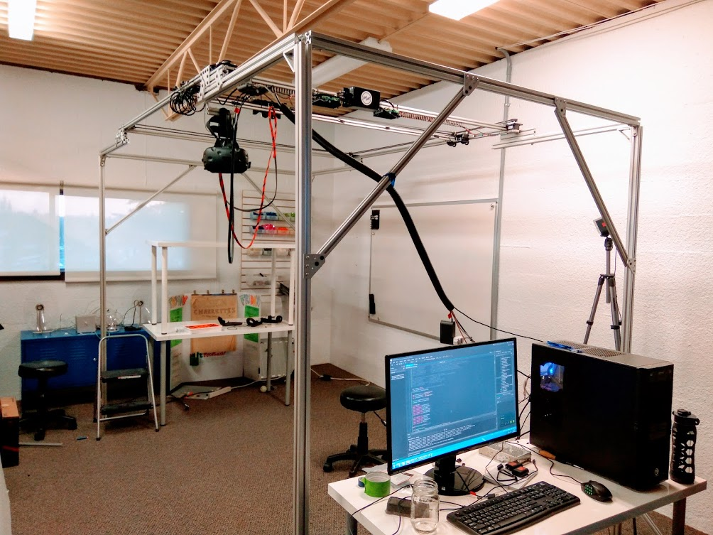
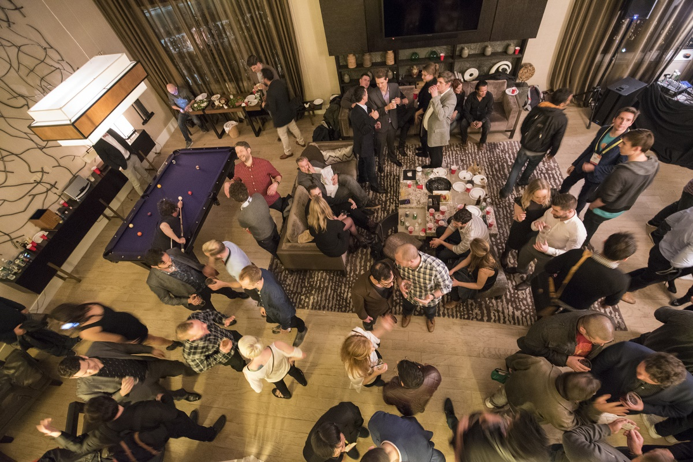

+++
layout =    "single"
type =      "blog"

date    = "2017-04-04T09:26:50-08:00"
draft =     false

tagline = "Tired of cables breaking presence in virtual reality? We are too."
title   = "Overhead Robotic Gantry for Tethered VR Headsets"
image =     "DSC1764.jpg"
tags =      ["work", "programming", "design", "electrical"]

aliases =   ["/projects/mecha/vr-gantry/"]
+++

# Project Overview

__Objective:__ Create an autonomous gantry to follow the HTC Vive headset around, keeping its cable behind the user at all times.

__Motivation:__ An extravagant party prop for an evening at CES 2017, hosted by MistyWest.

__Features:__

+ CoreXY planar gantry design
+ System built with 8020 aluminum extrusions and laser cut acrylic components
+ Stepper motor control through Teensy 3.2
+ HTC Vive pose tracking through C++
+ Patent pending

__Skills:__

+ Mechanical design with rapid prototyping methods
+ C++ software development
+ Arduino-based firmware development

__Sources:__

+ [MistyWest Github](https://github.com/MistyWestAdmin)
+ Medium blog post titled [_Tired of cables in VR? We are too._](https://medium.com/@mistywest/tired-of-cables-in-virtual-reality-we-are-too-efeab5606bf0)
+ CES Founders and Friends 2017 Photo Gallery by [Natalia Leva](https://natalialeva.shootproof.com/gallery/3918977/home)

__Acknowledgements:__

This project was completed under [MistyWest](https://mistywest.com/) with the help of:

+ Derek Disanjh - _Project Supervisor_
+ Div Gill - _Firmware Advisor_
+ Ryan Walker - _Software Advisor_
+ Denis Godin - _Filming_
+ Madison Reid - _Video Editing_



# The Development Story

We wanted a solution to increase and maintain presence in virtual reality; having to worry about tripping over the cable takes away from it. What we needed was a way to mimic a cable sherpa, following our every movement to prevent tension in the cable and entanglement around our legs. Whether we were moving forward, backward, left, right, or turning around, we wanted a way to roam freely as if virtual reality was already wireless.

## Design and Testing

We wanted to make this as quickly as possible, so I designed the rig using off-the-shelf parts and laser cut acrylic parts.



Preliminary tests were less than stellar. I initially used relative position commands, but as the clip below shows, but it wasn't responsive enough for practical use.



Changing the motor control to use absolute coordinates instead of relative showed promising results.



An overview of the software algorithm to parse the user's current position and command the stepper motors is shown in the flowchart below.

## User Testing

The results were so promising, in fact, that we decided to strap it to the ceiling and do some user testing. The results were... Loud due to the rattling and vibrations from the stepper motors. System responsiveness was slow, so more work needed to be done.



Many revisions later, and the rig was finally working as expected!



<!---->

## Making it "Portable"

Since this was an internal project with [MistyWest](https://mistywest.com/), the value was in showing this prototype around. The social media content was one thing, but physically bringing it around was thought to have additional "wow" factors. Since CES 2017 was coming up and MistyWest would be hosting a penthouse party during one of the evenings, it was time to make this thing free standing.

Continuing the theme with 8020 extrusions, the external frame was assembled and tested.

## Mission Complete

On January 6, 2017, the rig was set up in Las Vegas and (after some headache and remote debugging) the rig came alive at the [Founders and Friends 2017](https://mistywest.com/founders-friends-2017/). It was a huge hit amongst the tech enthusiasts and ran beautifully through the night.

The rig is now retired and sleeps soundly in its storage container. On to the next project!
