+++
image = "IMG_8522.jpg"
date = "2017-02-05T12:28:27-08:00"
type =      "project"
draft =     false
layout =    "single"
tags =      ["electrical", "programming", "embedded"]
tagline =   "Immersing food in a temperature controlled water bath."
title =     "ESP8266 Sous Vide Controller"
aliases = [
    "/projects/elec/sous-vide/"
]
+++

# Project Summary

__Objective:__ Create a small, modular controller to regulate the temperature of a water bath.

__Motivation:__ To get in on this cooking fad without dropping fat stacks of cash on an immersion circulator.

__Features:__

+ Crisp 0.96" OLED display
+ Pushbutton rotary encoder provides simple user interaction
+ Removable temperature plug through standard 3-pos audio connector
+ Temperature controlled outlet to be used with any heating element (ie. rice cooker, slow cooker, etc.)
+ Always on outlet for water circulator
+ Temperature logging over wifi

__Source:__ [Github](https://github.com/justinmklam/sous-vide)

<!--__Skills:__

+ Firmware programming
+ Enclosure design
+ PCB design-->


# The Long Version

## The Sous Vide Story

You may have heard people rant about this fancy new cooking method that's all the rage right now, but of course you shrug it off as a fad. But here you are, intrigued enough to be reading this article about the very thing you previously rolled your eyes at. So what the heck is sous vide anyway? The peeps over at [ChefSteps](https://www.chefsteps.com/activities/what-is-sous-vide) have an answer:

> Imagine you’re cooking a steak. You probably know exactly the color and texture—the doneness, in other words—you’d like, right? With sous vide (say “sue veed”), you simply set a pot of water to the corresponding time and temperature, and you can get that perfect doneness you desire, every time.

Simply put, you stick the steak in a ziploc bag, stick the bag in the temperature controlled water bath, and wait for the steak to reach thermal equilibrium. After an hour or so, the steak will be the same temperature of the water bath. Need to wait an extra hour before you cook? Not to worry, your steak will be safe since it'll never exceed the temperature of the bath.  With sous vide, say goodbye to overcooked food; physics just won't let it happen.


<!--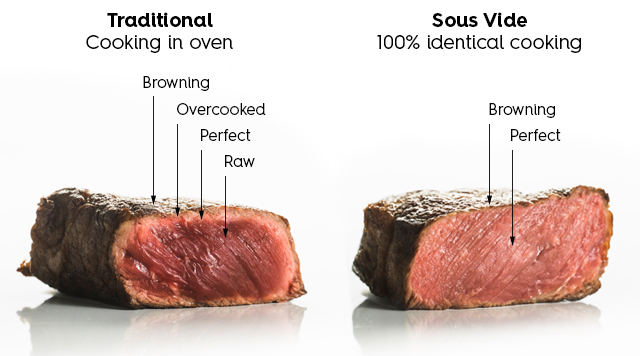-->

## The Controller

Wanting to get in on this craze without spending a fortune (especially if it turned out to be a novelty), I set off to make my own. If all a sous vide device does is temperature control of a heating element, then it wouldn't be anything my recent mechatronics degree couldn't handle.

__Equipment:__

+ Rice cooker to act as the heating element and water vessel
+ [80 GPH Acquarium pump](https://www.amazon.ca/gp/product/B00EWENKXO/ref=oh_aui_detailpage_o05_s00?ie=UTF8&psc=1) to circulate the water
+ [DS18B20](https://www.amazon.ca/gp/product/B00KLZQ0P8/ref=oh_aui_detailpage_o09_s00?ie=UTF8&psc=1) waterproof temperature sensor
+ ESP8266 WiFi Chip

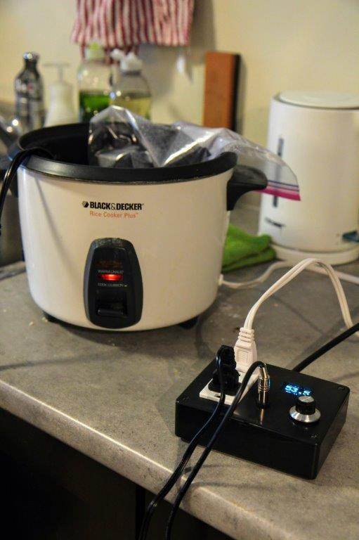

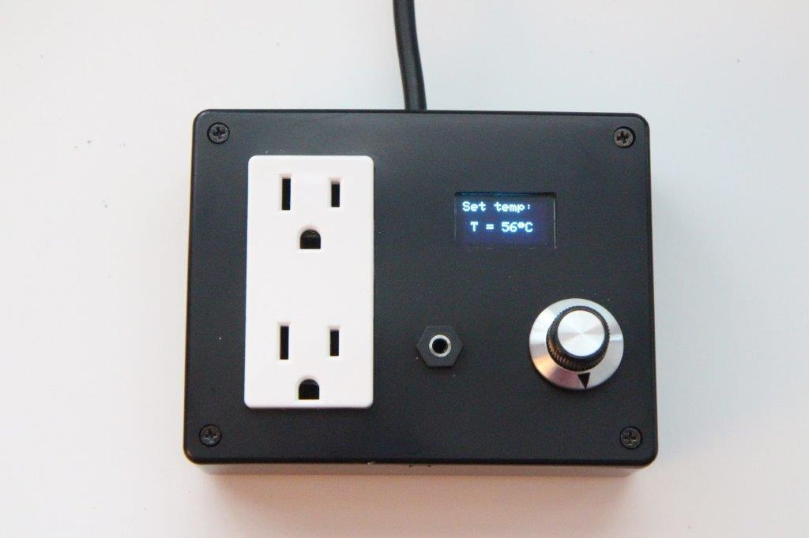

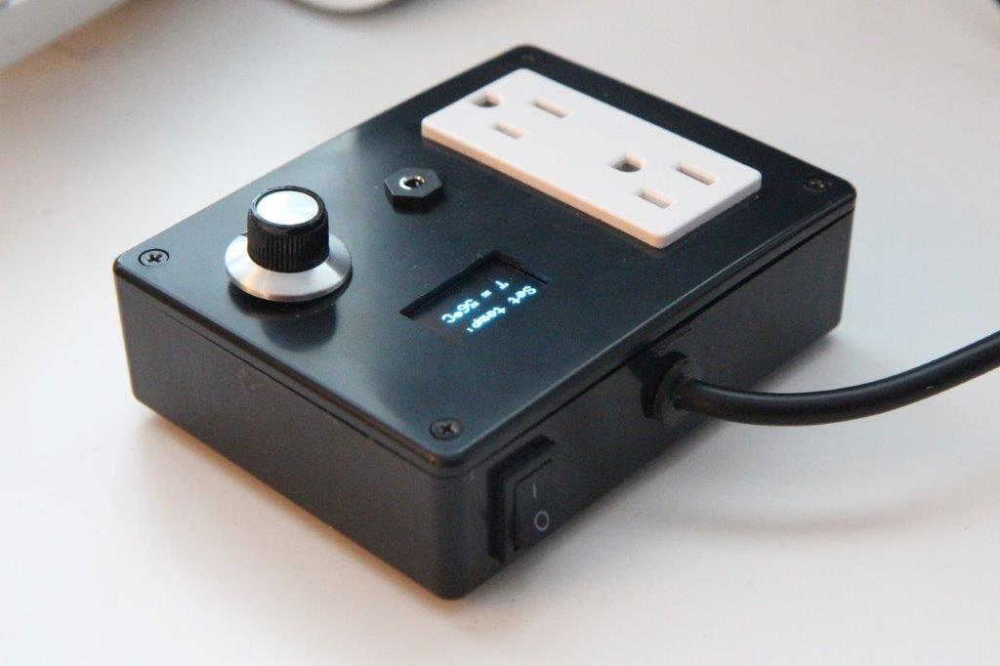

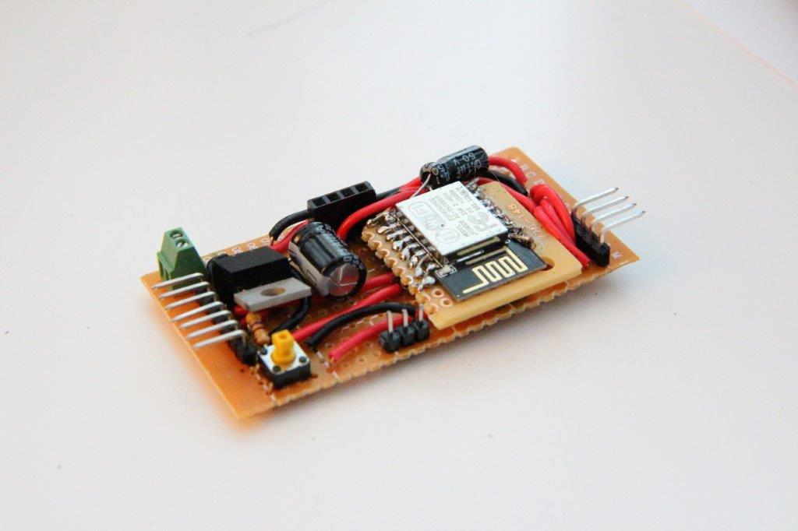

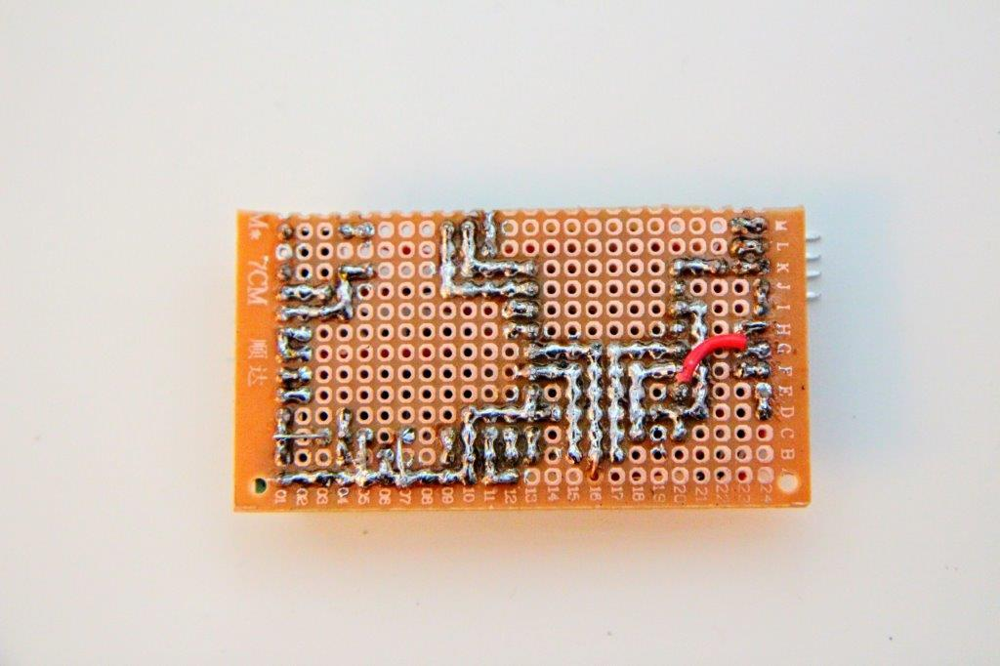

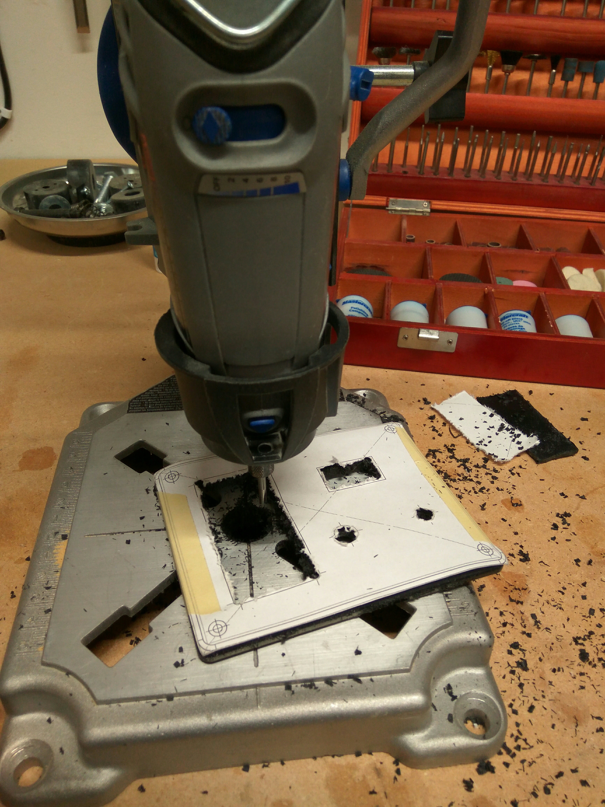


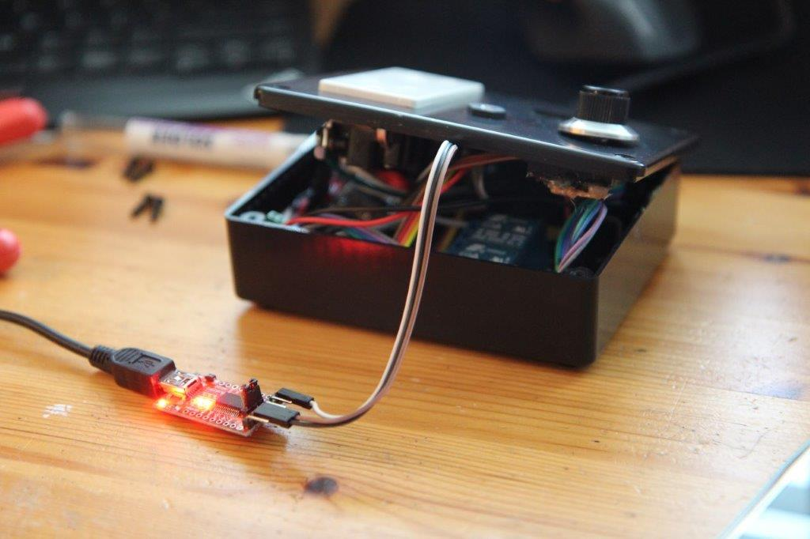

<!--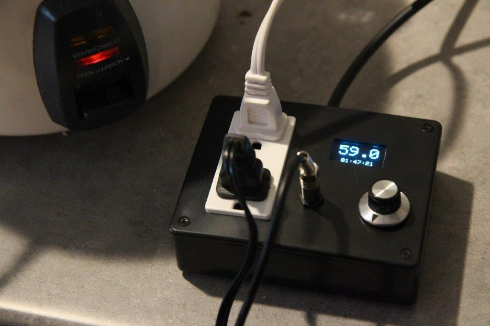-->

## The Data

No project is complete without analyzing data! The main unknowns thus far:

1. Rise time and stability comparison between various cooking vessels
1. Temperature stability improvements with a water circulator
1. Is a bang-bang controller sufficient or is PID required?

To assess these questions, I setup the ESP8266 to push live temperature data to an online web server. Through [MQTT](http://mqtt.org/), I was able to send live temperature data from the controller to [Adafruit.IO](https://io.adafruit.com/). This service (in open beta at the time of writing) allows dashboards and data feeds to be easily created for real-time monitoring of anything.

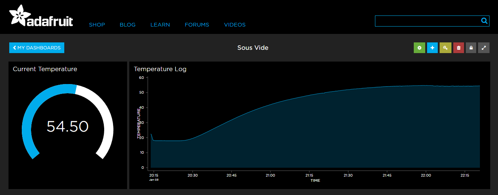

### A Comparison of Cookers

Four trials were conducted with three different cooking vessels: a 3 cup rice cooker, 7 cup rice cooker, and a 14 cup (3.3 L) slow cooker. Two cups of water were used in each vessel for these tests. As shown through the graph below, the rice cookers get up to 55°C significantly than the _(very)_ slow cooker. Although it would be better in maintaining temperature due to its ceramic makeup, it took way too long to heat up for practical purposes. You can fill it with hot/boiling water to help it warm up, but it still wouldn't be as fast or convenient than the rice cookers.

Slow cooker, you are the weakest link. Goodbye.

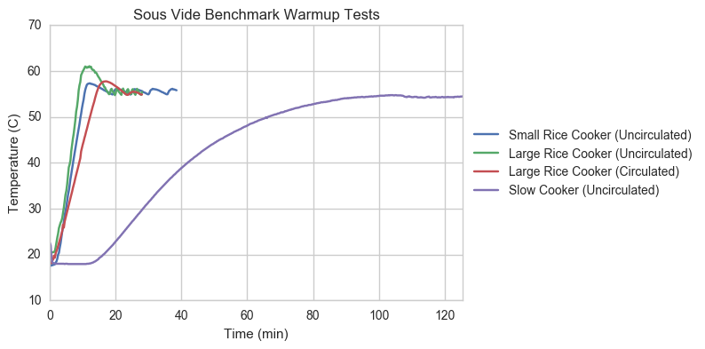

Looking at the rice cookers in more detail, we see that the small rice cooker has a much lower overshoot than the large. This makes sense since the heating element is smaller, thus it retains less heat "momentum" upon shutoff. The addition of a water circulator significantly reduced the steady state temperature oscillation as well as the amplitude of overshoot. With the added benefit of greater temperature uniformity within the water bath than relying on natural convection to mix the water, using a circulator is proven to be a necessity.

Moving forward, I decided to use the large rice cooker with a circulator. Although the small rice cooker reaches steady state more quickly, its small vessel size s unfortunately not practical for cooking anything but a feast for ants.

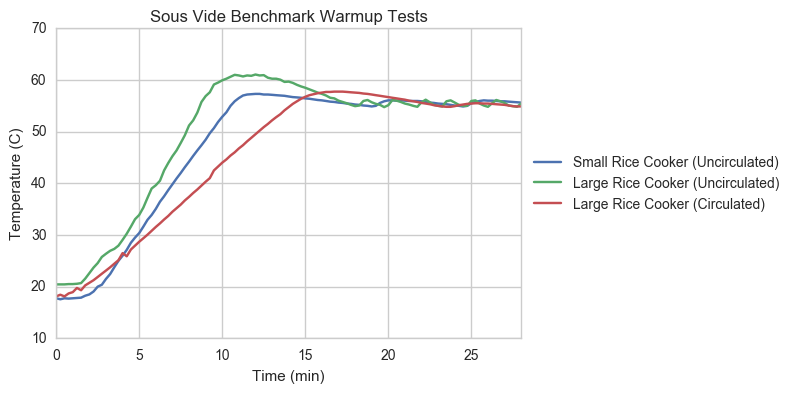

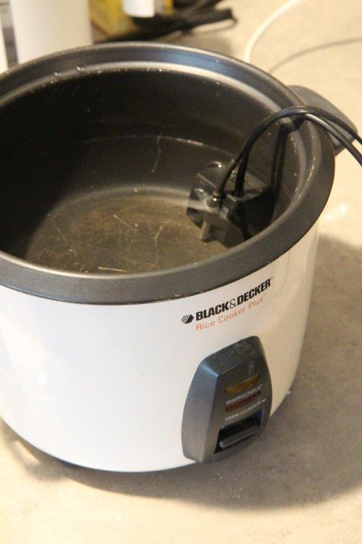

Time to actually cook with this thing! After trying out various foods, the data shows that the temperature stability is surprisingly stable given the simple on-off temperature control.


Quantifying the ripple with some simple analysis shows that the average standard deviation for these four cooking trials was ±0.4°C, where the steak had the highest deviation of ±0.6°C.

```no-highlight
    Trout Fillet at 48C for 59 mins
       Mean:  48.35°C (+1.15, -0.73)
       Std:  ±0.34°C

    Sirloin Steak at 53C for 84 mins
       Mean:  53.03°C (+1.78, -2.65)
       Std:  ±0.63°C

    Chicken Thighs at 70C for 99 mins
       Mean:  70.03°C (+0.59, -1.53)
       Std:  ±0.30°C

    Burger Patty at 60C for 31 mins
       Mean:  60.16°C (+0.72, -0.66)
       Std:  ±0.23°C

    --> AVERAGE STANDARD DEV: ±0.38°C
```

Thus, using a simple temperature control implementation with a water circulator yields quite satisfying results.

## The Verdict

They say a picture is worth a thousand words. The one below might not be worth quite that many, but that pink uniformity definitely speaks for itself.

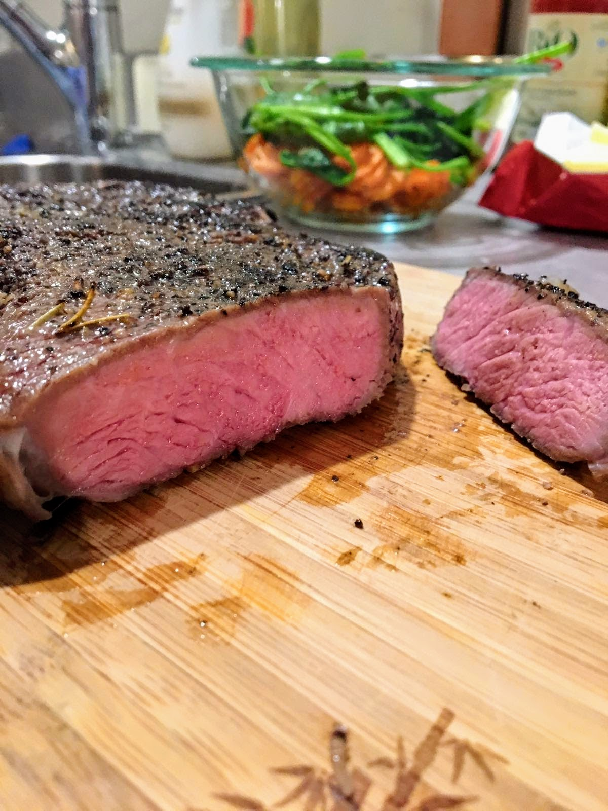
