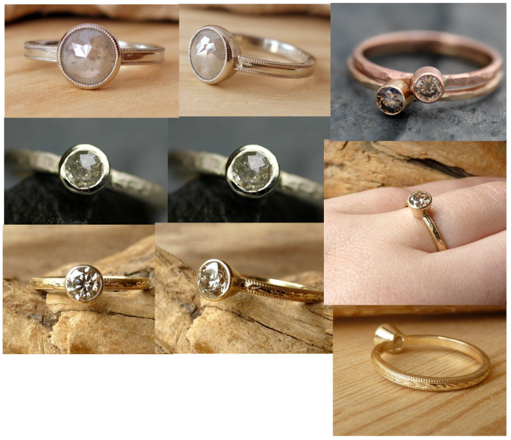
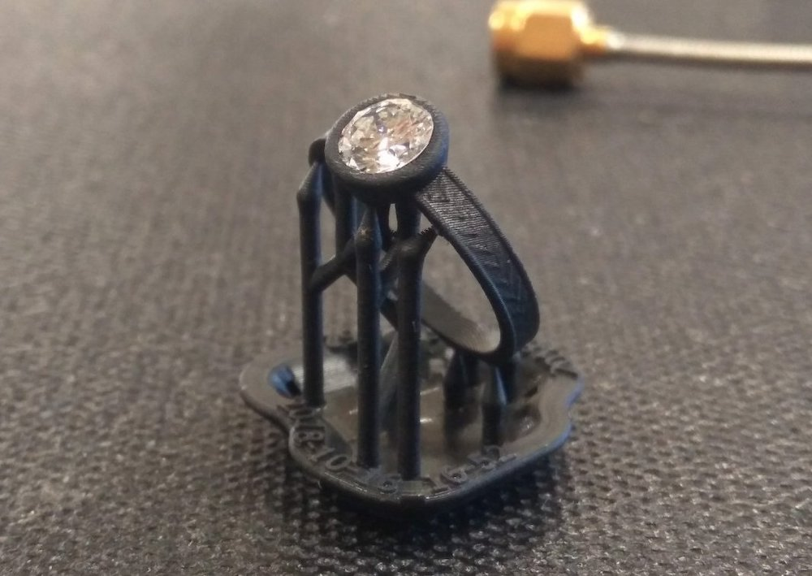
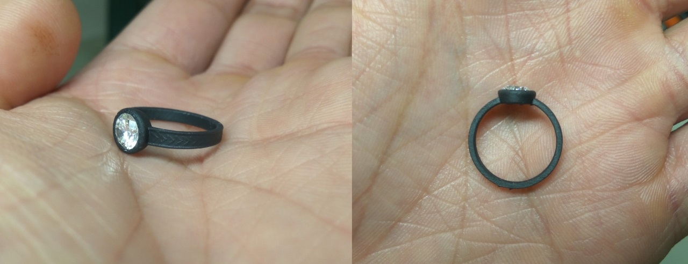
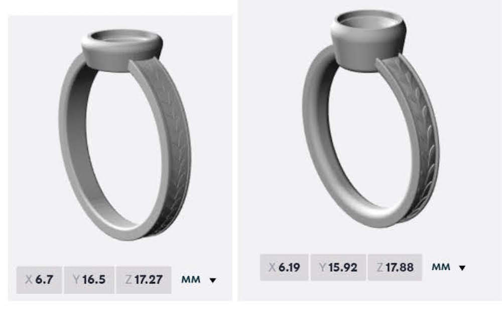
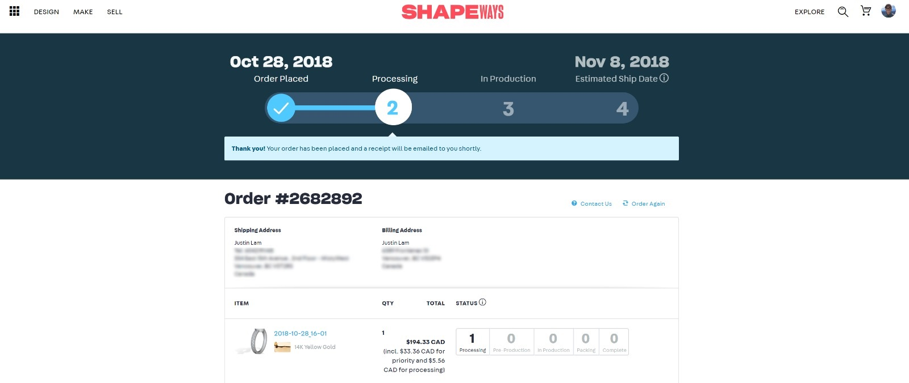
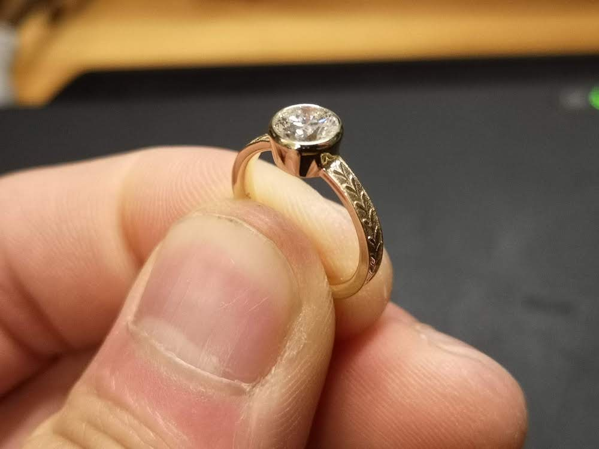
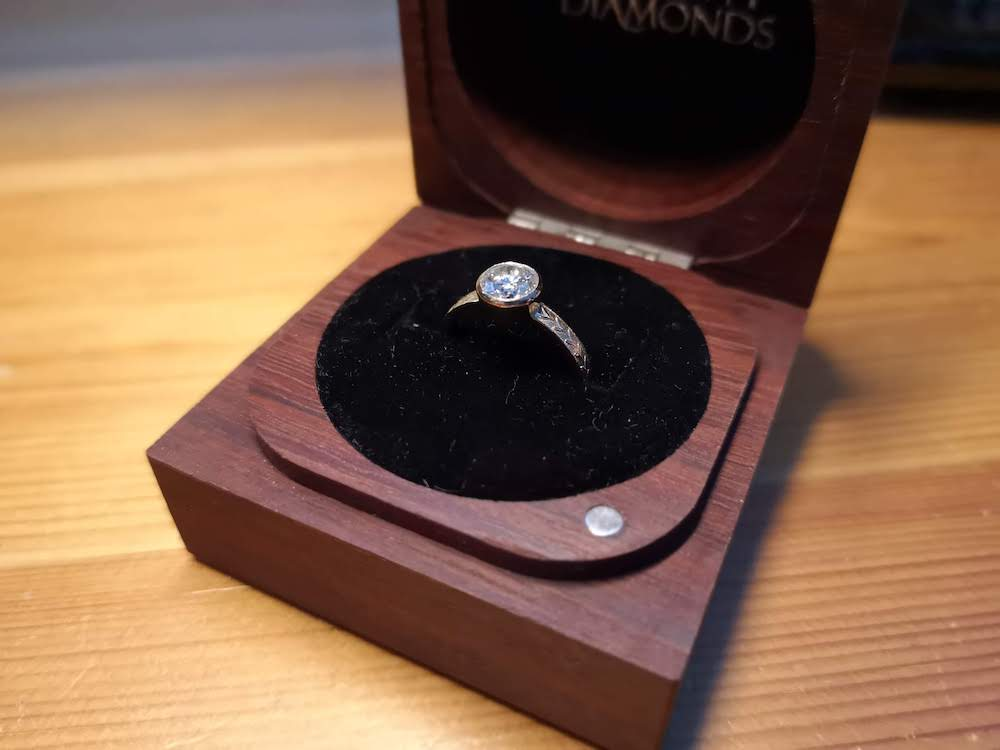
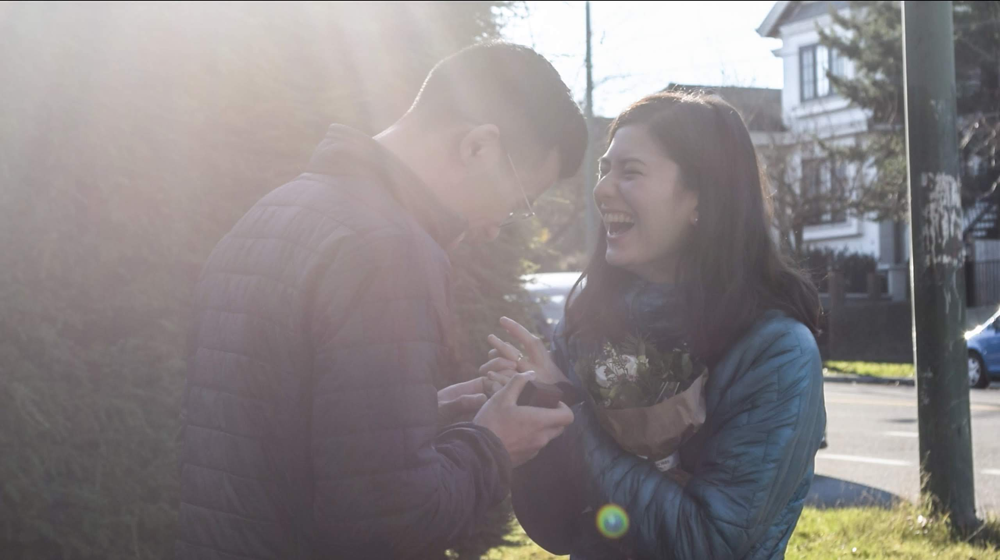
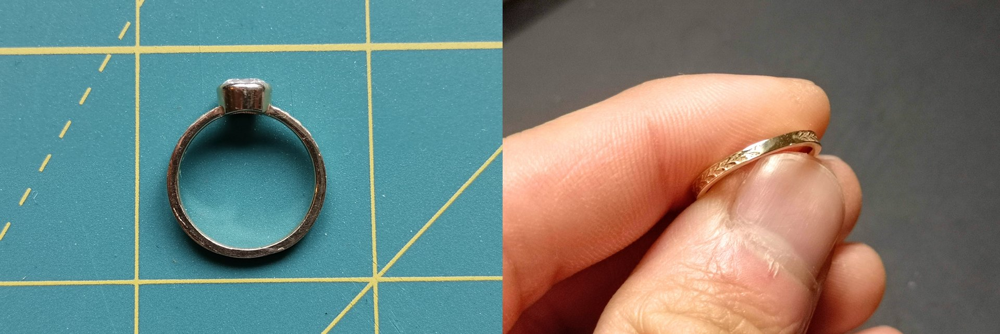

+++
image =     "J_H-323.jpg"
type =      "blog"
draft =     false
layout =    "single-blog"
tags =      ["3d-printing", "design"]
tagline =   "A perfectly imperfect expression of commitment."
title = "3D Printed Engagement Ring"
date = "2019-12-29T11:50:22-07:00"
+++

Professional photos from <a href="http://justine-russo.com/" target="_blank">Justine Russo Photography.</a>

For readers of my blog, you'll notice that I haven't had any new content in the past year. For good reason though, as I got married in June! Aside from planning the proposal and wedding, I also had the lofty goal of designing and making my wife's engagement ring.

With this post, I'd like to share my quest in designing and 3D printing the ring, along with some \**minor*\* mistakes I made.



# The Backstory

It all started with the diamond. My grandpa used to own a jewelry store, so my grandma naturally had a lot of jewelry. However, she doesn't wear much anymore, so a few years ago she took the diamonds out of one of her bracelets and gave it to each of her grandchildren. My older sister and cousin eventually made theirs into a pendant, but mine stayed in the safety deposit box for quite some time longer. I eventually realized I could use the diamond for an engagement ring (+1 for sentimental value), and so my journey began.

However, I didn't know many local shops where you can give them a stone to create a ring for it (mind you, this was an assumption and I didn't bother to validate it). Having experience with mechanical design and rapid manufacturing methods, I figured it was well within my capabilities to propose with a truly special, sentimental engagement ring. Turns out I was only partially right about this, but we'll get to that later...

The hardest part of this was keeping it a secret from my wife. We were already living together, so I had to do all the design work while "working late at the office" because of "tight deadlines". It worked out in the end, and I didn't have to pull too many extra hours to get it done!

# The Development

## Research

*~ September to October 2018 ~*

Fortunately, we had already talked about getting married, so bringing up the engagement ring was fairly easy. However, she didn't know when or how I would propose, so there would still be that as a surprise. She showed me a few rings and styles that she liked, so I collected those (secretly) and started to think about what the perfect ring for her would look like.

Simple, quiet, elegant. These were the words that percolated my mind as I looked at dozens of engagement rings, and I eventually settled on a few key elements:

- A thin/light look
- Bezel set diamond
- Textured band
- Yellow gold

It was quite important to make sure the ring looked thin and light (without looking flimsy or cheap), since her finger is very small. Like size 3.5, ie. 14.5 mm diameter small. With this, I knew I'd have to 3D print at least one prototype, because it's difficult to get a feel of physical proportions when looking at a CAD model on your computer screen.

## Specifications

Once I honed down on the desired design, I started my research of how to secure the stone. This was the most critical part of the design, as a diamond coming loose and falling out would not be good.

Turns out setting a stone in a ring is fairly straightforward, as it just involves bending metal over the lip of the stone. With a typical prong-style setting, you would bend the tip of each prong over the stone to secure it. With a bezel-style setting, you bend the entire lip over the stone. Since the stone is held by the entire circumference, the wall doesn't need to be as thick as with the prongs.



However, as great as qualitative instructions are, what I needed were actual dimensions on wall thickness, height, bend distance, etc. After much Googling, I fortunately found an article with the information I needed!

{{}}

## First Prototype
*~ October 11 to 17, 2018 ~*

Luckily, one of my coworkers, [Phil Tsao](http://www.philiptsao.com), owns a plethora of rapid prototyping machines as part of his [Ember Prototypes](https://www.emberprototypes.com) business. One of his fancy toys is the [Form 2 SLA Printer](https://formlabs.com/3d-printers/form-2/), which is well suited for printing intricate plastic parts with fine details. I sent him my first design, and was able to have it in my hands the next day.

Good thing for inexpensive prototypes, because I wasn't happy with how it looked. It was too blocky and square, so I took a closer look at other rings to see what made them look better. After all, they say good design is invisible (to the untrained eye, and my eye for ring design is pretty inexperienced). One main aspect is that almost all surfaces on rings (and other jewelry, for that matter) are curved, allowing light to reflect off the surface in a more aesthetically pleasing way.

Given these findings, my list of change orders were as follows:

- Increase height of stone holder to make it "stand out" more
- Increase height of leaf pattern and rim so the features are more pronounced
- Round inner surface of band for comfort
- Round and angle outer surfaces of band for aesthetic improvements

## Design Refinement
*~ October 22, 2018 ~*

Iterations are a key part of design (for both hardware and software). Seeing a physical prototype of the ring was extremely useful in determining what aspects needed changing. I was much happier with the ring after the aforementioned revisions.

## Final Procurement
*~ October 28, 2018 ~*

If my timeline were more permitting, I would have printed this second version in an inexpensive metal like plated brass or silver. This would ensure the end result of the ring is exactly how I expect it to be, rather than have the risk of being surprised on the final order. However, given my expedited timeline, I opted to take the risk and just go for ordering the ring in 14K gold. If I ended up unhappy with it, paying another ~$200 CAD would be acceptable (in my books) since the flipside of the risk was potentially proposing a few weeks earlier (and thus giving more time for the wedding planning!).



I hadn't used [Shapeways](https://www.shapeways.com) previously, but their offerings and capabilities looked promising. Aside from printing plastics and metals, [jewelry](https://www.shapeways.com/getting-started/jewelry) also seemed to be a common offering.

> Gold models are 3D printed using a complex five-step process. First, the model is printed in wax using a specialized high-resolution 3D printer. It is then put in a container where liquid plaster is poured in around it. When the plaster sets, the wax is melted out in a furnace, and the remaining plaster becomes the mold.
>
> Molten Gold is poured into this mold and set to harden. The plaster is broken away, revealing your new product. The product is then carefully cleaned and hand-polished to give it the trademark Gold luster. Please be aware that polishing can wear down or fill in very fine details and edges. Polishing also removes a bit of material from your product in order to smooth it out, so the exact volume may be up to 10% smaller than that of your digital model.
>
> \- [Shapeways: Gold Material Info](https://www.shapeways.com/materials/gold)

With that, I went ahead and placed the order. And so, the waiting game began (and planning the actual proposal)...

## Setting the Diamond

*~ November 6, 2018 ~*

I needed to figure out how to actually nicely bend the bezel over the stone. After scouring YouTube and Google for instructions, I came to the conclusion that it is actually quite a simple process:

1. Find a tool to form the edge over the stone
2. Bend the edge over the stone with the given tool'
3. Repeat for the circumference of the bezel

There are different tools available to do the bending. In the video below, a hammer-like tool is used to compress the edge on to the stone. In other videos, a file-like tool is pushed toward the center to bend the edge.





Once the ring arrived, I was ready to set the stone. However, due to the tight tolerances of the bezel and (expected) imperfections of the casting process, I had to use a rotary tool with the smallest grind attachment to carve out the tiny bumps so the diamond would actually fit inside. Having a very good microscope was integral in this slow, methodical process.

Once the stone sat snuggly inside, I settled on using the shaft of a large screwdriver as the tool to bend the lip over the stone. This ended up working quite well, and a few minutes later, the ring was complete!

I showed the ring to my grandpa to check my setting, and he gave it a thumbs up. It was finally time to propose!

# The Outcome

## The Proposal

*~ November 18, 2018 ~*

So my wife and I met through Craigslist. While we were both in university, I was buying some rock climbing gear, and she was selling hers. Turns out we were renting houses on the same block, so I took a gamble and asked her to go climbing at our local gym. She kindly said yes, and now we're here, about to get married.

For the proposal, I thought it'd be funny (and sweet) if I proposed on the same street corner that we had our first transaction. But how would I get her there as a surprise? Through another Craigslist transaction, of course!

Our friend was conveniently furnishing her new appartment, so we created a fake ad for a bookshelf. She took my wife to Ikea while I made my way to the proposal spot, and when they eventually arrived, I came out from my hiding spot and started my proposal.

## ... The Mistake

*~ November 21, 2018 ~*

Turns out my specifications were incorrect, and the ring didn't fit... Two things were at fault:

1. I sized it too tight
2. The flat edge under the stone reduced the effective diameter

A quick trip to a professional jeweler for a resizing and the issue was fixed, albeit with some blemishing. The leaf pattern where extra material needed to be added was now gone, but fortunately it wasn't too visible while worn.

Hindsight 20 / 20, but all things considered, it wasn't the worst thing that could have happened with this endeavour!

## The Wedding

*~ June 2019 ~*

With the engagement completed, we spent the next months planning for our farm-to-table themed wedding at the [Poplar Grove at UBC Farm](https://ubcfarm.ubc.ca/bookings/ubc-farm-venues/). We opted for professionally-made rings for our wedding bands (smartly so), and the end result of everything was just lovely.

{{}}

{{}}

{{}}

{{}}

{{}}

# Final Thoughts

So there you have it, a story of how a young engineer created a perfectly imperfect engagement ring with the help of 3D printing. I was very happy with how it turned out, and it received many compliments from friends, family, and of course, my wife. For anyone thinking of going down a similar path, I hope you learn from my mistakes (and that your significant other says yes!).

> There are some things that money can't buy or make. For everything else, there's 3D printing.
