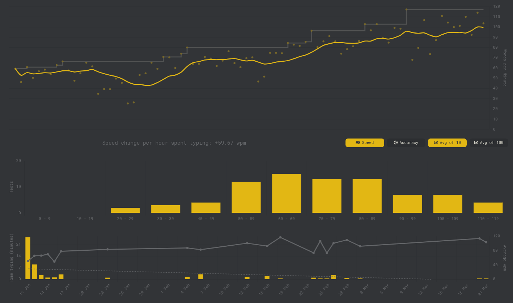
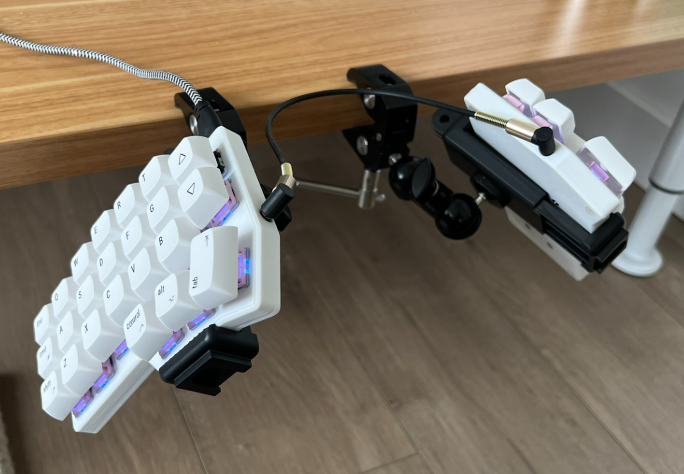

+++
title =     "Corne Keyboard"
date =      2025-05-19T15:57:51-07:00
tagline =   ""
image =     "/imgs/2025/corne-keyboard/corne.JPEG"
tags =      [""]
draft =     true

layout =    "single"
type =      "blog"
aliases =   []
+++

Been using a split ergonomic mechanical keyboard for 6 months. This is how it's going.

<!--more-->

Started off with a paltry 50 wpm, steadily increased back up to my normal typing speed.



Tried going full ergo, but didn't really work with my set up. Was too high for my elbows.


Tried different switches.


Mimicking the use of layers on a normal qwerty using [keyd](https://github.com/rvaiya/keyd).

```ini
[ids]
*

[main]
capslock = overload(control, esc)
j+k = esc
=+backspace = C-backspace
meta = layer(meta)

[meta]
h = left
j = down
k = up
l = right
```

Test edit from mobile