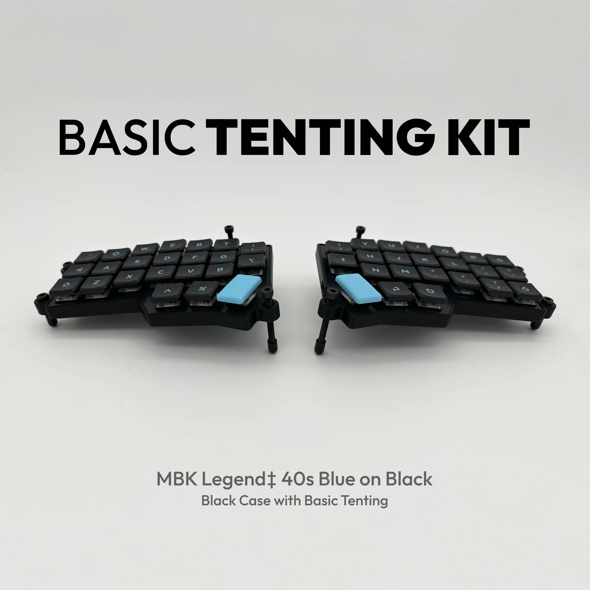

It all started when I first saw a tenkeyless keyboard. Compared to a standard 104-key keyboard, having only 87 keys (an entire 17 keys fewer!) seemed like the next best thing to sliced bread. Since I wasn't a big user of the numpad, it seemed like a no brainer to reduce desk space, bring my mousing hand a few inches closer to center, and just feel like I was one with [r/PCMasterRace](https://www.reddit.com/r/pcmasterrace/). Oh how naive I was.

<!--more-->

Little did I know that it was simply the beginning of a long, arduous journey in search of elusive perfection. Perhaps what I was looking for is actually from within? Or, perhaps I just needed to buy another keyboard. I went with the latter, and ended up with a minimalistic-ly cute 46-key keyboard called the [Corne](https://github.com/foostan/crkbd). 

# Backstory

The table below shows most of the keyboards I've tried over the years. I never got too deep into the world of mechanical keyboards since my pockets were (fortunately?) not as deep as my heart wanted them to be.

| Date      | Keyboard                   | Switches             |
| --------- | -------------------------- | -------------------- |
| July 2016 | CM Storm TKL               | MX Cherry Blue       |
| Aug 2016  | Lenovo TrackPoint Keyboard | Membrane             |
| Sep 2017  | Poker 61                   | MX Cherry Black      |
| Nov 2017  | Havit Low Profile TKL      | Kaihl Blue           |
| Mar 2019  | Tada68                     | Gateron Silent Red   |
| Apr 2021  | Apple Magic Keyboard       | 🦋                   |
| Jan 2025  | Corne                      | TTC Frozen V2 Silent |

I stuck with the TKL format for a while, but was always intrigued by smaller layouts. I tried the Poker, but I found it cumbersome not having arrow keys easily accessible, since it made things like selecting text by word require some nasty finger gymnastics (e.g. `CTRL+SHIFT+[LAYER+LEFT]`). A few boards later and after some ridicule from a coworker for having tried more keyboards than he's used in his lifetime, the Tada68 became my daily driver.


I was previously using Linux computers for personal and work, but when I started my new job in 2021, I was given a MacBook and was quickly frustrated with the difference in layouts. I then purchased a Magic Keyboard so the layout would be the same whether I was at my desk or on the go, and eventually came to like the shallow keys since it actually allowed me to type quite quickly.

However, a part of me kept wondering if something was missing from my life. Obviously it was another keyboard that was needed, but this time I looked towards ergonomic, mechanical keyboards. 

Previously, I had tried the [Microsoft Sculpt](https://www.pcmag.com/reviews/microsoft-sculpt-ergonomic-desktop) and the [Kinesis Freestyle](https://kinesis-ergo.com/shop/freestyle2-for-pc-us), but they never really clicked for me. I wanted something that spoke to me on a spiritual level. Perusing [r/ErgoMechKeyboards](https://www.reddit.com/r/ErgoMechKeyboards/) was just what I needed, and the simplistic-yet-still-practical layout of the Corne caught my eye. I bit the bullet with (a relatively inexpensive) one on Aliexpress for ~$80 CAD, and a few weeks later it arrived at my doorstep, ready to fill my emotional void.

# Getting Used to the Corne

## Learning Curve

It felt like I was in elementary school again, playing home row in the computer lab, trying to make sense of this piece of hardware that turns thoughts into words on a screen. 

I can usually type around 100-120 wpm, but the first few hours with this layout was definitely an adjustment. Made me realize that I was typing `n` and `b` with the wrong hands, that was hardest to get used to. 

Started off with a paltry 30 wpm, steadily increased back up to my normal typing speed. After about 1-2 weeks, I was typing steadily enough to use it for work, albeit still nowhere close to my usual flow. At the 3-4 week mark, I became comfortable with the layout and started to get a better understanding of what worked and didn’t work in my layout. 


## Ergonomics

Many of the keyboards I saw online were tented, so it seemed like the norm and tried it out. Since mine didn’t come with a tenting kit or mechanism, I used some books to achieve the same angling to see how it felt. 



It was ok. I didn’t find it to be a drastic improvement over being flat. But diving deeper into ergonomic configurations, I thought that maybe I wasn’t trying hard enough…

So I went deeper. Tried going full ergo, but didn't really work with my set up. Was too high for my elbows and although it was comfortable for my wrists, it felt like my arms couldn’t really relax. I think a set up like this would do better on a standing desk, or if you have a better, more flexible way of mounting them. I found the clamped position to not be optimal, and it also pushed me farther from my desk and monitor.


Ultimately, I went back to just a flat configuration. I found that having the sides separated was more important than the angle, at least for me.
## Mousing

Trackpad in between the halves is so aesthetically pleasing to me, but unfortunately I can’t use the trackpad for extended periods without my wrist flaring up. I use my mouse on my left hand even though I’m right hand dominant. 

Haven’t tried trackballs yet, but having one integrated would be nice. As much as I like the trackpoint on a Thinkpad, it just doesn’t have the precision of a mouse.

My ideal mousing would be eye based, where I can just look and the pointer will be there. But we’re not quite there yet.

I tried some keyboard driven workflows like shortcat and mouse keys. Although I’m a heavy vim user, there’s some things that are just easier/faster/unavoidable with a mouse.
# Keymap 

Through my months of usage, I’ve fiddled around with the layout in what feels like making incremental progress towards a piece of hardware that is an extension of the mind. 

This keyboard uses VIAL, which is QMK based but includes a web interface to update the layout on the fly instead of having to flash new firmware every time. Makes it easy to try new things.

## General Thoughts

Things that worked well:
- Having clusters are great, because it avoids the finger contortions for chorded hotkeys. Comfort would be improved if the keys were more to the middle, side reaching the thumb under the index finger isn’t the best for strain.
- Ortholinear is also nice, didn't take that long to get used to
- Macros for common chorded hotkeys was necessary, e.g. screencap selection = `GUI + SHIFT + 4`, which I put on the opposite hand of my mouse
	- Still wanted to be able to use ctrl but not always, so also needed it close by


Things I tried but didn't like:
- Having mod tap on regular keys, sometimes typing rolls messed the timing up. Also would sometimes cause a weird delay in keys, which was annoying. Because of that, didn't like home row mods

Design considerations:
- Making sure certain things were still usable with one hand
- Making sure certain mouse + keyboard workflows still worked

## Main Layer

Liked the combo of space and layer, thought that was quite nice. Don't really end up using the backspace in thumb cluster, haven't gotten used to that. Could consider switching it to enter key? 

Things that worked well:
- Key combos are a nice way to bring more keys to the main layer without having to switch layers
- Layer key for right half is on leftmost key instead of center, since found my right hand more on the left side instead of in typical home row position. Didn't like having my thumb curled under my index
- Having the L1 and LGUI keys right next to each other meant that it was possible to use the thumb on both simultaneously for certain key combos

Things that didn't:
- Since I mouse on my left hand, doing things like horizontal scrolling (shift + mouse) and panning (gui + mouse) was initially hard before duplicating it on the right side


## Symbols Layer

First set it up with numbers going across the top row, but found it hard to remember where the later numbers were (6-0), so switched to numpad and it's much better. Also it's faster to use with one hand.

There's duplication of the hyphen, but that's ok. Left cluster is for use in typing variables, right is for numpad use.

The random `LCTL+Q` is to lock my laptop with the hotkey `GUI+CTRL+Q` on macOS. I initially had it be one macro but found it was too easy to accidentally hit, so made it explicit but still be able to do with one hand.

Things that worked well:
- Numpad was easier to remember than having them all in the top row
- Hyphen and underscore are typed often, didn't like them as combos since didn't feel as precise/fast
- Like having # and * above/below each other for vim

Things that didn't:
- Less frequently used symbols are still hard to remember, e.g. $%^&


## Navigation Layer
For right handed users, probably want to move the browser nav buttons to the left cluster so mouse can still be used.

Things that worked well:
- Arrow key navigation/selection is really handy and fast since can use both hands (e.g. shift alt arrow key)
- Arrow keys in hjkl is also really nice, but needed layer toggle on the same side (whereas for numpad, it's opposite)
- Navigation for browser fwd/back and tab next/prev is handy

Things that didn't:
- Don't really use the mouse wheel keys on the left cluster, 
- Sometimes mouse control but it's kind of hard to be precise. Also doesn't work with click/drag so hard for that. But useful for things like refocusing a window/input that the mouse is nearby


## Miscellaneous Layer

Also barely use function keys outside of F2, so they're just there in case


# Using Laptop Keyboards

- First switch back was hard, but then it got better and now I can use either seamlessly
- Chorded hotkeys are annoying, so I set up keybindings to mimic some behaviour

On a standard keyboard, some degree of customization can be enabled by using tools like Karabiner (for macOS) or [keyd](https://github.com/rvaiya/keyd) (for Linux).

Here’s the keyd config I use for my Linux laptop:

```ini
[ids]
*

[main]
capslock = overload(control, esc)
j+k = esc
=+backspace = C-backspace
meta = layer(nav)

[nav]
h = left
j = down
k = up
l = right
```

# Mini Reviews
## Keyboard
From aliexpress, 3d printed case. No spacebar stabilizer issue since it's a single key. Build quality and switches are decent. Tolerances are good. Can't complain for the price.
## Switches

Tried different switches. Tempted by chocs, but different spacing.

| Name                 | Actuation Force | Comment                                                            |
| -------------------- | --------------- | ------------------------------------------------------------------ |
| Leopold Grayborg     | 40gf            | Feels ok, but very loud.                                           |
| Akko Silent Fairy    | 50gf            | Mushy and scratchy                                                 |
| TTC Frozen v2 Silent | 39gf            | Would be better lubed, but completely silent without feeling mushy |


