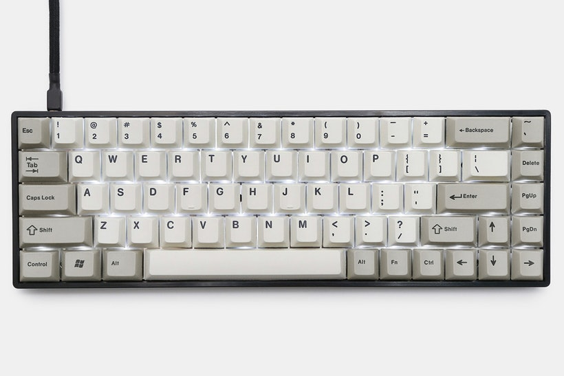
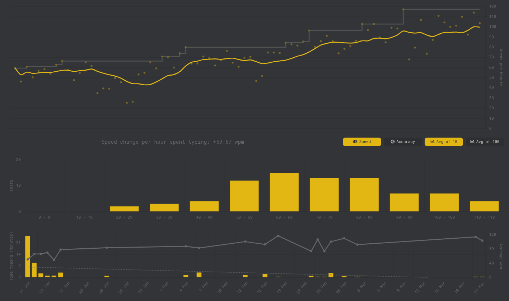
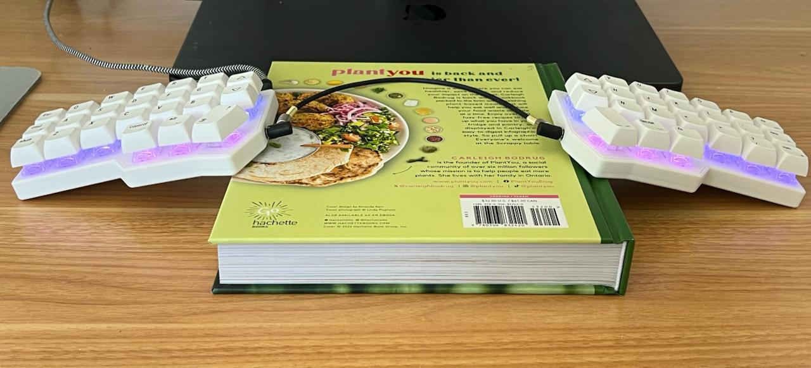
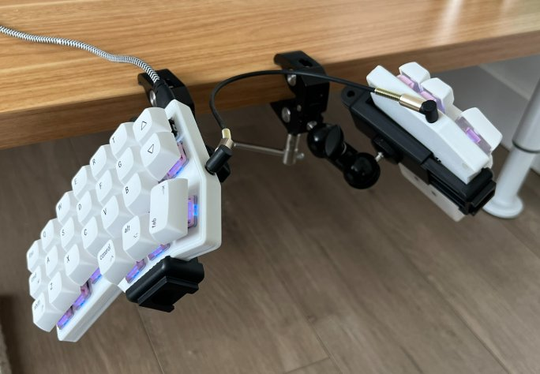
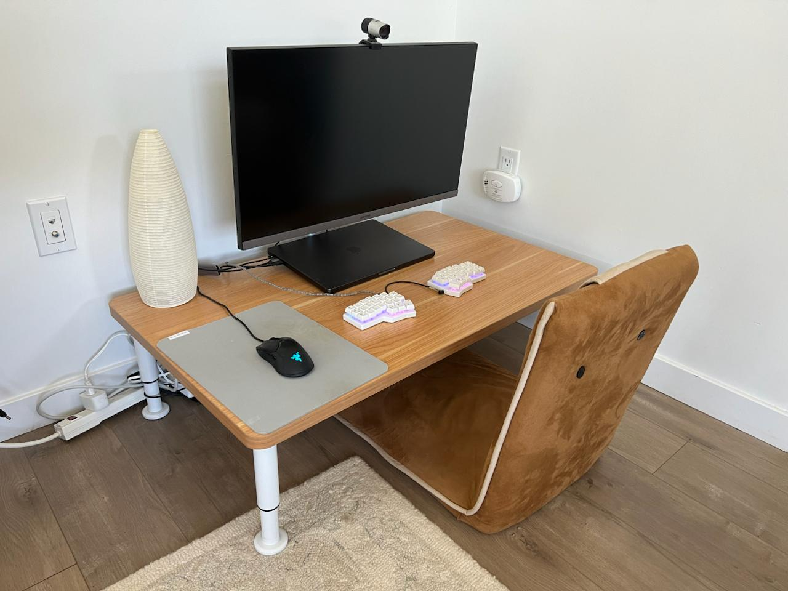
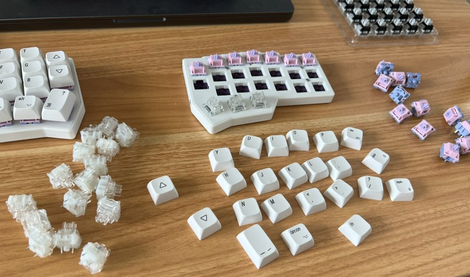
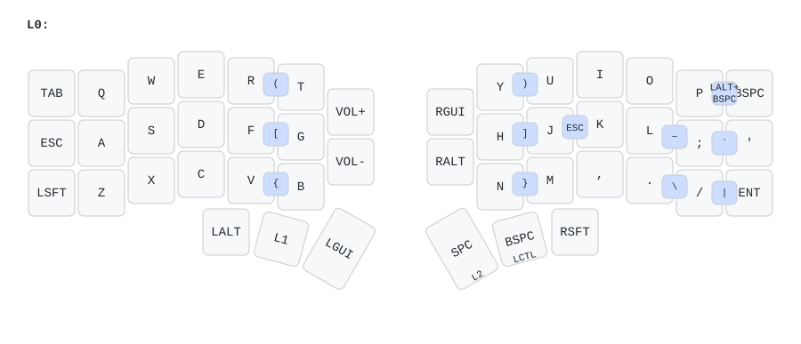
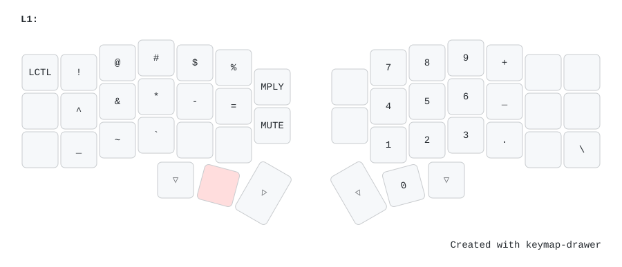
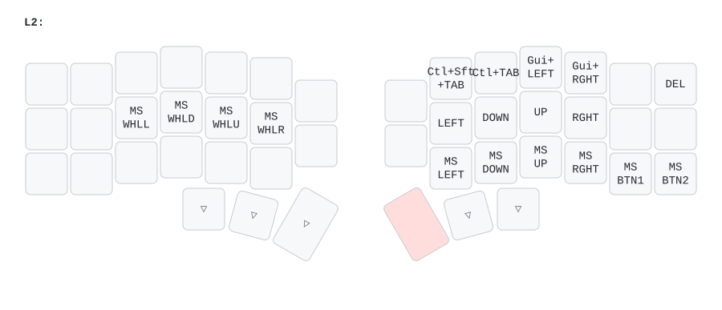
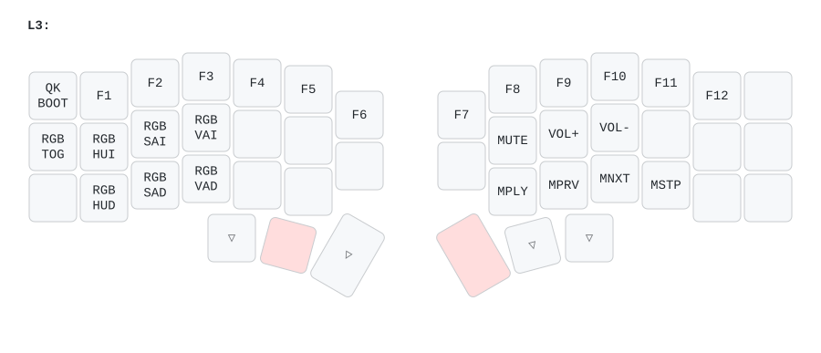

It all started when I first saw a [tenkeyless keyboard](https://www.daskeyboard.com/blog/what-is-tkl-keyboard/). Compared to a standard 104-key keyboard, having only 87 keys (an entire 17 keys fewer!) seemed like the next best thing to [sliced bread](/posts/2018/06/sourdough-starter-monitor/). Since I wasn't a big user of the numpad, it seemed like a no brainer to reduce desk space, bring my mousing hand a few inches closer, and just feel like I was one with [r/PCMasterRace](https://www.reddit.com/r/pcmasterrace/). Oh how naive I was.

<!--more-->

Little did I know that it was simply the beginning of a long, arduous journey in search of elusive perfection. Perhaps what I was looking for is actually from within? Or, perhaps I just needed to buy another keyboard. I went with the latter, and ended up with a minimalistic-ly cute 46-key keyboard called the [Corne](https://github.com/foostan/crkbd).

# Backstory

The table below shows most of the keyboards I've tried over the years. I never got too deep into the world of mechanical keyboards since my pockets were (fortunately?) not as deep as my heart wanted them to be.

| Date      | Keyboard                   | Switches             |
| --------- | -------------------------- | -------------------- |
| July 2016 | CM Storm TKL               | MX Cherry Blue       |
| Aug 2016  | Lenovo TrackPoint Keyboard | Membrane             |
| Sep 2017  | Poker 61                   | MX Cherry Black      |
| Nov 2017  | Havit Low Profile TKL      | Kaihl Blue           |
| Mar 2019  | Tada68                     | Gateron Silent Red   |
| Apr 2021  | Apple Magic Keyboard       | 🦋                   |
| Jan 2025  | Corne                      | TTC Frozen V2 Silent |

I stuck with the TKL format for a while, but was always intrigued by smaller layouts. I tried the Poker, but I found it cumbersome not having arrow keys easily accessible, since it made things like selecting text by word require some nasty finger gymnastics (e.g. `CTRL+SHIFT+[LAYER+LEFT]`). A few boards later and after some ridicule from a coworker for having tried more keyboards than he's used in his lifetime, the Tada68 became my daily driver.



I was previously using Linux computers for personal and work, but when I started my new job in 2021, I was given a MacBook and was quickly frustrated with the difference in layouts. I then purchased a Magic Keyboard so the layout would be the same whether I was at my desk or on the go, and eventually came to appreciate the shallow keys since it allowed me to type quite quickly.

However, a part of me kept wondering if something was missing from my life. Obviously it was another keyboard that was needed, but this time I looked towards ergonomic, mechanical keyboards.

Previously, I had tried the [Microsoft Sculpt](https://www.pcmag.com/reviews/microsoft-sculpt-ergonomic-desktop) and the [Kinesis Freestyle](https://kinesis-ergo.com/shop/freestyle2-for-pc-us), but they never really clicked for me. I wanted something that spoke to me on a spiritual level. Perusing [r/ErgoMechKeyboards](https://www.reddit.com/r/ErgoMechKeyboards/) was just what I needed, and the simplistic-yet-still-practical layout of the Corne caught my eye. I bit the bullet with (a relatively inexpensive) prebuilt one on Aliexpress for ~$80 CAD, and a few weeks later it arrived at my doorstep, ready to fill my emotional void.

For reference, here are some of the other keyboards I considered, but ultimately settled on the Corne due to a combination of features, aesthetics, cost, and ease of purchase.

- [Lily58](https://github.com/kata0510/Lily58)
- [Sofle](https://github.com/josefadamcik/SofleKeyboard)
- [Totem](https://github.com/GEIGEIGEIST/TOTEM)
- [Ferris Sweep](https://github.com/davidphilipbarr/Sweep)
- [Let's Split](https://github.com/nicinabox/lets-split-guide)
- [Iris](https://keeb.io/products/iris-keyboard-split-ergonomic-keyboard)
- [Ergodox Voyager](https://www.zsa.io/voyager)
- [Ergodox Moonlander](https://www.zsa.io/moonlander)
- [Naya Create](https://naya.tech/) <- Way out of budget but it sure looks nice!

# Getting Used to the Corne

## Learning Curve

It felt like I was in elementary school again, playing intro typing games like home row and [Math Blasters](https://en.wikipedia.org/wiki/Math_Blaster!) in the computer lab, trying to make sense of this piece of hardware that turns thoughts into words on a screen.

I can usually type around 100-110 wpm, but the first few hours with this layout was definitely an adjustment. Started off with a paltry 30 wpm, steadily increased back up to my normal typing speed. With some practice, I was starting to get the hang of the columnar stagger.

After about 1-2 weeks, I was typing steadily enough to use it for work, albeit still nowhere close to my usual flow. At the 3-4 week mark, I became comfortable with the layout and started to get a better understanding of what worked and didn’t work in my layout.



## Ergonomics

Many of the keyboards I saw online were tented, so it seemed like the norm to try it out. Since mine didn’t come with a tenting kit or mechanism, I used a book to achieve the same angling to see how it felt.



It was ok. I didn’t find it to be a drastic improvement over being flat. I also didn't like how it left my wrists floating above the surface. Perhaps I needed to take the ergonomics more seriously and try a little harder...

So I went deeper. Bought some ball mount clamps and went full ergo, or at least tried to. Unfortunately it didn't really work with my set up. It was too high for my elbows and, although it was comfortable for my wrists, it felt like my arms and shoulders couldn’t really relax. It also made using the mouse even more inconvenient, but that was a secondary problem.

I think a set up like this would do better on a standing desk, or if you have a better, more flexible way of mounting them. I found the clamped position to not be optimal, and it also pushed me farther from my desk and monitor.


Ultimately, I went back to just a flat configuration. I found that having the sides separated was more important than the angle, at least for me.



## Switches

The keyboard came with some Leopold switches, which actually felt decent but were loud enough to warrant my wife granting me more budget to get something quieter.

| Name                 | Actuation Force | Comment                                                            |
| -------------------- | --------------- | ------------------------------------------------------------------ |
| Leopold Grayborg     | 40gf            | Felt ok, but very loud.                                            |
| Akko Silent Fairy    | 50gf            | Mushy and scratchy. Would not recommend.                           |
| TTC Frozen v2 Silent | 39gf            | Impressed with how silent they are while feeling crisp and smooth. |

After trying a handful of different ones, I settled on the TTC Frozen v2 switches. They might be even better if lubed, but they passed both mine and my wife's sound test, so they were a keeper! A nice bonus is that due to their clear design, the keyboard lighting shines brightly and diffusely around the keycaps.




# Keymap

I tried to keep a handful of things in mind when designing the layout of my keyboard:
- Certain keys/combos should still be usable with one hand, e.g:
	- Using arrow keys
	- Copy/cut/paste
	- Cycling through windows/tabs
	- Taking screencaps via selected area
- Certain mouse + keyboard workflows still need to work, e.g:
	- Holding `ALT` and clicking to open a link in my IDE
	- Horizontal scrolling by holding `SHIFT` with the opposite hand
	- Panning certain diagraming tools by holding `GUI`
- Frequently used keys/combos should be easy and comfortable to use, e.g:
	- Selecting text by words/home/end
- Optimized for writing and software development
- Layout should be somewhat mnemonic to ease the learning curve

Through using this keyboard as my daily driver for almost half a year and occasional layout tweaks, I've come up with the mapping described below. It's far from perfect, but enables a pretty smooth workflow for how I use the computer.

> Note: This keyboard uses [VIAL](https://get.vial.today/), which is QMK based but includes a web interface to update the layout on the fly instead of having to flash new firmware every time. Makes it easy to fiddle around and try new configurations without much friction.
>
> Keyboard graphics were generated with [Keymap Drawer](https://github.com/caksoylar/keymap-drawer-web), which was fed the QMK layout from [QMK Configurator](https://config.qmk.fm/#/crkbd/rev4_0/standard/LAYOUT_split_3x6_3_ex2). Source files for both tools can be found in [this gist](https://gist.github.com/justinmklam/7385760c62a32232a9a72b08c342e36e).

## Main Layer




The main alpha layer is fairly straightforward, since it follows a standard QWERTY layout.

Things that worked well:
- **Key combos**: They're a nice way to bring more keys to the main layer without having to switch layers. Open/closing brackets being on opposite sides was kind of neat; it was easy to remember and convenient for programming.
- **Thumb mapping combos:** Key mappings like `SPACE|L2` and `BSPC|LTCL` were nice because they provide double duty on optimally positioned thumb keys.
- **Thumb layer/modifier combos** Having the layer and modifier keys right next to each other (`L1` and `LGUI`, `L2` and `LCTL`) meant that it was possible to use the thumb on both simultaneously to make certain key combos much easier, e.g. `LTCL+[L2+H]` to be the equivalent of `LCTL+LEFT`, which switches virtual desktops on macOS.
- **Breaking symmetry with the right layer key:** I mapped the L2 layer key on the leftmost key instead of center (like how it is on the left side), since I found my right index finger to always hover over `H` instead of the typical home row position of `J`. This is likely because on the right side, the second last column contains symbols instead of more frequently used letters. I didn't like having my thumb curled under my index too much, especially since it made using arrow keys a bit awkward.

Things that didn't work that well:
- **Optimizing for mouse + keyboard use:** Since I mouse on my left hand, doing things like horizontal scrolling (shift + mouse) and panning (`GUI` + mouse) was initially hard until I duplicated some keys on the right side (`RGUI`, `RALT`, `RSFT`).
- **[Mod tap](https://docs.qmk.fm/mod_tap) on letter keys:** Tried [home row mods](https://precondition.github.io/home-row-mods) for a bit, but didn't like how the timing was quite finicky and it would sometimes cause delays in keypresses, which was quite frustrating. With the presence of modifier keys on thumb clusters, it didn't seem like a necessary feature to implement.

## Symbols Layer



I initially set it up so numbers went from left to right along the middle row, then the corresponding symbols above it on the top row. It worked ok, but I found it hard to remember where the higher numbers were (6-0). I switched to numpad on the right side, and found it to be much better. Typing numbers (and things like numeric versions) is quite a bit faster, since it can all be done with the same hand.

There's duplication of the hyphen which might not be optimal, but I find it handy to be able to use the left one while typing (e.g. hyphenated variable names), and the right one for number-related tasks (e.g. in spreadsheets).

The random `LCTL+Q` is to lock my laptop with the hotkey `GUI+CTRL+Q` on macOS. I initially had it be one macro but found it was too easy to accidentally hit, so made it explicit but still be able to do it with one hand.

Things that worked well:
- Numpad was easier to remember than having them all in the top row
- Hyphen and underscore are typed often, didn't like them as combos since didn't feel as precise/fast
- Like having # and * above/below each other for vim, since they're used for cycling forward/back on the currently selected text.

Things that didn't:
- Less frequently used symbols are still hard to remember, e.g. `$%^&`

## Navigation Layer




Things that worked well:
- Arrow keys in `hjkl` are also very convenient, but needed layer toggle on the same side (whereas for numpad, it's opposite).
- Arrow key selection is really handy and fast since I can use both hands for the combo - right hand for the arrows (while hand is in home row), and left hand for the modifiers (e.g. `SHIFT` plus `ALT` for selecting by word, or `CMD` for selecting home/end).
- Navigation for browser fwd/back and tab next/prev is a pleasure to use.

Things that didn't:
- Don't really use the mouse wheel keys on the left cluster.
- Sometimes use mouse control, but it's kind of hard to be precise. Also doesn't easily work with click/drag. But it's useful for things like refocusing a window/input that the mouse is nearby.

For right handed users, you probably would want to move all the browser nav hotkeys (top row on the right side) to the left, so your mouse can still be used while your hand is on those keys.
## Miscellaneous Layer



I used to use this layer mainly for the volume and media keys, but I recently mapped the common ones (volume control, media play/pause) to the extra inner keys on the first two layers, which are more convenient and allow for single hand control.

Other than that, I don't use this layer very much, aside from the occasional `F2` when I want to rename all instances of a variable in my IDE. They're here just in case I need them. I've also seen the function keys mapped to a single side, so I may try that in the future if I end up needing to use these function keys more often.

# Using Regular Keyboards?

For the first three months, I exclusively used my Corne keyboard. When I tried using a regular keyboard after that, it definitely felt jarring and took a few minutes to recalibrate my typing. Now, with regularly switching between my Corne and a regular keyboard, I no longer suffer from that initial transition period, and can now type on either at full proficiency. Thank goodness for muscle memory, which fortunately keeps the different layouts well-compartmentalized!

> For the record, I did try using my Corne on top of my laptop while I'm sitting on the couch with it, but I found it cumbersome to move it from my desk, as well as it being precariously placed on top of my laptop. Even though there are solutions for keeping the keyboard in place and even disabling the laptop's internal keyboard, I found it just not as nice or easy to use.

However, I did look into software like [Karabiner Elements](https://karabiner-elements.pqrs.org/) (for macOS) and [keyd](https://github.com/rvaiya/keyd) (for Linux) to bring some of the niceties over from my Corne. Main things were:
- Mapping `j+k` to `ESC`
- Overloading `CAPSLOCK` to `ESC` if tapped, or `CTRL` if held
- Having a navigation layer to turn `hjkl` into arrow keys

Here’s the keyd config I use for my Linux laptop:

```ini
[ids]
*

[main]
capslock = overload(control, esc)
j+k = esc
=+backspace = C-backspace
meta = layer(nav)

[nav]
h = left
j = down
k = up
l = right
```

# Closing Thoughts

Overall, I've been quite happy with this keyboard and the functionality that it enables. Having a wireless option would be nice for making it easier to use with a laptop on the go, but the relatively short battery life is a deal breaker for me, since it'll just become another thing to regularly charge.

A lower profile, choc-style keyboard might be next on my list, but I actually haven't suffered from any wrist issues that have previously given me issues with MX-height keyboards (without using a wrist rest).

What's currently on my mind is figuring out a better pointing/mousing workflow. Haven't decided whether that would look something like a keyboard with [an integrated trackball](https://github.com/Bastardkb/Charybdis), or if I should dive into a fully keyboard-driven workflow with something like [Mouseless](https://mouseless.click/).

Or, perhaps this isn't the end of my keyboard journey, and I should go even deeper and get something like the [CharaChorder](https://www.charachorder.com/en-ca/products/cc2).

...Or perhaps I'll just stick with this one for now :)
