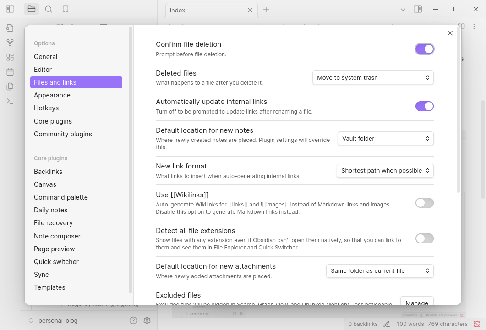
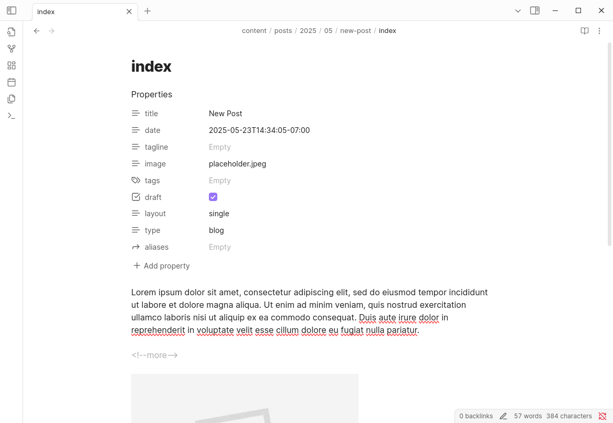

My intro to Hugo was back in 2016, a mere 3 years after its [inception](https://en.wikipedia.org/wiki/Hugo_(software)), when I was in my early days of learning web development. Quite a bit has changed since then, both in what Hugo is capable of and my understanding of how to actually code. I'm far from being a frontend dev, but I've gathered a collection of snippets that I've stumbled upon along the way in bringing this website up to more modern standards.

<!--more-->

# Creating New Posts

To create a new post, typically you would do something like this:

```sh
hugo new posts/2025/05/my-new-post/index.md
```

But manually typing date paths is cumbersome, so instead you can use a target like this in your Makefile:

```sh
new:
	@if [ -z "$(title)" ]; then echo "Please provide 'title'"; exit 1; fi
	hugo new posts/$$(date +%Y/%m)/$(title)/index.md
```

Which can then be used like this:
```sh
make new title=my-new-post
```
# Markdown Render Hooks

Render hooks can be used to override markdown to HTML conversions to give full flexibility in how components are presented while staying being able to write markdown. As useful as [shortcodes](https://gohugo.io/content-management/shortcodes/) are, they typically aren't compatible with normal markdown editors/viewers, which adds a bit of friction when you need to have two windows open (one for editing, and the other for previewing).

Full docs are [here](https://gohugo.io/render-hooks/introduction/), but the components  below are the ones I found that I actually wanted to change.

## Headings
Many websites these days have heading anchors that readers can click on, making it easy to reference or share direct sections of a page. Although Hugo doesn’t have this behaviour by default, a simple template can be used to achieve this.

Create the following file:
```
layouts/_default/_markup/render-heading.html
```

With content that looks something like this:
```html
<h{{ .Level }} id="{{ .Anchor | safeURL }}" class="anchor">
  <a href="#{{ .Anchor | safeURL }}">{{ .Text | safeHTML }}</a>
</h{{ .Level }}>
```

And voila, all your headings in your rendered posts are now anchored!
## Images

I wanted to customise how images and captions were displayed, as well as being able to use markdown syntax for both images and videos. This template does that, which conditionally renders the two media types differently.

I also wanted to show a build warning when an image can't be found (e.g. image was moved or renamed without updating the link), so `warnf` does that.

In this file:
```
layouts/_default/_markup/render-image.html
```

Contents look like so:

```html
<!-- This renders markdown image notation into pics or vids with captions -->
{{ $dest := .Destination | safeURL }}

<div class="row img-captioned">
    <!-- Video -->
    {{ if or (hasSuffix $dest ".mp4") (hasSuffix $dest ".webm") }}
    <video class="img-content" autoplay loop muted controls>
        <source src="{{ $dest }}" type="video/mp4" />
    </video>
    {{ else }}
    <!-- Image -->
        {{ $image := .PageInner.Resources.Get $dest }}
        {{ if $image }}
            {{ $image = partial "resize-image.html" (dict "image" $image) }}
    <a href={{ $image.RelPermalink }}></a>
        {{ else }}
            {{ warnf "Image not found for %s: %s" $.PageInner.RelPermalink $dest }}
        {{ end }}
    {{ end }}
    <p class="caption">{{ .Text | safeHTML }}{{ with .Title }} (Source: {{ . | safeHTML }}){{ end }}</p>
</div>
```

Note: There's a `resize-image.html` partial that's referenced, more on that next!
# Pipes

## Compiling and Minifying CSS
If you're using SASS/SCSS in your stylesheets, Hugo can compile them for you with `toCSS` without having it part of a separate build step. You can also use `resources.Concat` to concatenate multiple files into a single one, and then optionally use `resources.Minify` to minify them, which will work on any CSS, JS, JSON, HTML, SVG, or XML file.

An example that combines all of these operations:

```html
{{ $custom := resources.Get "css/custom.scss" | toCSS }}
{{ $main := resources.Get "css/main.scss" | toCSS }}
{{ $styles := slice $main $custom | resources.Concat "/css/styles.css" | resources.Minify }}
<link rel="stylesheet" href="{{ $styles.Permalink }}">
```
## Processing Images

Before [page bundles](https://gohugo.io/content-management/page-bundles/), images were typically stored under your `/static` directory. But since its introduction in [v0.32](https://github.com/gohugoio/hugo/releases/tag/v0.32), it opens up the ability to process images during the build. For example, if you want to resize and convert all your images that are displayed on your website to `jpg` or `webp`, you can use the partial below.

> Fun fact: Partials can also be used as functions, not just for rendering snippets of HTML.

```go
{{/*
    Usage:
    {{ partial "resize-image.html" (dict "image" $image) }}
    Returns: resized and processed image resource.
*/}}

<!-- Constants -->
{{ $maxSizePx := 1200 }}
{{ $imageType := "jpg" }}

<!-- Input args -->
{{ $image := .image }}

{{ $image_ext := (lower (path.Ext $.image) ) }}
<!-- do nothing for these filetypes -->
{{ if eq $image_ext ".gif" }}
{{ else if eq $image_ext ".png" }}
{{ else if $image }}
    <!-- Resize landscape -->
    {{ if gt $image.Width $maxSizePx }}
        {{ $resizeStrLandscape := printf "%dx %s" $maxSizePx $imageType }}
        {{ $image = $image.Resize $resizeStrLandscape }}
    <!-- Resize portrait -->
    {{ else if gt $image.Height $maxSizePx }}
        {{ $resizeStrPortrait := printf "x%d %s" $maxSizePx $imageType }}
        {{ $image = $image.Resize $resizeStrPortrait}}
    <!-- No resize necessary, just convert -->
    {{ else }}
        {{ $image = $image.Process $imageType}}
    {{ end }}

{{ end }}

{{ return $image }}

```

 Usage of this partial would look something like:
```html
{{ $image := .Resources.Get "posts/myimage.jpg" }}
{{ $image = partial "resize-image.html" (dict "image" $image) }}

```

# Adaptive Syntax Highlighting
Hugo has built in support for [syntax highlighting using Chroma](https://gohugo.io/content-management/syntax-highlighting/), but the default configuration doesn't allow for dynamically setting light/dark syntax highlighting. Fortunately there's an easy workaround with a few configs!

By default, your `config.yaml` may look something like this, which tells the renderer to use the `monokai` style everywhere:

```yaml
markup:
  highlight:
    style: monokai
```

Instead, we can set `noClasses=false` to use an external stylesheet, which will allow us to dynamically set the theme depending if the current colour scheme is light or dark. Change the `config.yaml` to this instead:

```yaml
markup:
  highlight:
    guessSyntax: true
    noClasses: false
```

And then generate your desired stylesheets using the [Hugo CLI](https://gohugo.io/commands/hugo_gen_chromastyles/) (see [here](https://gohugo.io/quick-reference/syntax-highlighting-styles/) for the full list of supported themes):

```sh
# Light mode
hugo gen chromastyles --style=monokailight > static/css/syntax.css
# Dark mode
hugo gen chromastyles --style=monokai > static/css/syntax-dark.css
```

And then include the following in your header to use these stylesheets depending on the colour scheme:

```html
<link rel="stylesheet" href="/css/syntax.css" media="screen">
<link rel="stylesheet" href="/css/syntax-dark.css" media="screen and (prefers-color-scheme: dark)">
```

<hr>

Depending on your other stylesheets, this may be all you need. However, if this still results in some wonky dark mode colours, you can make some manual edits to fix it. The exported chroma stylesheet contains empty classes, which normally would inherit the default text colour from your site, but since we're defining two stylesheets, it may end up inheriting from the light theme instead.

To resolve this, we'll need to do a **search and replace** of `{  }` to `{ color:inherit }` in the second stylesheet, to properly render the text colours based on the colour scheme. So change this:

```css
/* Generated using: hugo gen chromastyles --style=monokai */

/* Background */ .bg { color:#f8f8f2;background-color:#272822; }
/* PreWrapper */ .chroma { color:#f8f8f2;background-color:#272822; }
/* Other */ .chroma .x {  }
...
```

To this:

```css {hl_lines=[5]}
/* Generated using: hugo gen chromastyles --style=monokai */

/* Background */ .bg { color:#f8f8f2;background-color:#272822; }
/* PreWrapper */ .chroma { color:#f8f8f2;background-color:#272822; }
/* Other */ .chroma .x { color:inherit }
...
```

# Building and Deploying
Since my website is hosted on GitHub Pages, I used to manually build and deploy the assets with a script that looked something like this:

```sh
#!/bin/sh
# Usage:
# ./deploy.sh
# ./deploy.sh "Your optional commit message"

# If a command fails then the deploy stops
set -e

printf "\033[0;32mRebuilding website...\033[0m\n"

# Build the project.
hugo # if using a theme, replace with `hugo -t <YOURTHEME>`

# Go To publish folder
cd docs

# Add changes to git.
git add .

# Commit changes.
msg="Rebuild site ($(date))"
if [ -n "$*" ]; then
  msg="${msg}: $*"
fi
git commit -m "$msg"

printf "\033[0;32mPushing updates to GitHub...\033[0m\n"

# Push source and build repos.
git push origin main
```

However, after learning about CI/CD and that it can be quite easy to set up these days, that manual deployment has now been replaced with a Github Action. It runs on commits to main, which then Github picks up on the `gh-pages` branch.

```yaml
name: Github Pages

on:
  push:
    branches:
      - main
  pull_request:

jobs:
  deploy:
    runs-on: ubuntu-latest
    steps:
      - uses: actions/checkout@v4
        with:
          submodules: true  # Fetch Hugo themes (true OR recursive)
          fetch-depth: 0    # Fetch all history for .GitInfo and .Lastmod

      - name: Setup Hugo
        uses: peaceiris/actions-hugo@v3
        with:
          hugo-version: '0.147.1'
          extended: true

      - name: Build
        run: hugo --minify

      - name: Deploy
        uses: peaceiris/actions-gh-pages@v3
        if: github.ref == 'refs/heads/main'
        with:
          github_token: ${{ secrets.GITHUB_TOKEN }}
          publish_dir: ./docs
```
# Bonus: Using Obsidian as a Local CMS

Since Hugo posts are just markdown files, I started using [Obsidian](https://obsidian.md/)  to edit the files. Previously, I was writing content in my IDE, but something about it felt a bit off -- the virtual atmosphere that promoted writing code just didn’t hit the same for writing creatively.

I wanted a simple [WYSIWYG](https://en.wikipedia.org/wiki/WYSIWYG) editor to write my posts in, and with Obsidian being more popular than ever these days, I incorporated it into my workflow and have been finding it quite a joy to use! Now, I can write content in a clean interface using markdown, and have the niceties of having the elements rendered similar to how it'd look on my website without needing to have a separate window open to show the preview.

## Settings

Be sure to disable **"Use Wikilinks"** so that markdown format is used for image links, and select **"Default location for new attachments"** is set to the **"Same folder as current file"**, which works well if page bundles are used.



Note that the filename of the pasted image may not render correctly by Hugo, since it typically doesn't play well with spaces in image filenames. To fix this, just rename the image in Obsidian, which will automatically update the link in your markdown document.
## Plugins

Some days I want to stay within Obsidian and not have to open a separate terminal to commit my changes to Github, and the [Obsidian Git Plugin](https://github.com/Vinzent03/obsidian-git) makes that possible. After setting it up, you can do normal git operations straight from Obsidian for a truly seamless workflow.

There's a plethora of other [community of plugins](https://obsidian.md/plugins) which you can incorporate into your own writing workflow.
## Front Matter

Hugo supports defining your posts' front matter in `yaml` or `toml`, but Obsidian only supports rendering `yaml`. If you have a front matter that looks like this:

```md
---
title: New Post
date: 2025-05-23T14:34:05-07:00
tagline:
image: placeholder.jpeg
tags:
draft: true

layout: single
type: blog
aliases:
---

Lorem ipsum dolor sit amet...
```

It'll be rendered in Obsidian like so, which is pretty nifty!



## On the Go

Obsidian also has iOS and Android apps, but the git plugin isn't the most stable, at least not on iOS. As an alternative, you can follow the steps described in this [Obsidian forum thread](https://forum.obsidian.md/t/setting-up-obsidian-git-on-ios-without-ish-or-working-copy/97800) on setting up either [iSH](https://ish.app/) (free) or [Working Copy](https://workingcopy.app/) (paid). 

With iSH, git can be slow at times (e.g. during `git status` or `git checkout`) since to make it work, it emulates an x86 architecture on ARM-based iOS devices, so the added overhead takes a toll on performance.

But hey, at least works! Paired with automated deployments, it provides a relatively painless (and free!) way for me to update my website from my phone.