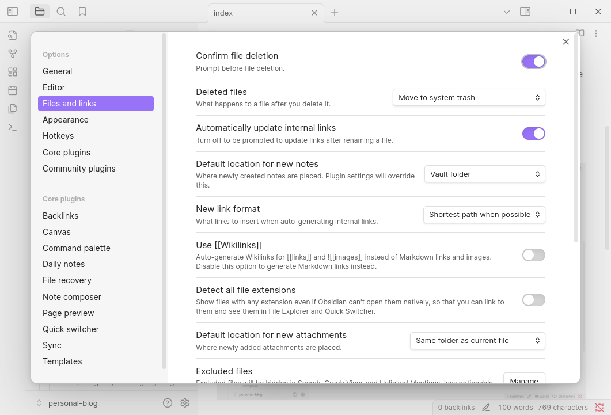

+++
title =     "Obsidian Blog Workflow"
date =      2025-05-19T16:06:14-07:00
tagline =   ""
image =     "settings.png"
tags =      [""]
draft =     true

layout =    "single"
type =      "blog"
aliases =   []
+++

This is my new blogging workflow.

<!--more-->

Be sure to disable "Use Wikilinks" so that markdown format is used for image links, and select "Default location for new attachments" is set to the "Same folder as current file", which works well if page bundles are used.

