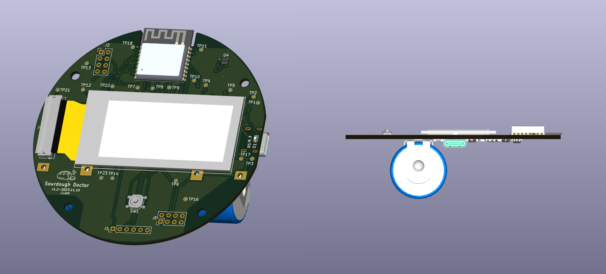

What started off as a fun, quirky prototype became stressful work that I no longer wanted anything to do with. This is the story of how I took the joy out of my passion project. 

<!--more-->

# A Short History

When I first started making sourdough, learning how to use my starter was a bit intimidating due its organic, seemingly unpredictable nature. So like any rationale engineer would do, I used computer vision to watch it rise instead of just monitoring it myself. 

The process had its fair share of flaws, so I put it aside. A few years later, I moved to a new place and my starter did not seem happy, so I decided to make a more robust monitoring system by slapping a bunch of sensors on a 3d-printed lid to track its growth. 

I shared it around the web and it went semi-viral, with a number of people expressing interest in buying one for themselves. I considered making it into a product, since at the time, I was working at a hardware consulting firm where I basically did this in a professional capacity. However, the costs didn’t really justify the return on effort for me; after all, it was still just a prototype and a lot more work was needed to make it consumer ready. 

So I passed on the opportunity and moved on with my life. It also became clear to me that sourdough starter is actually quite predictable, given that you take the time to observe and learn its behaviour.

Then came the email.

> Hi, I saw your sourdough starter lid on your website and I want to make it into a product with your help. Are you interested?

Whoa, some random person found my blog? And someone wants to pay me real money for it?

Suddenly, things became real. At my core, I felt validated because someone saw something I made and believed in it enough to pay me money for it, without me even trying.

Like any responsible adult, I ignored the red flags and decided to jump in.

After a few video calls, I was given the rundown of what the vision of the project would be. I was excited because someone else would be taking care of the funding, and I had the opportunity to just focus on the technical work. What could be better?

# Scoping the Project

At my previous job, scoping was a difficult but necessary part of any new project. Putting a plan together, identifying any risks and unknowns, assessing how those risks can be mitigated - these are all exercises I’ve done countless times before and was very comfortable with.

This new version was supposed to be an iteration of my prototype. Same distance sensor, better temperature/humidity sensor, then addition of a CO2 sensor, and an epaper display instead of an OLED. Backend would be HTTP/REST instead of MQTT, which I wouldn’t have to manage, so that’s even easier.

(insert table of both the old and new version sensors/features)

The biggest risk and unknown was around the new display, since I didn’t have any experience working with one before. So I did my due diligence and found an epaper display with compatible libraries, read a bunch of documentation, and it all seemed A-OK.

Unbeknownst to me, this display was going to be the catalyst of all my issues.

# De-Risking with Prototyping

To sanity check and address the risks, I bought dev kits of the sensors to make sure everything worked together. They were all I2C so it shouldn’t be an issue, but just wanted to confirm.

The epaper display was a bigger beast - it sure required a lot more wires and pins! Pervasive’s docs were a bit all over the place, but eventually I was able to get it working. At least they had examples. Risk was using it with an ESP32 with new architecture. Hello world!

# Design

Design was a lot more complicated than what I’ve done previously. 

Once I had the design complete, I printed it out to make sure that I had all the footprints correct.

Good thing I did, because it turns out the 40-pin connector got the display I used had the wrong pitch, so I had to fix that. Phew!

# Fabrication

(Insert screencap of parts list and pcb quote)

I ordered the boards, and when they came in I was a bit surprised. Even though I printed it out previously, for some reason I didn’t realize then how small some of these parts were. This would definitely be a challenge in reflowing…

Just look at how small U6 is 🫣

(Insert pic of kicad bring up tool)

First one didn’t work. I ordered lead free, low temp solder paste thinking it would be better for me, but it didn’t flow. 

Second attempt, I ordered the right paste and it was much better.

Except it wasn’t. There were still shorts, so start a lot of debugging and manual rework I cleaned up the connector and it turned on!

Kind of. Turns out I got a few things wrong. I was able to connect to the ESP32 but the display wasn’t working. After more debugging, I identified the issue and finally got it to work.

## Version 2

Rev2, trying to figure out why the display wasn’t working on one of the boards.

# Software

Had to switch to FreeRTOS. TaskScheduler wasn’t cutting it. Display and deep sleep made everything a lot more complicated.
# Closing Thoughts

I didn’t get a commercial product. I didn’t even get better bread. But I got a story, a working PCB (mostly), and a reminder that not every project needs to scale. Sometimes, it’s enough to build something strange, learn a ton, and then let it go.