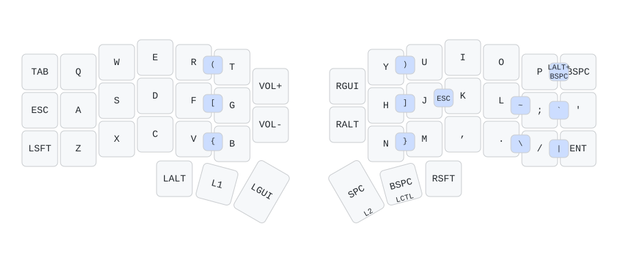
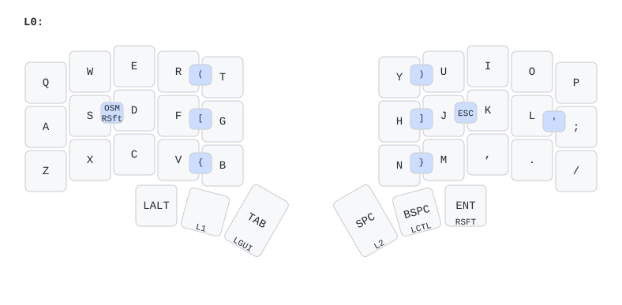
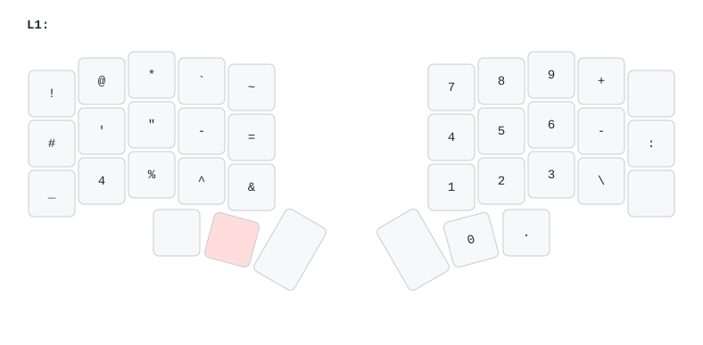
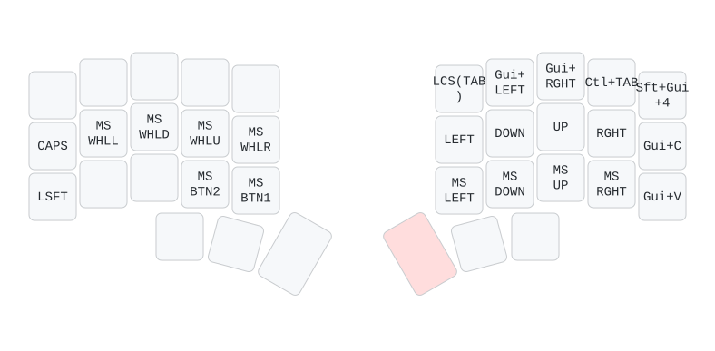
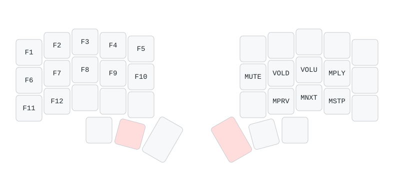

Having used my [Corne keyboard](/posts/2025/05/corne-keyboard) for a while now, I kept seeing 34 and 36 key layouts on [r/ErgoMechKeyboards](https://www.reddit.com/r/ErgoMechKeyboards/) and [KBD News](https://kbd.news/) with a bit of jealousy. I mean, look how dainty the [Ferris Sweep](https://github.com/davidphilipbarr/Sweep) looks! They looked even more minimal compared to my whopping 42 keys, and upon reflection, I found myself not actually using the outer columns that much. So naturally, I began the journey of trimming my layout to use fewer keys with the goal of (arguably futile) minimalism and "efficiency".

<!--more-->

# Why Fewer Keys?

Citing ergonomics would be the knee-jerk reaction, where with this smaller layout, each key is at most 1u key away from a finger. But there's debate about whether fewer keys is actually better since you end up trading off more hand movements for more combos (as well as cognitive overload), as described in more detail in [this blog post](https://getreuer.info/posts/keyboards/40-percent-ergo/index.html). I personally have found smaller layouts more comfortable to use since the reduced wrist and finger stretching induced noticeably less strain on my body, which far outweighs the need for layers, combos, and memorizing a new layout.

Granted, there's probably a sweet spot of reduced keys that is greater than ~30-40% to gain ergonomic benefits without the need to learn a radically new layout, such as the [Silakka54](https://github.com/Squalius-cephalus/silakka54?tab=readme-ov-file) which contains a number row and outer columns. Although honestly for me, it's fun to dive into creating a personalized layout that suits my own computing needs, and the aesthetics of having such a minimal keyboard are hard to beat (through my rose-tinted glasses anyway).

# Relocating the Outer Keys

The main changes to my previous [42-key layout](/posts/2025/05/corne-keyboard/#keymap) were figuring out where to put the outer column keys, which consisted of `TAB`, `ESC`, `SHIFT`, `BACKSPACE`, `'`, and `ENTER`. For the keys in the inner column, I never really used them and just mapped them superfluously to `VOL+`, `VOL-`, `RGUI`, and `RALT`, so losing those isn't a big deal.

## Tab, Enter
These were remapped to the thumb clusters, since there were some remaining keys that weren't using tap modifiers (e.g. `LGUI` and `RSFT`). No major issues or adjustments here, since it's fairly similar to hitting `SPACE` with a thumb.

## Backspace
I had this in the top right corner out of habit, but I eventually got used to using backspace with my thumb so it became redundant. I thought I would miss the `LALT+BSPC` combo for easily deleting words (on macOS), but I found that hitting `LALT` with my left thumb and `BSPC` with my right thumb was equally as convenient.

## Escape
After adding the `J+K` combo to be `ESC`, it quickly became accustomed to it since it's just so convenient! Again, this outer position became redundant, and was an artifact of remapping `CAPSLOCK` to "`CTRL` when held, `ESC` when tapped".

## Apostrophe, Quotation Mark
Not having the apostrophe and quotation mark in the normal position was definitely quite an adjustment. I initially tried putting it with the rest of the symbols in my symbols layer, but it just didn't feel natural. Things clicked once I created a combo on `L+;`, and I've been using that since.

## Shift

I previously tried home row mods but couldn't get used to it without causing accidental misfires.

# Keymap

The diagrams below show my final 36 key layout. The main changes were on the main layer, although I did rearrange the function keys on the last layer since I could no longer span `F1` to `F12` along the top row (which didn't make much sense to do anyways). The left half RGB controls were replaced with the function keys. In retrospect, I could have matched the order of the function keys to mimic the numpad (or even be in the same position as them), but I'd rather have the media keys on the right side (since I use the mouse on my left hand). I rarely use the function keys anyway, so they're just there in the odd time that I need it.

I've been using this layout with success for a few weeks now, and it's been quite good. Now to start shopping for an actual 36 key keyboard...