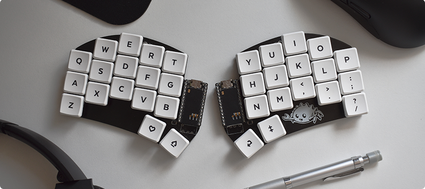
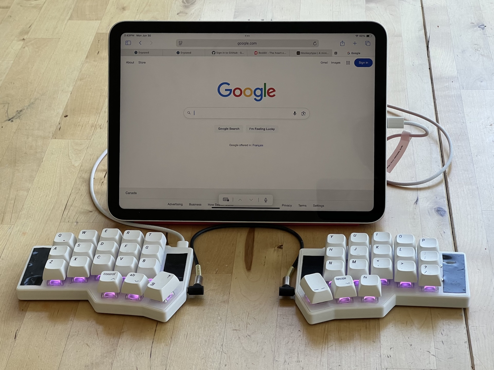

Having used my [Corne keyboard](/posts/2025/05/corne-keyboard) for some time now, I kept seeing 34/36 key layouts on [r/ErgoMechKeyboards](https://www.reddit.com/r/ErgoMechKeyboards/) with a growing amount of envy. I mean, the minimalist aesthetics of the [Ferris Sweep](https://github.com/davidphilipbarr/Sweep) are just so enticing! Staring down at my whopping 42 keys, I found myself not actually using the outer columns that often and wondered if I too could join the ranks of those using even fewer keys…

So naturally, I removed the extraneous keys, covered the openings with electrical tape, and began the pursuit of trimming my layout with the goal of (arguably futile) minimalism and "efficiency".

<!--more-->

# Why ...
## ... Fewer Keys?

Citing ergonomics would be the knee-jerk reaction, where with this smaller layout, each key is at most 1u key away from a finger. There's some debate about whether fewer keys is actually better, since you end up trading off more hand movements for more combos (as well as cognitive load), as described in more detail in [this blog post](https://getreuer.info/posts/keyboards/40-percent-ergo/index.html). I personally found smaller layouts to be more comfortable to use since the reduced wrist and finger stretching induced noticeably less strain on those body parts, which far outweighed the need for layers, combos, and memorizing a new layout.

Granted, there's probably a sweet spot of reduced keys that is greater than ~30-40% to gain ergonomic benefits without the need to learn a radically new layout. Take the [Silakka54](https://github.com/Squalius-cephalus/silakka54?tab=readme-ov-file) as an example, which contains a number row and outer columns, so it’s a minimal departure from the layout of a standard keyboard. 

Although for me, it's honestly fun to dive into creating a personalized layout that suits my own computing needs, and the aesthetics of having such a minimal keyboard are hard to beat (through my rose-tinted glasses anyway).

## ... 36 and Not 34 Keys?
It should be noted that going from 42 to 36 keys was relatively straightforward, since I was able to place all the required modifiers across the thumb clusters while still having layer keys. 

However, going down to 34 keys (thus removing two of the thumb keys) makes the reduction much more challenging, since relocating the modifiers to no longer be on dedicated keys requires a bit more creativity. Mod taps become a necessity (e.g. through the use of home or bottom row mods), or something like [Callum mods](https://keymapdb.com/keymaps/callum_oakley/) which uses one shot modifiers on a separate layer. This was something I wasn't quite ready to do yet, so I decided on a "sane" reduction to 36 keys.

# Relocating the Outer Keys
The main challenge in reducing a [42-key layout](/posts/2025/05/corne-keyboard/#keymap) to 36 keys were figuring out where to put the outer column keys, which consisted of `TAB`, `ESC`, `SHIFT`, `BACKSPACE`, `'`, and `ENTER`. For the keys on the inner column, they didn’t see much use anyway since I just mapped them superfluously to `VOL+`, `VOL-`, `RGUI`, and `RALT`, so losing those wasn’t a big deal.

## Tab, Enter

I added these keys to the remaining thumb cluster keys that weren't using tap modifiers (e.g. `LGUI` and `RSFT`). No major issues or adjustments here, since it was fairly similar to hitting `SPACE` with a thumb. `ENTER` was placed on the opposite side of `LGUI` so that combo could still be easily used for some desktop and web apps (e.g. to submit a comment in GitHub or Jira).

## Backspace
Out of habit, I had this in the top right corner, but I eventually got used to using backspace with my thumb so it became redundant. I thought I would miss the `LALT+BSPC` combo for easily deleting words (on macOS), but I found that hitting `LALT` with my left thumb and `BSPC` with my right thumb was equally as convenient.

## Escape
After adding the `J+K` combo to be `ESC`, I quickly became accustomed to it since it was just so convenient! Again, this outer position became redundant, and was an artifact of remapping `CAPSLOCK` to "`CTRL` when held, `ESC` when tapped".

## Apostrophe, Quotation Mark
Not having the apostrophe and quotation mark in the normal position was definitely a bit jarring. I initially tried putting it with the rest of the symbols in my symbols layer, but it just didn't feel natural. Things clicked once I created a combo on `L+;`, and I've been using that since.

## Shift
I previously tried home row mods, but couldn't get used to it without causing accidental misfires. I also tried using shift on one of the thumb keys, but I found that it was difficult to keep shift held down when typing all caps. Yes, I could just use capslock, or better yet capsword, but the latter was not available on my keyboard's version of vial (since it was purchased as a prebuilt without access to the firmware), and I'm not a fan of toggling capslock on/off while typing.

I wanted to keep the shift on the pinky, so I changed `Z` to be "`SHIFT` when held, `Z` when pressed" (aka `SHIFT_T[Z]`). This worked decently until I started typing quickly, which then resulted in shift not being registered (e.g. Instead of "La", it would output "zla"). 

This was mildly frustrating, so I started playing around with one shot modifiers. I mapped it to the `S+D` combo, and it actually flowed quite well into my typing habits. I still occasionally had misfires of an extra shifted letter when typing quickly (e.g. "LA" instead of "La"), but this happened far less often then with `SHIFT_T[Z]`.

However, for holding down shift while typing as well as for combos (e.g. selecting text), I still use `SHIFT_T[Z]` for that, which works without issue. Optionally, I can hit `S+D` twice in succession to enable or disable holding the shift key (so effectively capslock). Some may find it burdensome to having too many different options to remember, but I like how they serve different use cases: shifting while typing is a different rhythm and hand position than shifting while navigating, doing motions, etc.

With `SHIFT_T[Z]`, I figured I might as well try adding the rest of the modifiers (`ALT`, `CTRL`, `GUI`) as tap mods, so home row mods but on the bottom row. This actually worked surprisingly well, and removed many of the misfire issues I experienced with home row mods without having to fiddle around with [tapping term](https://precondition.github.io/home-row-mods#finding-the-sweet-spot) or enabling [chordal hold](https://docs.qmk.fm/tap_hold#chordal-hold) or [flow tap](https://docs.qmk.fm/tap_hold#flow-tap) (which again, my version of vial did not support). Ironically, this made me realize that transitioning to 34 keys would not be as out of reach as I initially thought, but I shelved that idea to be revisited another time.

# Revised Keymap

The diagrams below show my “final” 36 key layout. 

The main changes were on the main layer, although I did rearrange the function keys on the last layer since I could no longer span `F1` to `F12` along the top row (which didn't make much sense to do anyways). The left half RGB controls were replaced with the function keys. In retrospect, I could have matched the order of the function keys to mimic the numpad (or even be in the same position as them), but I'd rather have the media keys on the right side (since I use the mouse on my left hand). I rarely use the function keys anyway, so they're just there in the odd time that I need it.

I've been using this layout with success for a few weeks now, and it's been quite good. Now to start shopping for an actual 36 key keyboard...

