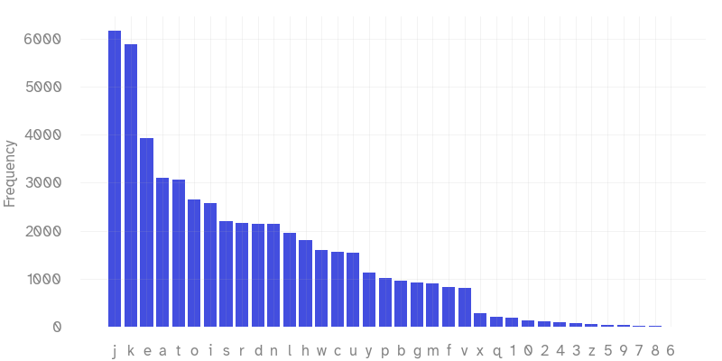
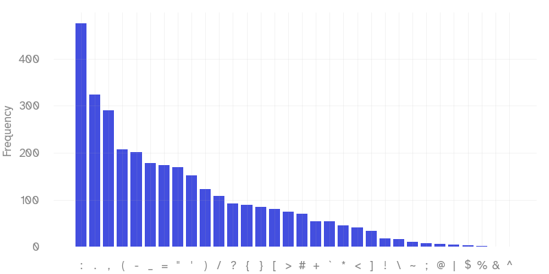
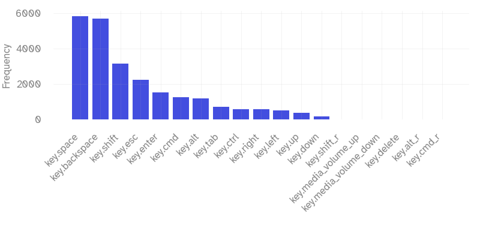

When first designing my layout on my Corne keyboard, I was mostly focused on the macro level of what layers keys should go on, as well as the ease of common workflows like selecting text or switching workspaces. I put *some* thought into the placement of each symbol, but now that I’ve grown very comfortable with my keyboard, it’s a good opportunity to revisit the micro details of the symbol placements.

<!--more-->

# Why go through the hassle?

You might be wondering why not just copy the symbol positions of a standard keyboard along the top row. While this works, it’s not the most efficient, or at least not in my experience. I found that having the numbers in a row was actually hard to remember the positions of them, whereas using a numpad was more natural and allowed for single hand entry.

For symbols, I initially just put them in order spanning the rows, but wanted to put my most used symbols on the home row for ease of use.


I mainly use Python at work, so these symbol usages will be biased towards that. Every language will have its own set of common symbols, so keep that in mind when designing your own.

[Symbols](https://getreuer.info/posts/keyboards/symbol-layer/index.html)
# Doing Some Research
## Gathering the Data
To start, I created a simple python script to log all my keystrokes. I left it running in the background for a week. It stores only saves to a persistent file when the script is terminated, but this didn’t seem to cause any issues for me.

```python
import json
from pynput import keyboard
from pathlib import Path

# Path to the JSON file where stats will be stored
STATS_FILE = Path("key_stats.json")

# Load existing stats or initialize a new dictionary
def load_stats():
    if STATS_FILE.exists():
        with open(STATS_FILE, "r") as f:
            return json.load(f)
    return {}

# Save stats to the JSON file
def save_stats(stats):
    with open(STATS_FILE, "w") as f:
        json.dump(stats, f, indent=4)

# Update key stats
def update_stats(key, stats):
    try:
        key_str = (key.char if hasattr(key, 'char') and key.char else str(key)).lower()
    except AttributeError:
        key_str = str(key)
    
    if key_str in stats:
        stats[key_str] += 1
    else:
        stats[key_str] = 1

# Key press handler
def on_press(key):
    global stats
    update_stats(key, stats)
    save_stats(stats)

# Initialize stats
stats = load_stats()

# Start listening to key presses
print("Keylogger started. Press 'Ctrl + C' to stop.")
with keyboard.Listener(on_press=on_press) as listener:
    try:
        listener.join()
    except KeyboardInterrupt:
        print("Keylogger stopped.")
        save_stats(stats)

```

The output data file looks something like this, making it easy to plot histograms of.

```json
{
    "key.cmd": 1259,
    "k": 5877,
    "key.shift": 3153,
    "l": 1953,
    "h": 1803,
    "e": 3930,
    "y": 1119,
	...
}
```

## Analyzing the Data

### Alphanumeric Keys

J and K are the most used because of vim. Yes, they aren’t the most efficient movement types, but even though I use ctrl+d and ctrl+u (among others), it adds up in usage due to many one off line moves. 

Nothing too surprising here, except maybe how infrequently X, Q, and especially Z are not used.



### Symbol Keys

I predominantly use python (and vim) at work, so these symbols will reflect that. I’m actually surprised that square brackets are my least commonly used bracket types.



### Miscellaneous Keys

It’s no surprise that space and backspace are the most common by a wide margin. 

Because I use macOS, CMD and ALT are the most used modifiers. CTRL would likely be lower if it weren’t for my vim keybindings. 



# Improving the Placements

Before:

After:
