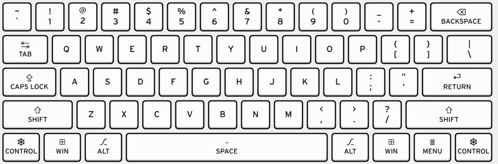
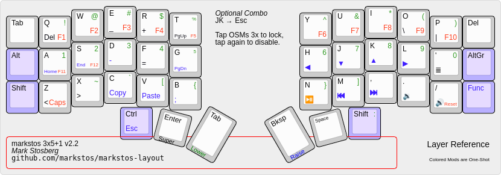
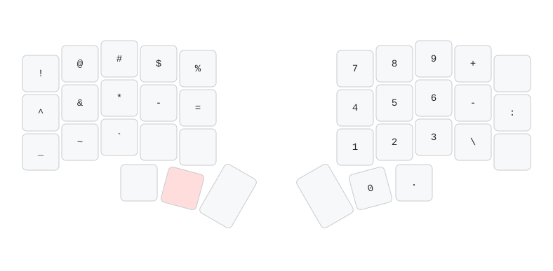
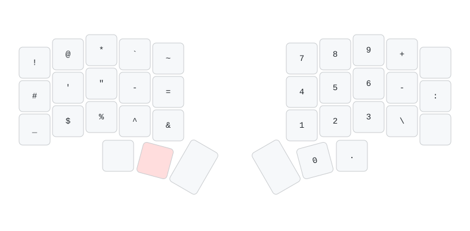

When first designing my layout on my [Corne keyboard](/posts/2025/05/corne-keyboard), I was mostly focused on the macro level of what layers keys should go on as well as the ease of common workflows like selecting text or switching workspaces. I put *some* thought into the placement of each symbol, but after growing quite comfortable with my keyboard and having a nagging feeling that something about the placement of my symbols felt off, it was finally a good opportunity to revisit the micro details of my symbols layer.

<!--more-->

# Why Go Through the Hassle?

You might be wondering - why not just copy the symbol positions of a standard keyboard along the top row? While this works, it’s not the most effective, or at least not in my experience. With the numbers across home row and the corresponding symbols along the top row, I found it kind of difficult to remember where the second half of the numbers were (e.g. was `7` on my middle or ring finger?). Switching the numbers to be a numpad layout was much easier to remember for me, since it leveraged the same muscle memory as in standard layouts as well as allowing for single-handed entry.





Although I could have used the numeric position as the symbols' position (e.g. `!` at `1`, `@` at `2`, etc.), I would still need to train myself to commit the new positions to memory. But if I'm doing that anyway, I may as well create a personalized, brand new layout for symbols to memorize! 

I initially just put them in order spanning the rows on the left half, which worked okay but I figured it would be better to put my most used symbols on the home row for ease of use.

The pic below is from another blog I came across during my research, which showed their grid of relative effort for each key placement. I generally agree with most of it, except I find the bottom pinky position actually quite easy, likely because of my habit of using my pinky to hold down the `SHIFT` key (in lieu of using `CAPSLOCK`), and/or because my pinkies are strong from [rock climbing](https://www.youtube.com/shorts/SjlCFlNW8UI).


I mainly use Python at work, so these symbol usages will be biased towards that. Every language will have its own set of common symbols (as explained in depth by [Pascal Getreuer](https://getreuer.info/posts/keyboards/symbol-layer/index.html), so keep that in mind if you decide to design your own layout.

# Getting Nerdy With It
## Making a Keylogger

To start, I created a simple python script to log all my keystrokes. I left it running in the background for a week or so to gather enough data, since my day to day involves both coding and writing documentation. The script only saves to a persistent file when it's terminated, but this didn’t seem to cause any data loss issues for me.

```python
import json
from pynput import keyboard
from pathlib import Path

# Path to the JSON file where stats will be stored
STATS_FILE = Path("key_stats.json")

# Load existing stats or initialize a new dictionary
def load_stats():
    if STATS_FILE.exists():
        with open(STATS_FILE, "r") as f:
            return json.load(f)
    return {}

# Save stats to the JSON file
def save_stats(stats):
    with open(STATS_FILE, "w") as f:
        json.dump(stats, f, indent=4)

# Update key stats
def update_stats(key, stats):
    try:
        key_str = (key.char if hasattr(key, 'char') and key.char else str(key)).lower()
    except AttributeError:
        key_str = str(key)
    
    if key_str in stats:
        stats[key_str] += 1
    else:
        stats[key_str] = 1

# Key press handler
def on_press(key):
    global stats
    update_stats(key, stats)
    save_stats(stats)

# Initialize stats
stats = load_stats()

# Start listening to key presses
print("Keylogger started. Press 'Ctrl + C' to stop.")
with keyboard.Listener(on_press=on_press) as listener:
    try:
        listener.join()
    except KeyboardInterrupt:
        print("Keylogger stopped.")
        save_stats(stats)

```

The output data file looked something like this, which made it easy to visualize afterwards.

```json
{
    "key.cmd": 1259,
    "k": 5877,
    "key.shift": 3153,
    "l": 1953,
    "h": 1803,
    "e": 3930,
    "y": 1119,
	...
}
```

I manually split up the json file into alpha, symbols, and misc files to graph the keys in logical groups. I considered building this into the script, but decided not to since it didn't seem worth the effort for this one-time data collection and analysis.
## Patterns, Pain Points, and Priorities

### Alphanumeric Keys

`J` and `K` were the most used, most likely because of vim. Yes, they aren’t the most efficient motions, but they do add up in usage due to many one off line moves (in comparison to larger motions like `CTRL+D`, `CTRL+U`, `CTRL+[`, `CTRL+]`, etc.). 

Nothing too surprising here, except maybe how infrequently `X`, `Q`, and especially `Z` were not used by a relatively wide margin.


### Symbol Keys

As mentioned before, I predominantly use Python (and vim) at work, so these symbols will reflect that (e.g.  high usage of `:` for vim commands, low usage of `;` since Python doesn't use semicolons at the end of each line like C/C++ do). I’m actually surprised that square brackets are my least commonly used bracket types since it's used for array indices and dictionaries, but I guess it's not as frequent as I thought.

It's no surprise that the symbols `@|$%&^` are the least used, so the placement of those symbols will be fine in less-optimal positions.


### Miscellaneous Keys

Since I use macOS, `CMD` and `ALT` are the most used modifiers (e.g. `CMD+C` to copy, `ALT+LeftArrow` to navigate text by word). `CTRL` would likely be lower if it weren’t for my vim keybindings, although on Linux or Windows, I'd imagine it'd take the place of `CMD` (e.g. since on those platforms, copying is `CTRL+C`).

Interestingly, the arrow keys are fairly equal in usage. I also wonder if it's common for `SPACE` and `BACKSPACE` to be so close in usage together - maybe I make a ton of typing mistakes? 


# Tweaking for Ease of Use and Comfort

With this data, I can now put the symbols in places that make a bit more sense!

I kept `!` and `@` in the same positions out of habit, and it didn't really make sense to move those. Home row now contains `#'"-=`, and I opted to put `_` where `SHIFT` would be since I find it quite comfortable to hit that bottom corner key with my pinky while typing variable names (e.g. `some_variable_like_this`), which leverages the same "hold shift while typing for all caps" muscle memory. I also decided to add `'` and `"` as separate keys to make those easier to type, especially with `"` no longer requiring an additional `SHIFT` key to hit. 

`$%^&` are now on the bottom row since they don't see as frequent usage.

Keen readers might notice that the parentheses, brackets, and braces are nowhere to be found. They weren't forgotten, but rather promoted to my main layer as combos! See my main keymap [here](/posts/2025/05/corne-keyboard/#main-layer) for details. I did switch the position of `[]` and `()` so the latter is on home row instead, based on it being more frequently used from my data above.



After a few weeks of using this layout, I can say for sure that it's quite an improvement. Common symbols are easier to type, and as a result, it was also easier to memorize these new symbol placements.

Admittedly, I still find myself using my alpha-layer combo of `L+;` to type the quotation more often, so time will tell if I decide to replace those two home row positions with something else. Otherwise, I'm quite happy with the result of this exercise. 

Hooray for data driven decisions!