As I continued the descent into my split ergonomic keyboard addiction, I decided to handwire the Skeletyl keyboard from BastardKB. 

My [Corne]() was a good intro keyboard, but I eventually determined it had more keys than [I actually needed](). I also grew intrigued towards keyboards with better ergonomics - more stagger and splay to improve alignment with ring and pinky fingers, as well as keyboards with sculpted, organic surfaces to better follow my hand’s natural shape. 

Other keyboards like the Dactyl and Charybdis seemed to be the most popular, but I was searching for something smaller and less bulky looking. I also didn’t want to design my own using Cosmos just yet, since I knew it’d take a few iterations to get right and be difficult without my own 3D printer. 

The Skeletyl spoke to me on an intimate level, and although it lacked an integrated pointing device like a trackpoint, it checked enough boxes that I became sold on that form factor.

<!--more-->

Since I had never used a keyboard like this before, I was hesitant to put too much money into it. Prebuilt options and kits were going for >$300 CAD, which was more than I was willing to empty my wallet with for something that may or may not work long term for me. Although I could have sourced the PCBs and parts myself, this was a great opportunity to get my extremities wet with handwiring since it would keep costs low, as well as being suited well for a complex-shaped board like this one. 

With the decision made, I began my journey.
# Bill of Materials

My friend from [Ember Prototypes](https://www.emberprototypes.com/) was kind enough to print the case for me, but if you don't have access to a 3D printer yourself or a friend who does, many local libraries have them and are very affordable. Otherwise, places like JLCPCB offer printing for not too much. 

Total cost for my build was **~$70 CAD**, where $45 of it was from the keycaps and (relatively expensive) switches. Aside from the case, all parts were sourced from Amazon and Aliexpress.

If you're looking to build one yourself, based on the parts I found it can range from **$45-100 CAD**. Getting the build to be <$40 would likely be possible if you hunt a bit harder for better deals, especially since switches and keycaps make up for a large portion of the overall cost. Alternatively, 3D printing your own keycaps is an option to further save some money.

For my build, I chose the same TTC Frozen Silent v2 switches that I used on my [Corne keyboard](/posts/2025/05/corne-keyboard), and I bought blank PBT in the XDA profile. I tried Cherry/OEM profile, but I wasn’t a fan of feel or look of the sharp corners.

| Part                           | Quantity | Cost (in CAD) |
| ------------------------------ | -------- | ------------- |
| 3D printed case (top + bottom) | 2        | $0-15         |
| M4 heat-set threaded inserts   | 12       | $2            |
| M4 5mm fasteners               | 12       | $3            |
| 1N4148 diodes (through hole)   | 36       | $1            |
| TRS/TRRS connectors            | 2        | $3            |
| RP2040 Zero dev board          | 2        | $12           |
| TRS cable                      | 1        | $4            |
| MX switches                    | 36       | $5-30         |
| MX-compatible keycaps          | 36       | $15-30        |

# The Build

## Schematic

The wiring followed a basic row/column matrix, where the diodes were connected along the rows, and the remaining switch legs were wired directly together in columns.

On the MCU, the pins required were:
- Switch matrix, 4 rows x 5 columns = 9 GPIO pins
- TRS connector (soft serial) = 1 GPIO pin, VCC, GND

[insert wiring diagram or just qmk config]

[insert matrix diagram]
## Assembling the Hardware

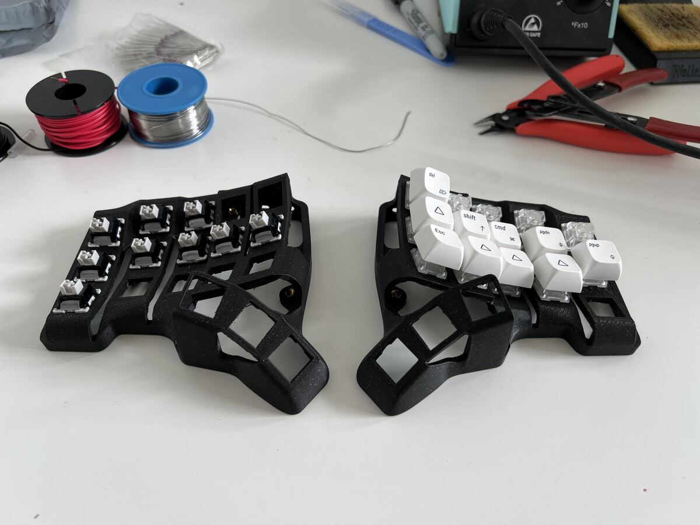

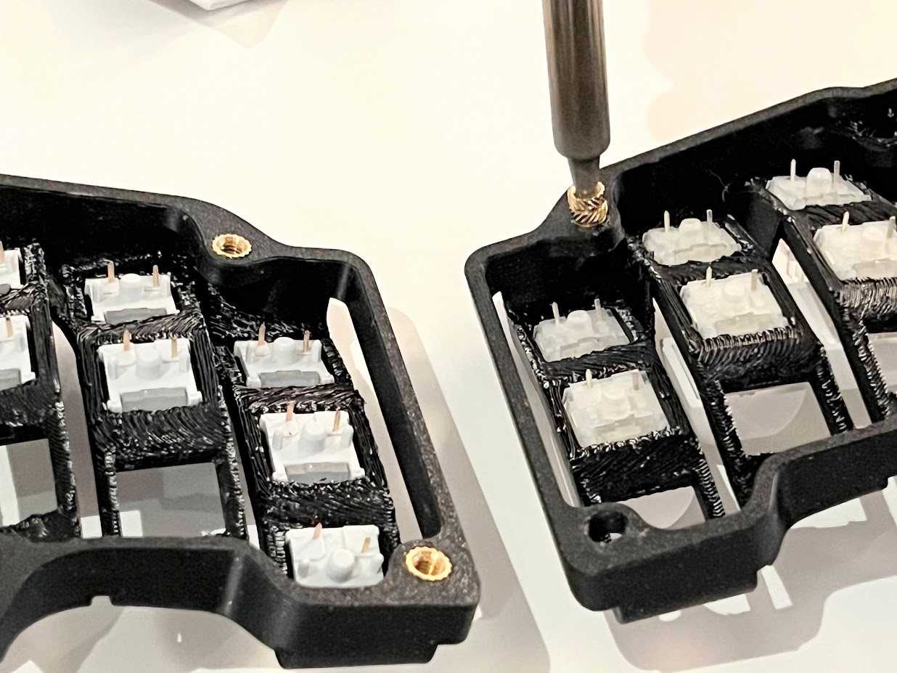

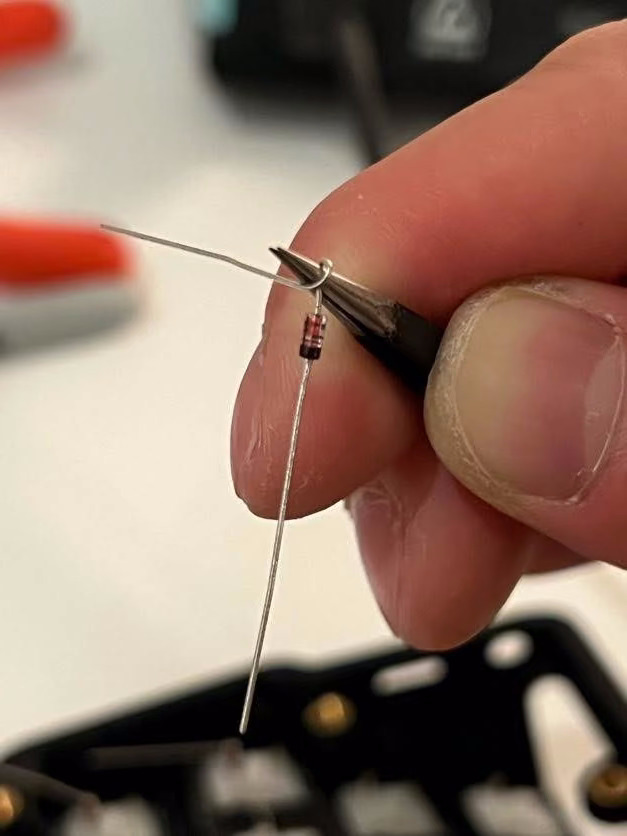

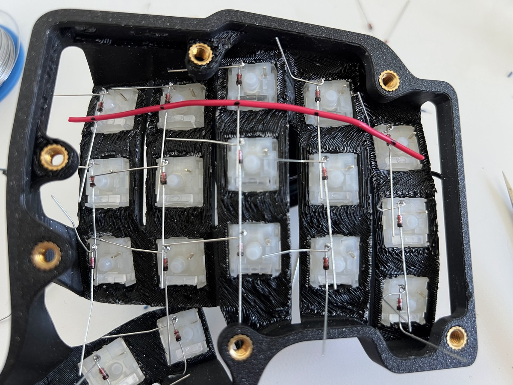

For splicing the wire, this turned out to be easier to do than expected. Joe Scotto’s way is to use bare copper wire and heat shrink the intersections, but I don’t think it’s actually that much faster since it still takes time to cut, place, and heat the heat shrink.

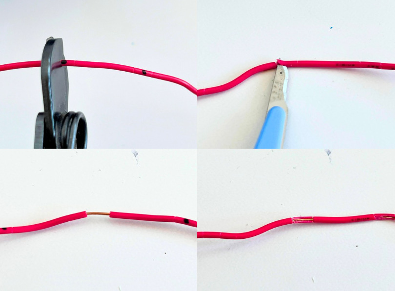

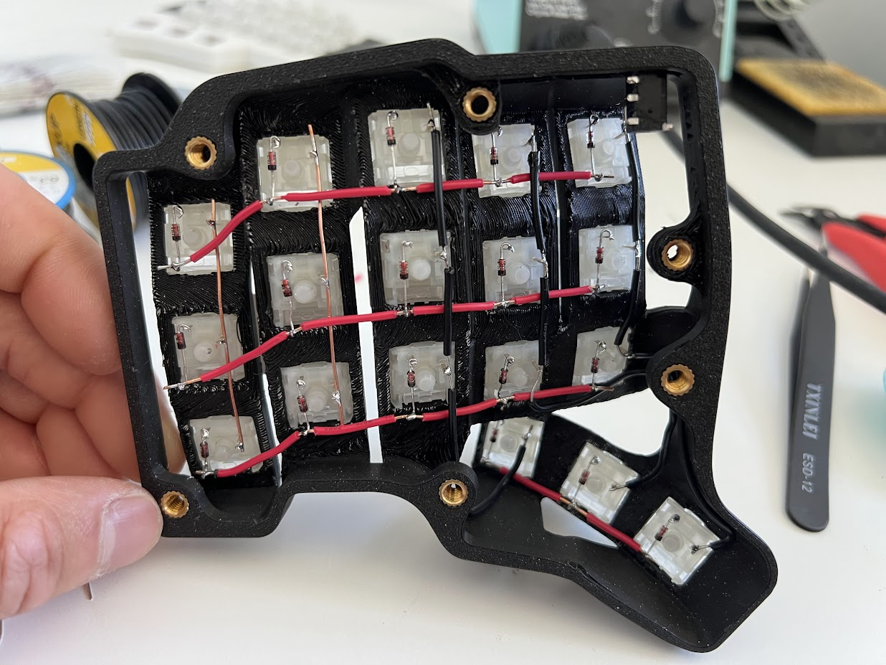

One weird aspect of sculpted keyboards is how the thumb clusters are on a different plane than the rest of the keys. The wiring ended up looking a little funny, but I wanted to hide it reasonably well to prevent them peeking through the exposed sections of the case. 

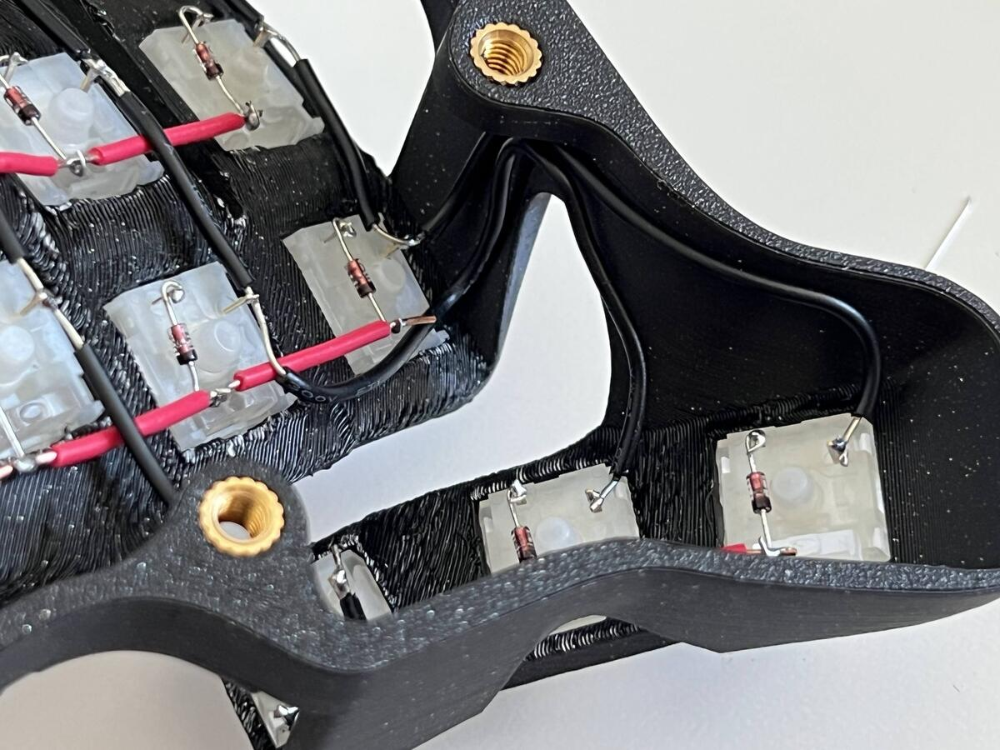

With the matrix all done, all that was left was to wire each row and column to the MCU. I chose to solder these blue wires at the ends of each row and column to keep things looking tidy. The MCU was oriented upside down so the reset buttons would still be easily accessible when fully assembled.

For the TRS connector, I initially bought ones on breakout boards, but it turned out to be way too bulky so I had to desolder it. Was a bit of a pain, but it worked out in the end.

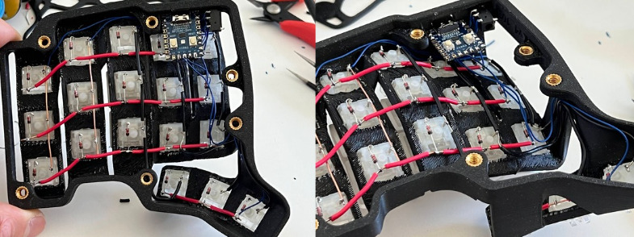

Doing everything again for the other half, and it was complete!

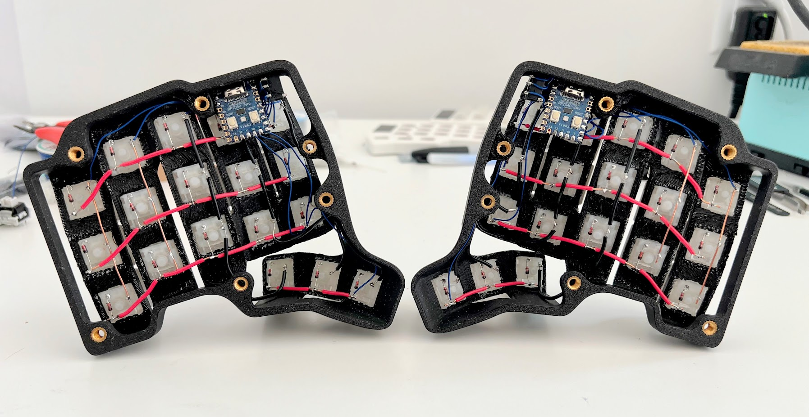

I initially thought to design a nice 3D printed bracket to hold the MCU and TRS connector, but I was impatient and opted for the hacky way of just using hot glue since I was likely only going to be building this once.

Surprisingly, the glue was sturdy enough to hold the components in place even when plugging/unplugging the cables from them.

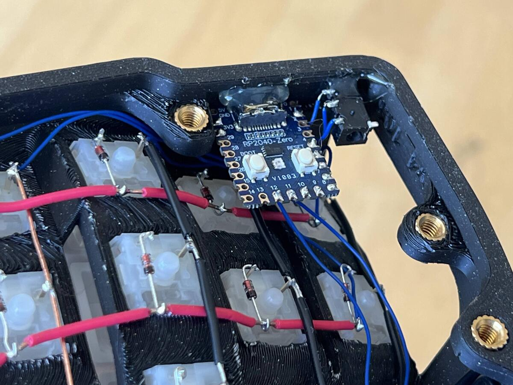

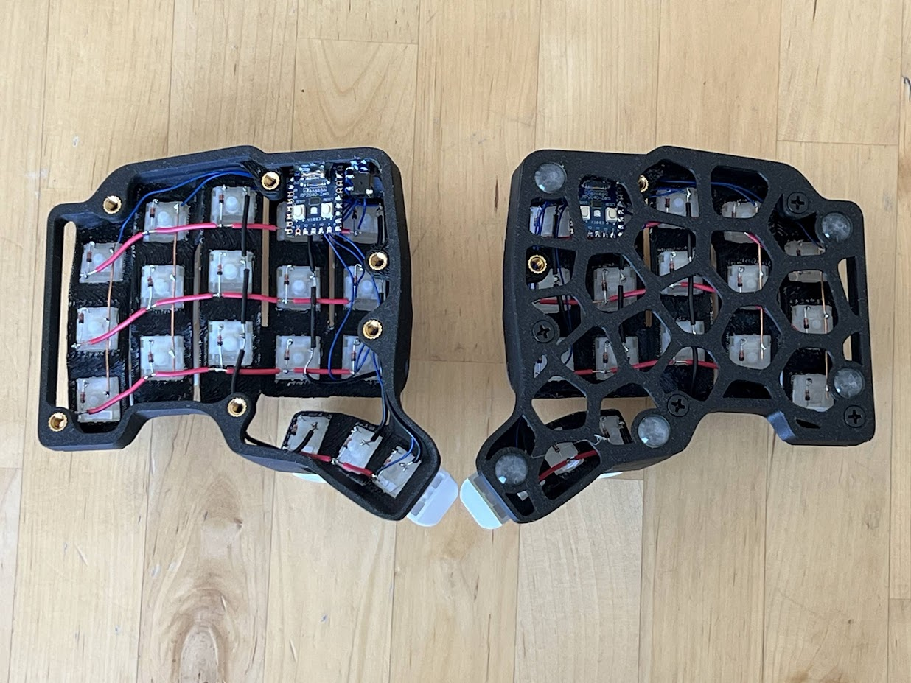

## Compiling the Firmware

### QMK

Forked the QMK repo, ran the new keyboard command, and then updated the config. With the RP2040, the bootloader and processor need to just be RP2040 instead of the dev board, which is one of the default options.

It took a while to figure out what the correct configuration was for the layout, but I eventually got it done with a bit of help from ChatGPT.

### Vial?

My previous keyboard came with vial, and it was immensely helpful to be able to play around with different key layouts and tweaks without having to compile and flash for every small change. Since I had my 36 key layout dialled in (or so I thought, more on that later), I thought that having a relatively stable layout in QMK would be sufficient.

And then I actually went through the process of compiling/flashing firmware, and I immediately wanted vial back!

The main reason was because the process to make changes on a split keyboard are:
1. Update configuration
2. Run command to compile firmware
3. Unplug USB cable from keyboard
4. Unplug TRS cable from both halves
5. With one half, turn upside down and press reset on the MCU to enter bootloader mode
6. Plug USB cable back in
7. Open file explorer, move firmware file to bootloader
8. Unplug USB cable to exit bootloader mode
9. Repeat step 5-8 for other half (may not be necessary depending on type of change)
10. Plug TRS cable back in to both halves
11. Plug USB cable back in to keyboard
12. Test updated configuration
13. Repeat from step 1 as needed

Compared to the process with vial:
1. Open vial.rocks in web browser
2. Update configuration
3. Test updated configuration
4. Repeat from step 2 as needed

Way easier and faster right? Especially when fiddling with timing or mouse key configurations, it’s just a much better development cycle since vial enables immediate changes.

### Yes, Vial

Anyway, setting up vial was relatively straightforward. It involved creating a new config from the QMK one, and adding an extra config file that describes the visual representation of the keyboard. This config maps what you see in the UI to the key in QMK.

It was mildly annoying since I initially forked the QMK repo, and vial requires forking their repo instead, so I just had to copy files into the vial repo to continue from there.
# Layout Tweaks
I thought that my 36 key layout would be fine, but it was not. Since the thumb cluster was wider, the farthest thumb no longer felt as comfortable or easy to hit, especially for combos like CMD+T. Then I went into bottom row mods, which helped.

Another thing I noticed was how my hands wanted to rest in home row, whereas in a flat keyboard, I found it to matter less where the resting position was since it could just move laterally to correct without issue.

# Final Thoughts

One interesting thing about sculpted keyboards is that if the rubber feet were a bit dusty, the keyboard would have a tendency to shift while typing. This is not an issue with flat keyboards since the direction of force is vertically down, whereas here, the force vectors are also horizontal. This can be mitigated by making sure the rubber feet are clean and have good grip, or adding weight with motorcycle weights.

Hitting the inner column keys with the forefinger is also a little awkward. But the ring and pinky fingers feel very comfortable. 

Thumb clusters could bed a little lower and close together, since outer key is hard to reach.

Maybe it is time to make my own dactyl?

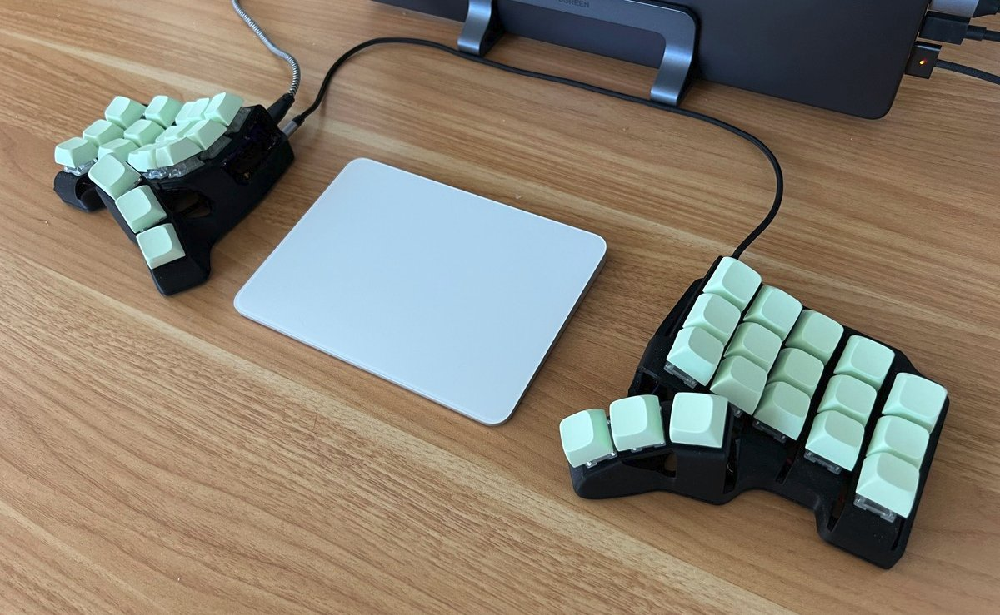

A month passed, still looking for my next keyboard to make it even more appealing.