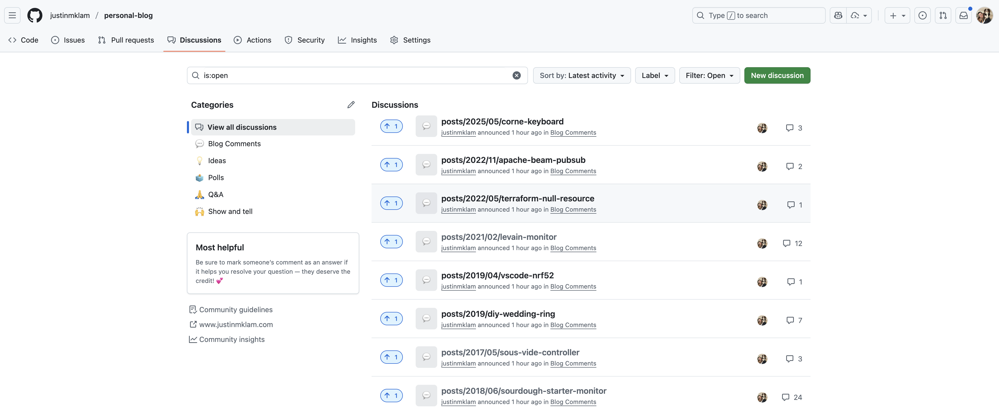
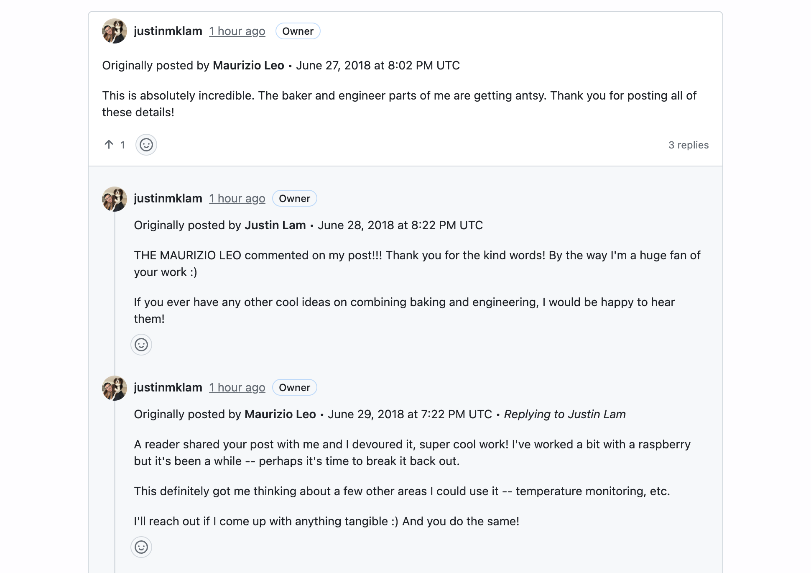

As you might have noticed, I've put this website through a number of changes this year. Apart from changing the theme (sorry if you hate blue), I also switched my website metrics from Google Analytics to [Umami](https://umami.is/), which is an open source, privacy focused analytics platform. 

Along the same vain, it was finally time to move on from Disqus. 

<!--more-->

Disqus was the go-to commenting platform back in the 2010s, but over time they've become focused on profiting through [selling user data and advertisements](https://markosaric.com/remove-disqus/), as well as just being [very bloated](https://victorzhou.com/blog/replacing-disqus/). The final straw was adding advertisements to their free plan, and despite them not enabling it (yet) for small, non-commercial websites like this one, it's likely only a matter of time before they go that direction.

# Prior Art

There are a number of cloud and self-hosted Disqus alternatives, but I wanted something open source, simple, no-frills, and low maintenance. For this static site hosted on Github Pages, it seemed silly to self-host a comment platform like [Isso](https://github.com/isso-comments/isso) or [Commento](https://github.com/adtac/commento) just for the <100 comments I have. 

[Utterances](https://github.com/utterance/utterances) was previously a common choice which uses Github Issues, but I settled on [Giscus](https://github.com/giscus/giscus) since it uses the (more logical) Github Discussions component instead. It also seemed to be the go-to choice these days amongst bloggers, as well as being the most actively maintained of these tools.

One caveat to using a Github-based tool is that users need to have a Github account to comment and react to a post. I mostly write about tech, so most of my users likely already have Github accounts, so this isn't too much of an issue for me. It does add a friction point of not having easy login options like Google or other social media accounts, though I don't get a ton of comments on my blog anyway, so again, something I can live with.

# Setup

## Configuring Giscus

Setting up Giscus was quite straightforward, the instructions on [their homepage](https://giscus.app/) were easy to follow. Once the Giscus app was installed and Discussions enabled on my repo, I copied the generated snippet to my website, replacing where Disqus would go.

```html
<script src="https://giscus.app/client.js"
	data-repo="[ENTER REPO HERE]"
	data-repo-id="[ENTER REPO ID HERE]"
	data-category="[ENTER CATEGORY NAME HERE]"
	data-category-id="[ENTER CATEGORY ID HERE]"
	data-mapping="pathname"
	data-strict="0"
	data-reactions-enabled="1"
	data-emit-metadata="0"
	data-input-position="bottom"
	data-theme="preferred_color_scheme"
	data-lang="en"
	crossorigin="anonymous"
	async>
</script>
```

## Counting Comments

One of the nice things about Disqus was its "built-in" comment counter. This was enabled with a snippet like this:

```html
<!-- The placeholder to be replaced... -->
<span class="disqus-comment-count" data-disqus-url="{{ .Permalink }}#disqus_thread">0 comments</span>

...

<!-- ... From this script -->
<script defer id="dsq-count-scr" src="//[SHORTNAME].disqus.com/count.js" async></script>
```

Giscus doesn't have a built in option for that (see [this issue](https://github.com/orgs/giscus/discussions/113), but I was able to achieve it fairly easily with a bit of Javascript. In my Hugo template:

```html
<!-- The placeholder to be replaced... -->
<span id="giscus-comment-count-{{ $context.File.UniqueID }}" class="giscus-comment-count" data-url="{{ $context.RelPermalink }}">
    <a href="{{ $context.RelPermalink }}#comments">0 comments</a>
</span>

<!-- ... From this script -->
{{ $giscusJs := resources.Get "js/giscus-comments.js" }}
{{ if $giscusJs }}
    {{ $giscusJs := $giscusJs | resources.Minify }}
    <script src="{{ $giscusJs.RelPermalink }}" defer></script>
{{ end }}
```

And in `giscus-comments.js`:

```js
// Giscus Comment Count Manager
// Uses PostMessage API to get comment counts from Giscus iframes

class GiscusCommentManager {
  constructor() {
    this.setupMessageListener();
  }

  setupMessageListener() {
    window.addEventListener("message", (event) => {
      if (event.origin !== "https://giscus.app") return;
      if (!(typeof event.data === "object" && event.data.giscus)) return;

      const giscusData = event.data.giscus;
      const currentPath = window.location.pathname;

      // Check if this contains discussion data with comment count
      if ("discussion" in giscusData) {
        const discussion = giscusData.discussion;

        if (discussion && typeof discussion.totalCommentCount === "number") {
          // Calculate total count including both comments and replies
          const commentCount = discussion.totalCommentCount || 0;
          const replyCount = discussion.totalReplyCount || 0;
          const totalCount = commentCount + replyCount;

          // Update comment count displays on current page
          this.updateCommentCountDisplays(
            currentPath,
            totalCount
          );

          console.log(
            `Giscus: Page ${currentPath} has ${commentCount} comments and ${replyCount} replies (${totalCount} total)`
          );
        } else if (discussion === null) {
          // Discussion doesn't exist (404), default to 0 comments
          this.updateCommentCountDisplays(currentPath, 0);
          console.log(`Giscus: Page ${currentPath} has no discussion (defaulting to 0 comments)`);
        }
      }

      // Handle error messages (e.g., when discussion doesn't exist)
      if ("error" in giscusData) {
        const error = giscusData.error;
        
        // Default to 0 comments on any error
        this.updateCommentCountDisplays(currentPath, 0);
      }
    });
  }

  updateCommentCountDisplays(url, count) {
    // Update comment count elements for this URL on the current page
    const elements = document.querySelectorAll(`[data-url="${url}"]`);
    elements.forEach((element) => {
      const link = element.querySelector("a") || element;
      if (count === 0) {
        link.innerHTML = "0 comments";
      } else if (count === 1) {
        link.innerHTML = "1 comment";
      } else {
        link.innerHTML = `${count} comments`;
      }
    });
  }

  // Initialize comment count manager
  initialize() {
    // The PostMessage listener will automatically update counts when Giscus loads
    // No need for stored counts - fresh data every time
  }
}

// Initialize the comment manager when DOM is loaded
document.addEventListener("DOMContentLoaded", function () {
  window.giscusCommentManager = new GiscusCommentManager();
  window.giscusCommentManager.initialize();
});
```

One mildly annoying thing is that this counter can take a few seconds to update since the page needs to wait for the Giscus widget to fully load, but it's a small (and acceptable) price to pay to avoid having user data being tracked and sold!

# The Great Migration

Giscus unfortunately doesn't have a built in way to migrate comments from Disqus to Github Discussions. There are quite a few blog posts about this topic, but they were in languages like Java, Ruby, .NET, none of which I have set up on my laptop. Some of them also did things like attempting to map the Disqus usernames to Github users, but I didn't want to bother with that since the hit rate seems low anyway.

Predominantly being a Python developer, I figured this would also be a good opportunity to see how far *vibe coding* can take me through this problem and use it to create a script tailored to my heart's desires.

## Exporting from Disqus

Fortunately, Disqus allows [exporting comments](https://help.disqus.com/en/articles/1717164-comments-export) to XML. After requesting an export [here](http://disqus.com/admin/discussions/export/), I shortly received an email with the contents.

## Converting Disqus to Github Discussions

There were a few tricky parts with the conversion:
- Disqus has support for multiple thread levels, Github only has one level
- Export only has usernames of the commenters
- Github has a GraphQL rate limit of 5000 requests/hr
- Unless you create a separate Github account, all imported comments will show up under your Github user

The last point might be a deal breaker for some, but I wanted to keep this migration as simple as possible, so I dealt with it. The imported comments will have a header that shows who and when it would be posted, which is sufficient enough for my needs.

The full script is in [this gist](https://gist.github.com/justinmklam/59a6c72d98ffc0a67948e254286114ae), and it was definitely way more lines than I thought it'd be. But it does have some nice features like:
- Having a `--dry-run` flag to test parsing without hitting the Github API
- Idempotency by keeping track of published comments in a state file

The vibe coding did take quite a few back-and-forths to get right, but I'm overall impressed with the output and speed.

Usage:
```sh
$ uv run disqus_to_giscus.py --help

usage: disqus_to_giscus.py [-h] [--repo-owner REPO_OWNER] [--repo-name REPO_NAME] [--category-name CATEGORY_NAME] [--dry-run] [--output OUTPUT] [--state-file STATE_FILE] xml_file

Migrate Disqus comments to GitHub Discussions

positional arguments:
  xml_file              Path to Disqus XML export file

options:
  -h, --help            show this help message and exit
  --repo-owner REPO_OWNER
                        GitHub repository owner/organization name (required for real migration)
  --repo-name REPO_NAME
                        GitHub repository name (required for real migration)
  --category-name CATEGORY_NAME
                        GitHub Discussion category name (default: Announcements)
  --dry-run             Preview migration without posting to GitHub (recommended)
  --output OUTPUT       Output file for dry run preview (default: migration_preview.md)
  --state-file STATE_FILE
                        State file for tracking migration progress (default: migration_state.json)

Environment Variables:
  GITHUB_TOKEN                    Required: GitHub personal access token

State Tracking:
  The script maintains a local state file (migration_state.json by default) to track
  which discussions and comments have been successfully created. This makes the script
  idempotent - you can safely re-run it after failures and it will resume where it
  left off without creating duplicates.

Examples:
  # Dry run (recommended first)
  python disqus_to_giscus.py export.xml --dry-run

  # Real migration with default "Announcements" category
  python disqus_to_giscus.py export.xml --repo-owner myusername --repo-name myrepo

  # With custom category name
  python disqus_to_giscus.py export.xml --repo-owner myusername --repo-name myrepo --category-name "General"

  # Custom output file for dry run
  python disqus_to_giscus.py export.xml --dry-run --output custom_preview.md

  # Custom state file location
  python disqus_to_giscus.py export.xml --repo-owner myusername --repo-name myrepo --state-file my_migration.json
        
```

Using the `--dry-run` mode will export the parsed comments into a `migration_preview.md` file, in case you want to edit any processing/formatting to suit your own needs.

```sh
$ uv run disqus_to_giscus.py justinmklam-2025-08-26T15_34_53.793894-all.xml --dry-run

🚀 Starting Disqus to GitHub Discussions migration
📖 Parsing Disqus XML: justinmklam-2025-08-26T15_34_53.793894-all.xml
✅ Parsed 277 threads with comments
🔍 Performing dry run - generating preview to migration_preview.md
📊 Existing state: 4 discussions, 28 comments already created
✅ Dry run complete! Preview saved to migration_preview.md
📊 Summary: 8 new threads ready for migration, 4 already exist
🚫 Skipped 265 threads with no comments
```

For actually running the migration to Github Discussions, be sure to create a new [personal access token](https://github.com/settings/personal-access-tokens) and set it as `GITHUB_TOKEN` in your environment. 

I would recommend testing it out on a new repository first to make sure everything works and looks as expected. I did this with a new `giscus-import-test` repo, and after verifying the results, I changed the repo to the final repo.

```sh
$ uv run disqus_to_giscus.py \
  justinmklam-2025-08-26T15_34_53.793894-all.xml \
  --repo-owner justinmklam \
  --repo-name personal-blog \
  --category-name "Blog Comments"
```

Now, all my comments are in this website's repo under the Discussions tab [here](https://github.com/justinmklam/personal-blog/discussions)!



As mentioned before, the comment threads all appear under my Github handle, which is not ideal but it's an acceptable trade-off for a free, no-hassle commenting platform.



# Closing Thoughts

I was able to get the migration done in an evening, so I'd call that a success! Claude Code definitely did a lot of heavy lifting, but it was a neat experiment in using AI for menial, one-off automations that would normally be more painful and time consuming.

Hope this helps anyone else planning to migrate away from Disqus!