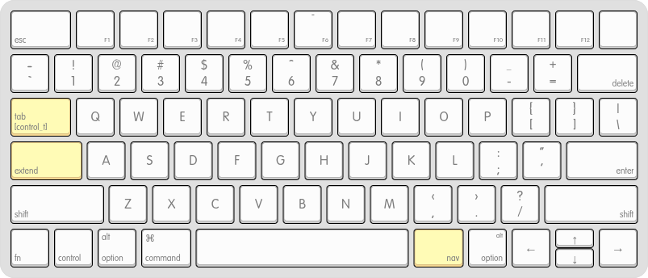
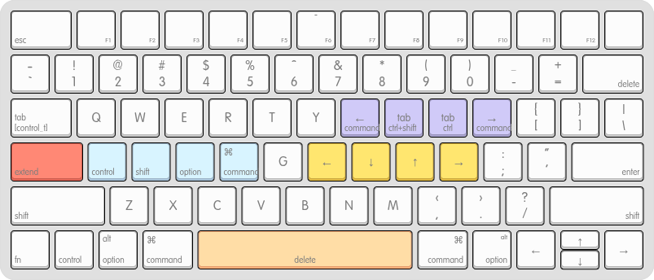
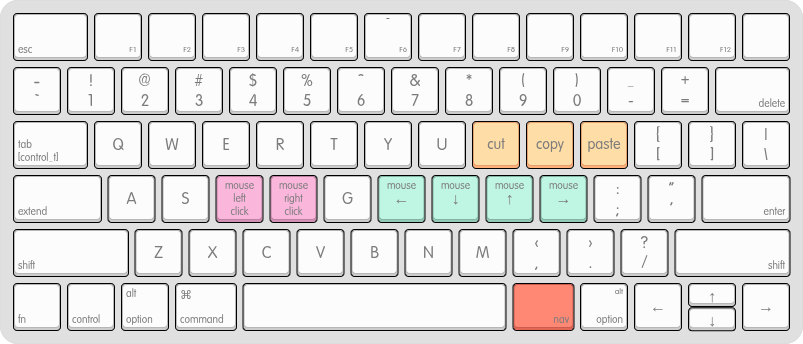

As much as I enjoy using my ergonomic keyboards, sometimes I still need to use the built in keyboard on my laptop. Transitioning between the two drastically different layouts is no longer an issue, but I find myself having an itch of wondering whether it’s possible to improve the usability of a standard keyboard.

<!--more-->

I personally find typing letters and numbers is actually not so bad; despite the row stagger causing my fingers to move around more than they would need to on a columnar stagger layout, it’s not the worst thing to deal with.  The thing that bothers me more are the actions around text manipulation like selecting or deleting text by words or entire lines. The keys for these are at the peripheral of the keyboard, which causes me to move both my hands away from the home row whenever I need to do those operations, which is fairly often while typing.

With a bit of layer remapping that I adapted from using small form factor keyboards, I was able to achieve a layout that keeps my hands relatively centered around home row. It’s not a far departure from a standard layout, so the learning curve is low compared to other, more drastic layout changes to bring improved ergonomics to common keyboards.

# The Goal

To enable keeping my hands close to home row as often as possible, I need to move a handful of *key* keys:
- Top left: `Escape`
- Top right: `Delete/Backspace`
- Bottom left: `Shift`, `Control`, `Option/Alt`, `Command`
- Bottom right: `Left`, `Right`, `Up`, `Down` Arrow Keys

# Prior Art
Other efforts exist like [SpaceFN](https://drop.com/talk/138510/what-is-space-fn-and-why-you-should-give-it-a-try) or [Home Row Mods](https://drop.com/talk/138510/what-is-space-fn-and-why-you-should-give-it-a-try) to improve the usability of standard keyboards, but the issue I found is that they all modify frequently used keys. I find these customizations work best on keys that aren't as commonly used during regular typing. On my split keyboard, I started using bottom row mods (where the modifiers are on `ZXCV` instead of `ASDF`) which I find work much better, but unfortunately on a standard layout, the bottom row is shifted quite far right which makes using it with the left hand more awkward.

After a bit of trial and error, I settled on a remapping that works for my workflow. I even went as far as replacing my daily split keyboard with the [Apple Magic Keyboard](https://capitaloneshopping.com/p/apple-magic-keyboard-us-english/TWRN969XDQ) for a few weeks, since my secondary hypothesis was whether it’s possible to make a standard keyboard ergonomic enough to avoid needing to buy and learn how to use a columnar-stagger split keyboard. Unsurprising spoiler alert: You can get close, but there are tradeoffs.
# The Layers
## Base



For the main base layer, only three infrequently used keys are changed:
- `Tab` -> `Tab` when pressed, `Control` when held
- `Capslock` -> Hold for `Extend` layer
- `RightAlt` -> Hold for `Nav` layer

Additionally, I added a combo of `J+K = Escape`, which is especially useful for Vim.

`Tab`'s default behaviour doesn't change, but holding it unlocks a new behaviour of acting as `Control`. `Capslock` and `Right Alt` are not used often (at least by me), so I opted to use those as the keys to activate the two new layers, "Extend" and "Nav", which I'll explain more in the following sections.

I considered using `LeftCommand` to toggle the layer as well, which would help with symmetry and also have both thumbs operating the layers, similar to how it works on typical split keyboards. But I use `Command` often, and `Capslock` is basically unused. I already had remapped it to be "escape when tapped, control when held" to improve ergonomics when using vim, since `Capslock` is in a prime location for the pinky to press while the rest of the fingers are free to move along the home row.

## Extend: via Capslock



With this layer, I can easily manipulate text with my right fingers on the arrow keys, and left fingers on the modifiers. This lets my hands stay on home row, where typically to do similar actions, I'd need to move both hands to the bottom corners to press the modifiers and the arrow keys.

For example, if I want to select a bunch of text, instead of moving my left hand to the bottom left of the keyboard to press `Shift + Option`, and my right hand to the arrow keys, I can just press `S+D` with my left hand, and one of `H|J|K|L` with my right hand for the arrow key.

In this layer, `Spacebar` also becomes `Delete/Backspace`, which avoids having to move my right hand to the top corner to delete text, as well as allowing my left hand to use `Option` or `Command` to easily delete by word or line.

I also added a few keys for browser navigation - browser forward/back, and next/previous tab.

If you don't use macOS, you could consider remapping the `Left Alt` key to activate the left thumb layer instead, which would keep things symmetrical where both thumbs are used to activate layers.

One caveat is that putting `Control` on the `Tab` key is a little weird for vim motions. It's not the most comfortable and takes a while to get used to, but I'm okay sacrificing a bit here to keep the arrow keys in an easily accessible place.
## Nav: via Right Alt



By activating this layer with the right thumb, the keys turn to mouse navigation (similar to QMK Mouse Keys) for those times when you just need to nudge your mouse a bit, e.g. to the next input box or adjacent window. Using a mouse or dedicated pointing device is still much more efficient, but it's nice to have this option for other situations.

I also added cut/copy/paste here. Since I use a mouse with my left hand, this regains my ability to execute these operations with my non-mousing hand.

For moving mouse keys and navigating tabs. Also adding cut/copy/command so I can use it along with left mouse.
# Karabiner Config

Making complex modifications directly with Karabiner isn't the easiest, where it requires manually writing JSON, which can be error prone and finicky. There are other tools to make it easier to create configs, and I recently started using [karaml](https://github.com/al-ce/karaml).

The `karaml_config.yaml` looks like this (non-exhaustive), which then gets translated to Karabiner JSON format:
```yaml
/base/:
  caps_lock: /extend/
  j + k: escape
  tab: [left_control, tab]

/extend/:
  # Vim motions, (x) means to include any optional mods
  (x) | h: left
  (x) | j: down
  (x) | k: up
  (x) | l: right

  space: backspace
  semicolon: enter

  ...
```

[GokuRakuJoudo](https://github.com/yqrashawn/GokuRakuJoudo) is another popular option, but I personally found the syntax to be confusing and too complicated for my simple mind to comprehend.

For those on Linux, keyd is quite simple to configure in a similar way. However, I haven't quite figured out how to chord the combos in the extend layer (e.g. to execute `Shift + Control + Left`), which works fine in Karabiner though. So please comment if you know how to fix it!

```ini
[ids]
*

[main]
capslock = overload(extend, esc)
j+k = esc
tab = overload(control, tab)
rightalt = overload(nav, backspace)

[extend]
a = leftalt
s = leftshift
d = leftcontrol
f = leftmeta
h = left
j = down
k = up
l = right
space = backspace

[nav]
u = C-S-tab
p = C-tab
i = A-left
o = A-right
```
# Closing Thoughts
All in all, this was a successful experiment in improving the usability of a regular keyboard, and I'll definitely continue to iterate on this layout as needed. Use a dedicated split keyboard is still (probably) superior, sometimes you need to make do with what you have, and hopefully this helps anyone who's on that journey.

Some resources referenced in this post:
- Karabiner configurations ([Github Gist](https://gist.github.com/justinmklam/3e389a6e06820ffaec1c2dea8381357b))
- Keyboard Layout Editor visualizations:
	- [Unmodified](https://www.keyboard-layout-editor.com/##@_backcolor=%23e0e0e0&radii=18px&css=%2F@import%20url(http%2F:%2F%2F%2F%2Ffonts.googleapis.com%2F%2Fcss%3Ffamily%2F=Varela+Round)%2F%3B%0A%0A.keylabel%20%7B%0A%20%20%20%20font-family%2F:%20'volkswagen%2F_serialregular'%2F%3B%0A%7D%0A%0A%2F%2F*%20Strangely,%20%22Volkswagen%20Serial%22%20doesn't%20have%20a%20tilde%20character%20*%2F%2F%0A.varela%20%7B%20%0A%20%20%20%20font-family%2F:%20'Varela%20Round'%2F%3B%20%0A%20%20%20%20display%2F:%20inline-block%2F%3B%20%0A%20%20%20%20font-size%2F:%20inherit%2F%3B%20%0A%20%20%20%20text-rendering%2F:%20auto%2F%3B%20%0A%20%20%20%20-webkit-font-smoothing%2F:%20antialiased%2F%3B%20%0A%20%20%20%20-moz-osx-font-smoothing%2F:%20grayscale%2F%3B%0A%20%20%20%20transform%2F:%20translate(0,%200)%2F%3B%0A%7D%0A.varela-tilde%2F:after%20%7B%20content%2F:%20%22%5C07e%22%2F%3B%20%7D%3B&@_t=%23666666&p=CHICKLET&f:2&w:1.5%3B&=%0Aesc&_fa@:0&:0&:0&:1%3B%3B&=%0A%0A%0AF1&=%0A%0A%0AF2&=%0A%0A%0AF3&=%0A%0A%0AF4&=%0A%0A%0AF5&=%0A%0A%0AF6%0A%0A%0A%0A%0A~&=%0A%0A%0AF7&=%0A%0A%0AF8&=%0A%0A%0AF9&=%0A%0A%0AF10&=%0A%0A%0AF11&=%0A%0A%0AF12&_t=%23000000&a:7&f:3%3B&=%3B&@_t=%23666666&a:5&f:5%3B&=%0A%60%0A%0A%0A%0A%0A~&=!%0A1&=%2F@%0A2&=%23%0A3&=$%0A4&=%25%0A5&=%5E%0A6&=%2F&%0A7&=*%0A8&=(%0A9&=)%0A0&=%2F_%0A-&=+%0A%2F=&_a:4&f:2&w:1.5%3B&=%0A%0A%0Adelete%3B&@_w:1.5%3B&=%0Atab&_a:7&f:5%3B&=Q&=W&=E&=R&=T&=Y&=U&=I&=O&=P&_a:5%3B&=%7B%0A%5B&=%7D%0A%5D&=%7C%0A%5C%3B&@_a:4&f:2&w:1.75%3B&=%0Acaps%20lock&_a:7&f:5%3B&=A&=S&=D&=F&=G&=H&=J&=K&=L&_a:5%3B&=%2F:%0A%2F%3B&=%22%0A'&_a:4&f:2&w:1.75%3B&=%0A%0A%0Aenter%3B&@_w:2.25%3B&=%0Ashift&_a:7&f:5%3B&=Z&=X&=C&=V&=B&=N&=M&_a:5%3B&=%3C%0A,&=%3E%0A.&=%3F%0A%2F%2F&_a:4&f:2&w:2.25%3B&=%0A%0A%0Ashift%3B&@=%0Afn&=%0Acontrol&=alt%0Aoption&_fa@:3&:0&:0%3B&w:1.25%3B&=%E2%8C%98%0Acommand&_a:7&w:5%3B&=&_a:4&fa@:3&:0&:3%3B&w:1.25%3B&=%0A%0A%E2%8C%98%0Acommand&_fa@:3&:0&:1%3B%3B&=%0A%0Aalt%0Aoption&_a:7&f:5%3B&=%E2%86%90&_h:0.55%3B&=%E2%86%91&=%E2%86%92%3B&@_y:-0.5499999999999998&x:12.5&h:0.55%3B&=%E2%86%93)
	- [Main Layer](https://www.keyboard-layout-editor.com/##@_backcolor=%23e0e0e0&radii=18px&css=%2F@import%20url(http%2F:%2F%2F%2F%2Ffonts.googleapis.com%2F%2Fcss%3Ffamily%2F=Varela+Round)%2F%3B%0A%0A.keylabel%20%7B%0A%20%20%20%20font-family%2F:%20'volkswagen%2F_serialregular'%2F%3B%0A%7D%0A%0A%2F%2F*%20Strangely,%20%22Volkswagen%20Serial%22%20doesn't%20have%20a%20tilde%20character%20*%2F%2F%0A.varela%20%7B%20%0A%20%20%20%20font-family%2F:%20'Varela%20Round'%2F%3B%20%0A%20%20%20%20display%2F:%20inline-block%2F%3B%20%0A%20%20%20%20font-size%2F:%20inherit%2F%3B%20%0A%20%20%20%20text-rendering%2F:%20auto%2F%3B%20%0A%20%20%20%20-webkit-font-smoothing%2F:%20antialiased%2F%3B%20%0A%20%20%20%20-moz-osx-font-smoothing%2F:%20grayscale%2F%3B%0A%20%20%20%20transform%2F:%20translate(0,%200)%2F%3B%0A%7D%0A.varela-tilde%2F:after%20%7B%20content%2F:%20%22%5C07e%22%2F%3B%20%7D%3B&@_t=%23666666&p=CHICKLET&f:2&w:1.5%3B&=%0Aesc&_fa@:0&:0&:0&:1%3B%3B&=%0A%0A%0AF1&=%0A%0A%0AF2&=%0A%0A%0AF3&=%0A%0A%0AF4&=%0A%0A%0AF5&=%0A%0A%0AF6%0A%0A%0A%0A%0A~&=%0A%0A%0AF7&=%0A%0A%0AF8&=%0A%0A%0AF9&=%0A%0A%0AF10&=%0A%0A%0AF11&=%0A%0A%0AF12&_t=%23000000&a:7&f:3%3B&=%3B&@_t=%23666666&a:5&f:5%3B&=%0A%60%0A%0A%0A%0A%0A~&=!%0A1&=%2F@%0A2&=%23%0A3&=$%0A4&=%25%0A5&=%5E%0A6&=%2F&%0A7&=*%0A8&=(%0A9&=)%0A0&=%2F_%0A-&=+%0A%2F=&_a:4&f:2&w:1.5%3B&=%0A%0A%0Adelete%3B&@_c=%23f5d793&w:1.5%3B&=%0A%5Bcontrol%2F_t%5D%0A%0A%0A%0A%0Atab&_c=%23cccccc&a:7&f:5%3B&=Q&=W&=E&=R&=T&=Y&=U&=I&=O&=P&_a:5%3B&=%7B%0A%5B&=%7D%0A%5D&=%7C%0A%5C%3B&@_c=%23f5d793&a:4&f:2&w:1.75%3B&=%0Aextend&_c=%23cccccc&a:7&f:5%3B&=A&=S&=D&=F&=G&=H&=J&=K&=L&_a:5%3B&=%2F:%0A%2F%3B&=%22%0A'&_a:4&f:2&w:1.75%3B&=%0A%0A%0Aenter%3B&@_w:2.25%3B&=%0Ashift&_a:7&f:5%3B&=Z&=X&=C&=V&=B&=N&=M&_a:5%3B&=%3C%0A,&=%3E%0A.&=%3F%0A%2F%2F&_a:4&f:2&w:2.25%3B&=%0A%0A%0Ashift%3B&@=%0Afn&=%0Acontrol&=alt%0Aoption&_fa@:3%3B&w:1.25%3B&=%E2%8C%98%0Acommand&_a:7&w:5%3B&=&_c=%23f5d793&a:4&w:1.25%3B&=%0A%0A%0Anav&_c=%23cccccc&fa@:3&:0&:1%3B%3B&=%0A%0Aalt%0Aoption&_a:7&f:5%3B&=%E2%86%90&_h:0.55%3B&=%E2%86%91&=%E2%86%92%3B&@_y:-0.5499999999999998&x:12.5&h:0.55%3B&=%E2%86%93)
	- [Extend Layer](https://www.keyboard-layout-editor.com/##@_backcolor=%23e0e0e0&radii=18px&css=%2F@import%20url(http%2F:%2F%2F%2F%2Ffonts.googleapis.com%2F%2Fcss%3Ffamily%2F=Varela+Round)%2F%3B%0A%0A.keylabel%20%7B%0A%20%20%20%20font-family%2F:%20'volkswagen%2F_serialregular'%2F%3B%0A%7D%0A%0A%2F%2F*%20Strangely,%20%22Volkswagen%20Serial%22%20doesn't%20have%20a%20tilde%20character%20*%2F%2F%0A.varela%20%7B%20%0A%20%20%20%20font-family%2F:%20'Varela%20Round'%2F%3B%20%0A%20%20%20%20display%2F:%20inline-block%2F%3B%20%0A%20%20%20%20font-size%2F:%20inherit%2F%3B%20%0A%20%20%20%20text-rendering%2F:%20auto%2F%3B%20%0A%20%20%20%20-webkit-font-smoothing%2F:%20antialiased%2F%3B%20%0A%20%20%20%20-moz-osx-font-smoothing%2F:%20grayscale%2F%3B%0A%20%20%20%20transform%2F:%20translate(0,%200)%2F%3B%0A%7D%0A.varela-tilde%2F:after%20%7B%20content%2F:%20%22%5C07e%22%2F%3B%20%7D%3B&@_t=%23666666&p=CHICKLET&f:2&w:1.5%3B&=%0Aesc&_fa@:0&:0&:0&:1%3B%3B&=%0A%0A%0AF1&=%0A%0A%0AF2&=%0A%0A%0AF3&=%0A%0A%0AF4&=%0A%0A%0AF5&=%0A%0A%0AF6%0A%0A%0A%0A%0A~&=%0A%0A%0AF7&=%0A%0A%0AF8&=%0A%0A%0AF9&=%0A%0A%0AF10&=%0A%0A%0AF11&=%0A%0A%0AF12&_t=%23000000&a:7&f:3%3B&=%3B&@_t=%23666666&a:5&f:5%3B&=%0A%60%0A%0A%0A%0A%0A~&=!%0A1&=%2F@%0A2&=%23%0A3&=$%0A4&=%25%0A5&=%5E%0A6&=%2F&%0A7&=*%0A8&=(%0A9&=)%0A0&=%2F_%0A-&=+%0A%2F=&_a:4&f:2&w:1.5%3B&=%0A%0A%0Adelete%3B&@_w:1.5%3B&=%0A%5Bcontrol%2F_t%5D%0A%0A%0A%0A%0Atab&_a:7&f:5%3B&=Q&=W&=E&=R&=T&=Y&_c=%23a9a3cf&a:4&f:2&fa@:0&:0&:0&:0&:0&:0&:0&:0&:0&:5%3B%3B&=%0Acommand%0A%0A%0A%0A%0A%0A%0A%0A%E2%86%90&_fa@:0&:0&:0&:0&:0&:0&:0&:0&:0&:3%3B%3B&=%0Actrl+shift%0A%0A%0A%0A%0A%0A%0A%0Atab&_a:5&fa@:0&:0&:0&:0&:0&:0&:3%3B%3B&=%0Actrl%0A%0A%0A%0A%0Atab&_a:4&fa@:0&:0&:0&:0&:0&:0&:3&:0&:0&:5%3B%3B&=%0Acommand%0A%0A%0A%0A%0A%0A%0A%0A%E2%86%92&_c=%23cccccc&a:5&f:5%3B&=%7B%0A%5B&=%7D%0A%5D&=%7C%0A%5C%3B&@_c=%23e26757&a:4&f:2&w:1.75%3B&=%0Aextend&_c=%23abc6dc&f:5&f2:2%3B&=%0Acontrol&=%0Ashift&=%0Aoption&_fa@:3&:2%3B%3B&=%E2%8C%98%0Acommand&_c=%23cccccc&a:7&f:5%3B&=G&_c=%23e1ba44&f:5%3B&=%E2%86%90&_f:5%3B&=%E2%86%93&_f:5%3B&=%E2%86%91&_f:5%3B&=%E2%86%92&_c=%23cccccc&a:5&f:5%3B&=%2F:%0A%2F%3B&_f:5%3B&=%22%0A'&_a:4&f:2&w:1.75%3B&=%0A%0A%0Aenter%3B&@_w:2.25%3B&=%0Ashift&_a:7&f:5%3B&=Z&=X&=C&=V&=B&=N&=M&_a:5%3B&=%3C%0A,&=%3E%0A.&=%3F%0A%2F%2F&_a:4&f:2&w:2.25%3B&=%0A%0A%0Ashift%3B&@=%0Afn&=%0Acontrol&=alt%0Aoption&_fa@:3%3B&w:1.25%3B&=%E2%8C%98%0Acommand&_c=%23ffb07b&a:5&w:5%3B&=%0Adelete&_c=%23cccccc&a:4&fa@:3&:0&:3%3B&w:1.25%3B&=%0A%0A%E2%8C%98%0Acommand&_fa@:3&:0&:1%3B%3B&=%0A%0Aalt%0Aoption&_a:7&f:5%3B&=%E2%86%90&_h:0.55%3B&=%E2%86%91&=%E2%86%92%3B&@_y:-0.5499999999999998&x:12.5&h:0.55%3B&=%E2%86%93)
	- [Nav Layer](https://www.keyboard-layout-editor.com/##@_backcolor=%23e0e0e0&radii=18px&css=%2F@import%20url(http%2F:%2F%2F%2F%2Ffonts.googleapis.com%2F%2Fcss%3Ffamily%2F=Varela+Round)%2F%3B%0A%0A.keylabel%20%7B%0A%20%20%20%20font-family%2F:%20'volkswagen%2F_serialregular'%2F%3B%0A%7D%0A%0A%2F%2F*%20Strangely,%20%22Volkswagen%20Serial%22%20doesn't%20have%20a%20tilde%20character%20*%2F%2F%0A.varela%20%7B%20%0A%20%20%20%20font-family%2F:%20'Varela%20Round'%2F%3B%20%0A%20%20%20%20display%2F:%20inline-block%2F%3B%20%0A%20%20%20%20font-size%2F:%20inherit%2F%3B%20%0A%20%20%20%20text-rendering%2F:%20auto%2F%3B%20%0A%20%20%20%20-webkit-font-smoothing%2F:%20antialiased%2F%3B%20%0A%20%20%20%20-moz-osx-font-smoothing%2F:%20grayscale%2F%3B%0A%20%20%20%20transform%2F:%20translate(0,%200)%2F%3B%0A%7D%0A.varela-tilde%2F:after%20%7B%20content%2F:%20%22%5C07e%22%2F%3B%20%7D%3B&@_t=%23666666&p=CHICKLET&f:2&w:1.5%3B&=%0Aesc&_fa@:0&:0&:0&:1%3B%3B&=%0A%0A%0AF1&=%0A%0A%0AF2&=%0A%0A%0AF3&=%0A%0A%0AF4&=%0A%0A%0AF5&=%0A%0A%0AF6%0A%0A%0A%0A%0A~&=%0A%0A%0AF7&=%0A%0A%0AF8&=%0A%0A%0AF9&=%0A%0A%0AF10&=%0A%0A%0AF11&=%0A%0A%0AF12&_t=%23000000&a:7&f:3%3B&=%3B&@_t=%23666666&a:5&f:5%3B&=%0A%60%0A%0A%0A%0A%0A~&=!%0A1&=%2F@%0A2&=%23%0A3&=$%0A4&=%25%0A5&=%5E%0A6&=%2F&%0A7&=*%0A8&=(%0A9&=)%0A0&=%2F_%0A-&=+%0A%2F=&_a:4&f:2&w:1.5%3B&=%0A%0A%0Adelete%3B&@_w:1.5%3B&=%0A%5Bcontrol%2F_t%5D%0A%0A%0A%0A%0Atab&_a:7&f:5%3B&=Q&=W&=E&=R&=T&=Y&=U&_c=%23ffb07b&f:4%3B&=cut&=copy&=paste&_c=%23cccccc&a:5&f:5%3B&=%7B%0A%5B&=%7D%0A%5D&=%7C%0A%5C%3B&@_a:4&f:2&w:1.75%3B&=%0Aextend&_a:7&f:5%3B&=A&=S&_c=%23d290b4&a:5&f:2%3B&=mouse%0Aclick%0A%0A%0A%0A%0Aleft&=mouse%0Aclick%0A%0A%0A%0A%0Aright&_c=%23cccccc&a:7&f:5%3B&=G&_c=%2393c9b7&a:5&fa@:2&:0%3B%3B&=mouse%0A%0A%0A%0A%0A%0A%E2%86%90&=mouse%0A%0A%0A%0A%0A%0A%E2%86%93&=mouse%0A%0A%0A%0A%0A%0A%E2%86%91&=mouse%0A%0A%0A%0A%0A%0A%E2%86%92&_c=%23cccccc&f:5%3B&=%2F:%0A%2F%3B&_f:5%3B&=%22%0A'&_a:4&f:2&w:1.75%3B&=%0A%0A%0Aenter%3B&@_w:2.25%3B&=%0Ashift&_a:7&f:5%3B&=Z&=X&=C&=V&=B&=N&=M&_a:5%3B&=%3C%0A,&=%3E%0A.&=%3F%0A%2F%2F&_a:4&f:2&w:2.25%3B&=%0A%0A%0Ashift%3B&@=%0Afn&=%0Acontrol&=alt%0Aoption&_fa@:3%3B&w:1.25%3B&=%E2%8C%98%0Acommand&_a:7&w:5%3B&=&_c=%23e26757&a:4&w:1.25%3B&=%0A%0A%0Anav&_c=%23cccccc&fa@:3&:0&:1%3B%3B&=%0A%0Aalt%0Aoption&_a:7&f:5%3B&=%E2%86%90&_h:0.55%3B&=%E2%86%91&=%E2%86%92%3B&@_y:-0.5499999999999998&x:12.5&h:0.55%3B&=%E2%86%93)

Happy typing!
