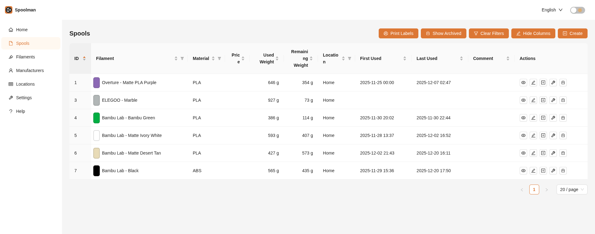
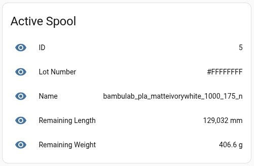
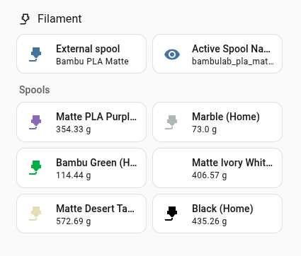

Lorem ipsum dolor sit amet, consectetur adipiscing elit, sed do eiusmod tempor incididunt ut labore et dolore magna aliqua. Ut enim ad minim veniam, quis nostrud exercitation ullamco laboris nisi ut aliquip ex ea commodo consequat. Duis aute irure dolor in reprehenderit in voluptate velit esse cillum dolore eu fugiat nulla pariatur. Excepteur sint occaecat cupidatat non proident, sunt in culpa qui officia deserunt mollit anim id est laborum.

<!--more-->




Prerequisites:
- Home assistant
- Bambulab home assistant integration
- Self hosted instance of Spoolman

Workflow:
- Use `lotnr` in spoolman to keep track of the colour code and to match the spool in bambulab to spoolman
- Sensor to find the corresponding spool in spoolman
- When print is complete, home assistant automation is triggered to consume the filament via rest

In `configuration.yaml`:
```yaml
rest:
  - resource_template: >-
      http://192.168.1.80:7912/api/v1/spool?filament.material={{ state_attr('sensor.p1s_01p00c560700409_externalspool_external_spool', 'type') | lower }}&lot_nr={{ state_attr('sensor.p1s_01p00c560700409_externalspool_external_spool', 'color') | lower | replace('#','') }}
    scan_interval: 30

    sensor:
      - name: "Active Spool Name"
        unique_id: spoolman.active_spool.name
        value_template: >-
          {{ value_json[0].filament.external_id if value_json else None }}

      - name: "Active Spool ID"
        unique_id: spoolman.active_spool.id
        value_template: >-
          {{ value_json[0].id if value_json else None }}

      - name: "Active Spool Lot Number"
        unique_id: spoolman.active_spool.lot_nr
        value_template: >-
          {{ value_json[0].lot_nr if value_json else None }}

      - name: "Active Spool Remaining Weight"
        unique_id: spoolman.active_spool.remaining_weight
        unit_of_measurement: "g"
        value_template: >-
          {{ value_json[0].remaining_weight | float(0) | round(1) if value_json else None }}

      - name: "Active Spool Remaining Length"
        unique_id: spoolman.active_spool.remaining_length
        unit_of_measurement: "mm"
        value_template: >-
          {{ value_json[0].remaining_length | float(0) | round(0) if value_json else None }}

group:
  active_spool:
    name: "Active Spool"
    entities:
      - sensor.active_spool_name
      - sensor.active_spool_id
      - sensor.active_spool_lot_number
      - sensor.active_spool_remaining_weight
      - sensor.active_spool_remaining_length
```

Which will create these sensors:



Then create an automation:

```yaml
alias: Consume Spoolman
description: Consumes weight from spool when print is complete
triggers:
  - entity_id:
      - sensor.p1s_01p00c560700409_print_status
    from:
      - running
    to:
      - finish
      - failed
    trigger: state
conditions: []
actions:
  - data:
      id: "{{ spool_id }}"
      use_weight: "{{ scaled_weight }}"
    action: spoolman.use_spool_filament
mode: single
variables:
  spool_id: "{{ states('sensor.active_spool_id') }}"
  weight: "{{ states('sensor.p1s_01p00c560700409_print_weight') | float }}"
  current_layer: "{{ states('sensor.p1s_01p00c560700409_current_layer') | float }}"
  total_layer_count: "{{ states('sensor.p1s_01p00c560700409_total_layer_count') | float }}"
  scaled_weight: "{{ weight * (current_layer / total_layer_count) }}"

```

Dashboard

Using auto entities:

```yaml
type: custom:auto-entities
filter:
  include:
    - integration: "*spoolman*"
      sort:
        method: attribute
        attribute: location
        reverse: false
      attributes:
        archived: false
      options:
        type: custom:mushroom-template-card
        vertical: false
        icon_color: "#{{ state_attr(entity, 'filament_color_hex') }}"
        icon: mdi:printer-3d-nozzle
        badge_icon: |
          
            mdi:archive
          
            mdi:check-circle
          
        badge_color: |
          
            orange
          
            green
          
            default_color
          
        primary: |
           
            {{ state_attr(entity, 'filament_name') }} ({{ location }})
          
            {{ state_attr(entity, 'filament_name') }}
          
        secondary: "{{ (state_attr(entity, 'remaining_weight') | float)  | round(2) }} g"
        tap_action:
          action: more-info
sort:
  method: attribute
  attribute: klipper_active_spool
  reverse: true
card:
  type: grid
  columns: 2
  square: false
card_param: cards

```

