So you’ve heard of split keyboards and want to buy one, but don’t know where to start? You’ve come to the right place! There are many offerings these days which can be overwhelming, so this guide aims to provide a high level overview of the landscape so you can figure out which path you want to take.

<!--more-->
> The intent of this guide is not to tell you which specific keyboard you should buy, but rather to equip you with the knowledge to find one that works for yourself. 
> 
> The content in this post is mainly a consolidation of content that exists in [r/ErgoMechKeyboards](https://www.reddit.com/r/ErgoMechKeyboards/), but organized in a way that is hopefully helpful for beginners.
> 
> Also, it should be noted that regardless of how ergonomic your setup is, it's important to take frequent breaks from being in front of a computer when possible, and to get up and move around. If you’re suffering from acute muscular pain (e.g. from keyboard use, or other), consider also seeing a physiotherapist or other healthcare practitioner for professional help.

# Introduction
## Types of Keyboards
There are three main categories of keyboards, which define the overall positions of the keys. 
- **Row-staggered**: Keys are aligned in rows, like a traditional keyboard. This is what you're already used to.
- **Column-staggered**: Keys are aligned in columns. This better matches finger anatomy and is very common in ergonomic splits.
- **Ortholinear**: Uniform grid, no stagger. Visually pleasing, but less common in ergonomic splits.

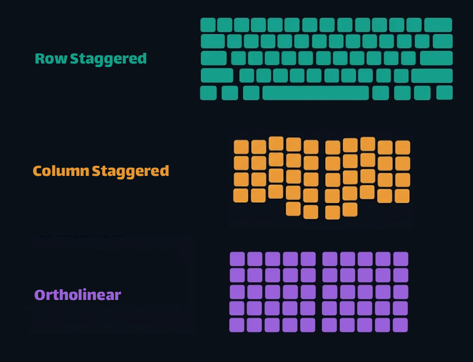
For people interested in ergonomics, most transition from row staggered to column staggered. Ortholinear was popular for a time and still has a cult following (e.g. with the Planck), but is not as popular for ergonomic keyboards. Majority of the split keyboards shown in this post will be column staggered.
## The Big Question: How Much Time Do You Have?
Despite the promised land of ergonomic benefits being a mere credit card purchase away, it is not without its dark side. There is unfortunately an **inevitable learning curve,** and it can be a steep one. 

Re-training years, if not decades, of muscle memory for typing on a traditional keyboard is tough work, and can have its frustrating moments. It’s common to take at least a week or two of lots of typing practice to get accustomed to the new layout. For me, it took about a month of heavy use to be comfortable typing at a productive level for work, and that’s in a profession that involves a significant amount of daily typing (i.e. software development).

If you’re practicing with something like [monkeytype](https://monkeytype.com/), the default mode of typing lowercase words is only half the battle. Getting familiar with a keyboard involves other things, like:
- Using numbers, punctuation, and symbols 
- Selecting/manipulating text (arrow keys) with shift or by word, home/end
- Application-specific hot keys (e.g. browser fwd/back, tab cycling, closing tabs/Windows, window management, Excel motions, etc)

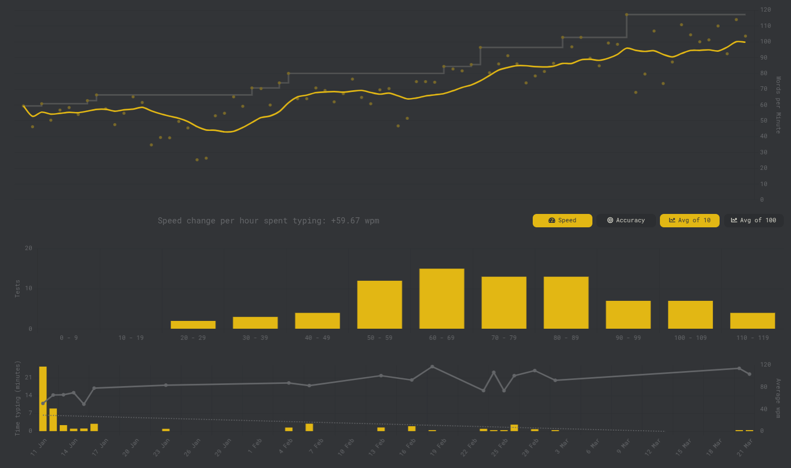

If at this point you’re questioning the time investment required for this whole endeavour, fear not! **There’s a keyboard for everyone,** and not all require this steep learning curve.
# Path 1: “I want a split, but don't have time to learn”
These keyboards keep a row-staggered layout, so you can keep that well-trained muscle memory. You still get the biggest ergonomic win of splitting your hands apart, but without a massive cognitive load of retraining your fingers and brain for typing on a radically new layout.

Some examples of traditional keyboards with a slight split in them:

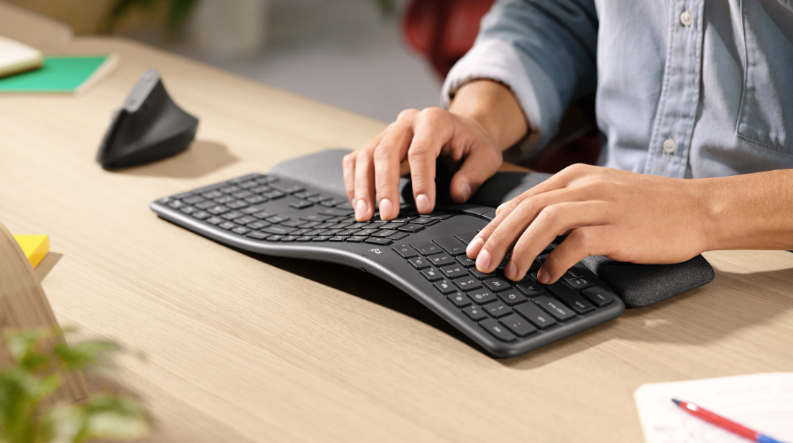

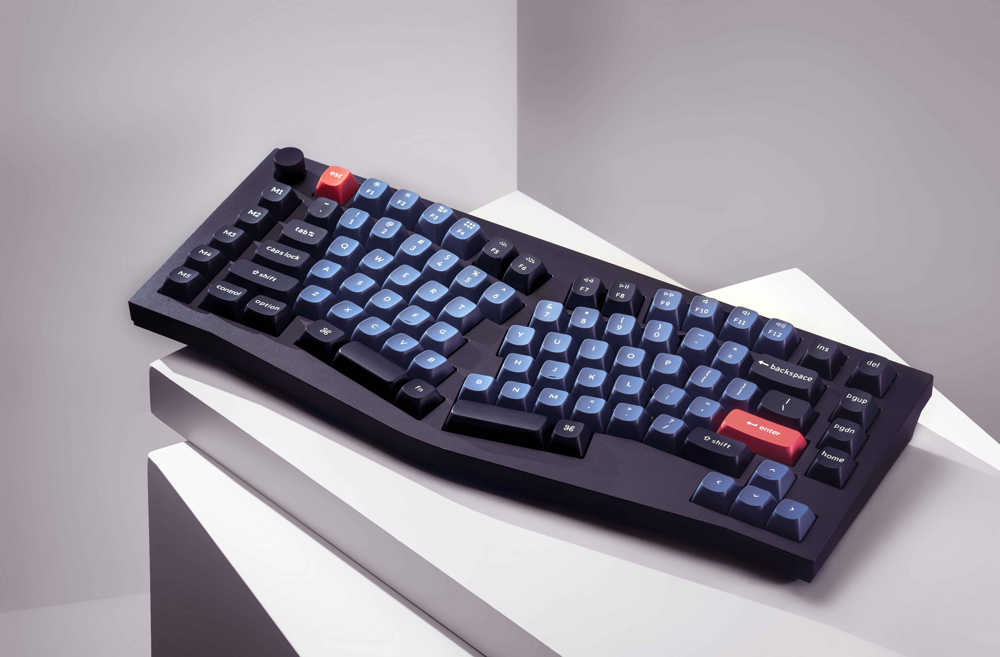

Going one step further, getting a keyboard with independent halves will provide the most flexibility, since this allows you to freely position the halves (e.g. shoulder width apart), or even set them up with [tenting](#tenting).

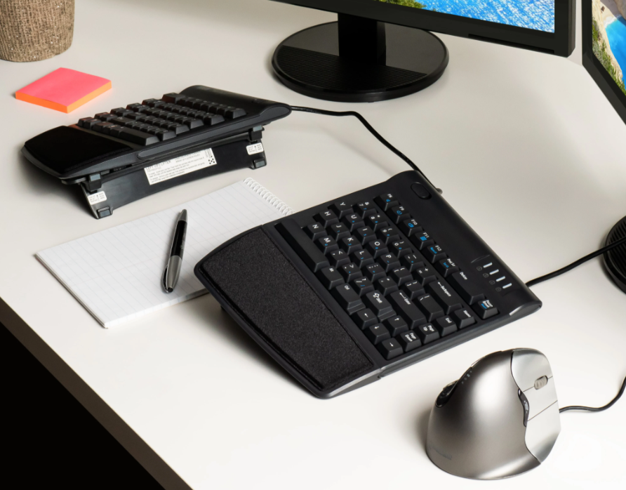

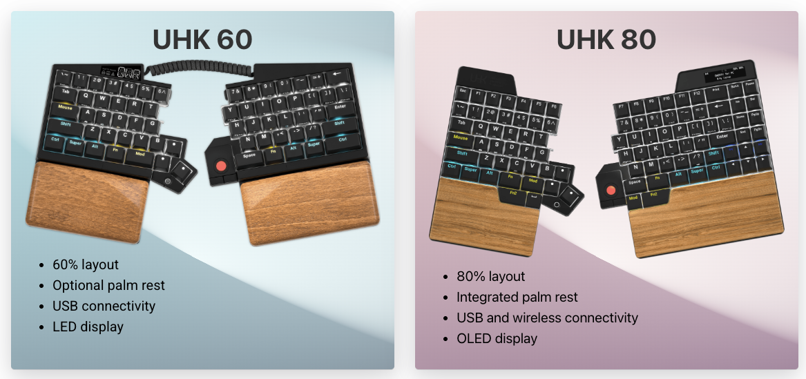

These keyboards may not be perfect for "power" users, but they tick enough boxes for the majority of people. If you do want to use more advanced features like layers and combos, you can use software like [Karabiner Elements](https://karabiner-elements.pqrs.org/) (macOS), [keyd](https://github.com/rvaiya/keyd) (Linux), or [Kanata](https://github.com/jtroo/kanata) (cross-platform) to add this functionality, similar to how I modified a regular keyboard's keymap [here](/posts/2025/11/remapping-standard-keyboard/).

If you're in this group, you can stop reading here! You can also find other similar keyboards using the (basic) search term "ergonomic keyboard" to see what's currently available on the market.
# Path 2: “I’m willing to learn for better ergonomics”
If you do have the time and motivation, then welcome to the rabbit hole of features, geometries, and customizability!

Most keyboards in this category will have columnar stagger and multiple thumb keys (in place of a single spacebar), which are the main drivers for relearning how to type.
## Features

### Number of Keys
When shopping for split keyboards, you’ll notice they can have a wide range of number of keys. A standard US keyboard has 104 keys (or 105 keys for those outside the US), but many have half that or even less! 

The rationale for having fewer keys is to keep your fingers as close to home row as possible, minimizing the amount of hand movement while typing. The tradeoff to fewer keys is complexity - instead of just reaching over to press a number, multiple keys will need to be pressed to achieve the same result. 

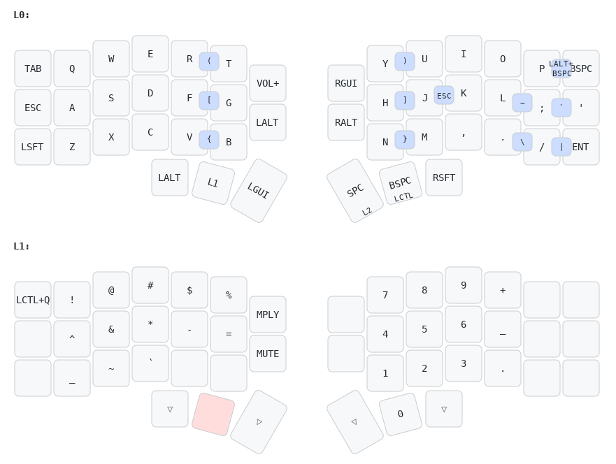

There’s [some discussion](https://getreuer.info/posts/keyboards/40-percent-ergo/index.html) of whether smaller layouts are actually better for ergonomics, but some find enjoyment in seeing how few keys one actually needs. This is ultimately a personal choice, but if you’re just starting out, it’s always better to have more keys and not use them, than to not have them and want them. You can also always try smaller layouts on a larger keyboard, like I did when [experimenting with a 36 key layout](/posts/2025/07/36-key-layout/).

Here’s a few examples of keyboards showing the range of key counts:

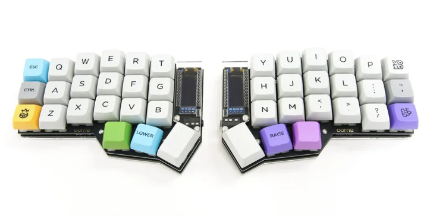

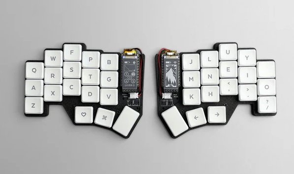

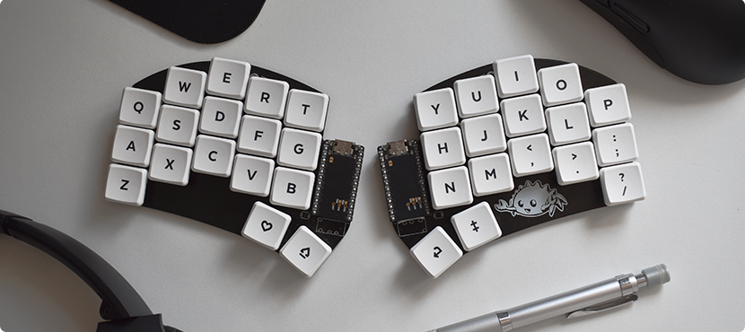

Smaller keyboards do exist, but these layouts require extensive use of layers and/or combos since the main layer is no longer large enough to contain all alpha keys as well as basic function keys like layer switch, space, backspace, etc. The [Hummingbird](https://github.com/PJE66/hummingbird) is a common keyboard/layout in this form factor, where Z/X/Q/J keys are relegated to combos to make space for other keys.

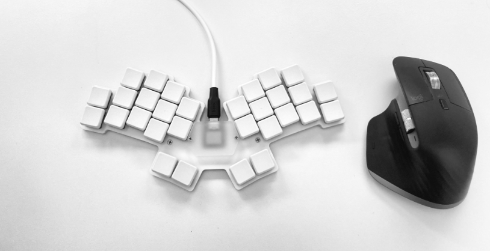

### Geometric Considerations
Aside from the number of physical keys, there are also many options of how the keys are laid out. Keyboards can have different amounts of column stagger, as well as **splay** - which is when the columns are at an angle instead of parallel with each other.

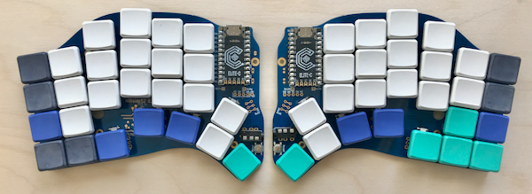

You can also find keyboards that are **sculpted** in 3D like the Glove80 or Charybdis, or you can even design your own [Dactyl](https://ryanis.cool/dactyl/#manuform). Some find great comfort in these, however they come at a higher cost due to manufacturing complexities, unless you [handwire your own](/posts/2025/08/handwired-skeletyl/).

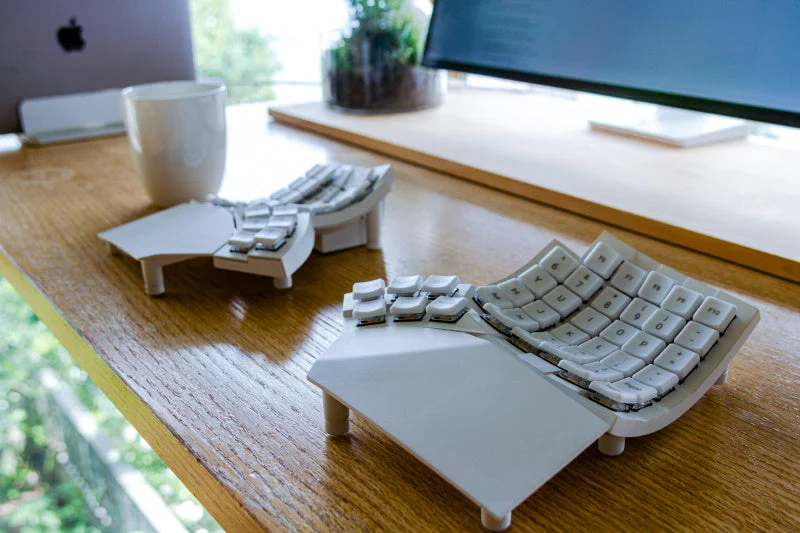

Recently, people started designing **sculpted keycaps** like the [KLP Lamé](https://github.com/braindefender/KLP-Lame-Keycaps) which brings the benefits of sculpted shapes without needing a special keyboard.

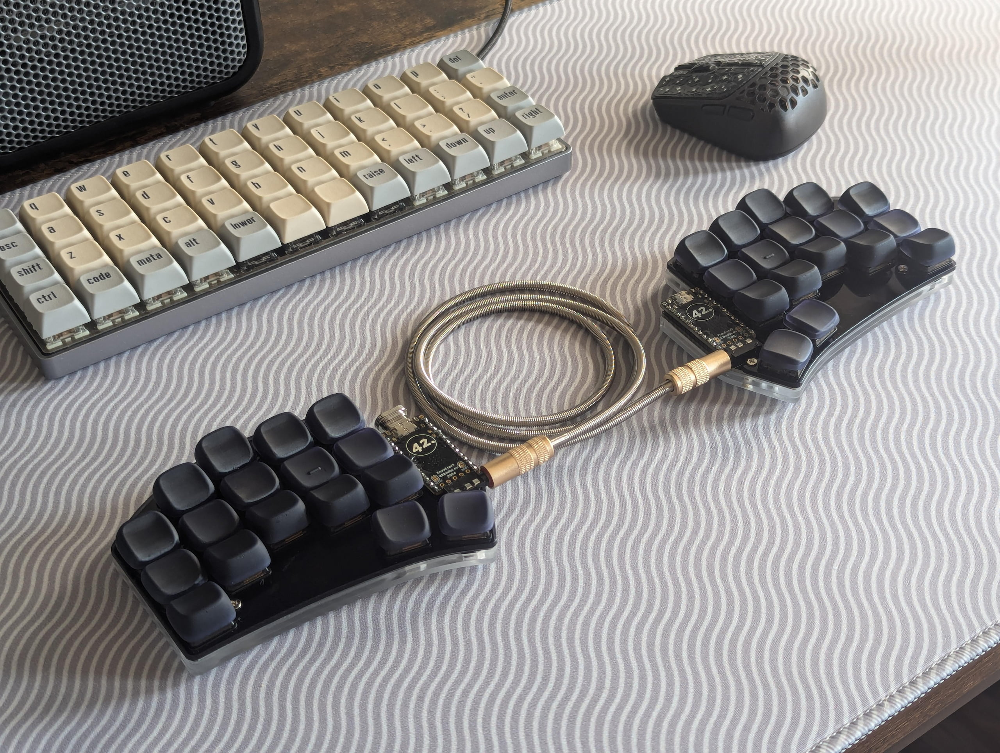

You can also find **unibody/monoblock** keyboards, which still have a split-like layout but are connected as a single unit. Some prefer the constraints and reproducibility of having the halves  always being in the same position, since independent halves can shift around throughout the day. Unibody keyboards are also generally easier to take and move around, like if you’re working on your lap on the couch or on an airplane tray.

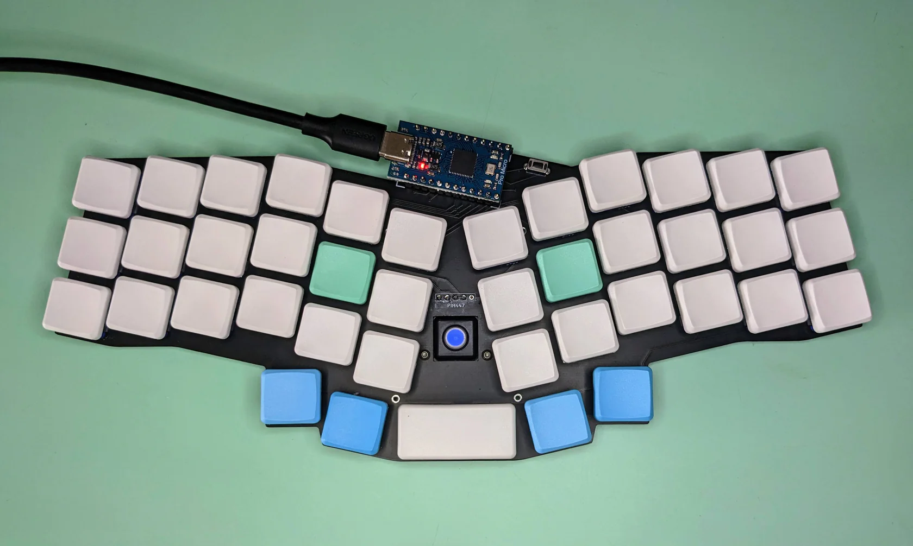

The pursuit of ergonomics goes quite deep, where there's also a league of non-keyboard-looking keyboards that use innovative methods for input. The [Svalboard](https://svalboard.com/), for example, uses multiple feather-light paddles for each finger instead of regular switches. This keyboard was inspired by the [DataHand](https://en.wikipedia.org/wiki/DataHand), an alternative keyboard designed to be operated without requiring any finger travel. Similarly, the [Charachorder](https://www.charachorder.com/) uses joystick-like switches for each finger and makes heavy use of combos, although this makes it closer to [stenography](https://studysteno.com/moo/mod/page/view.php?id=150) in philosophy.

In reality, this is near the bottom of the rabbit hole. Most users never go anywhere near this level of ergonomic experimentation, but it’s where the most interesting (and potentially [game changing](https://svalboard.com/pages/reviews)) ideas tend to emerge!

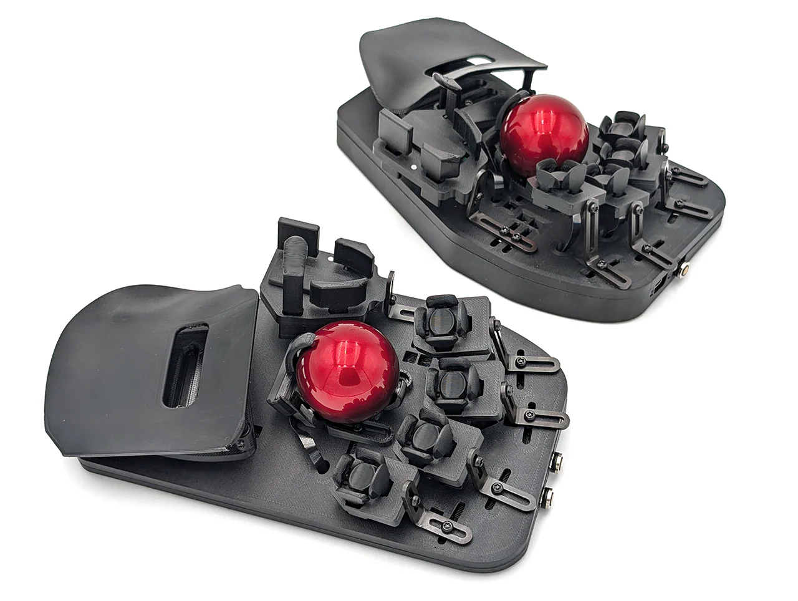

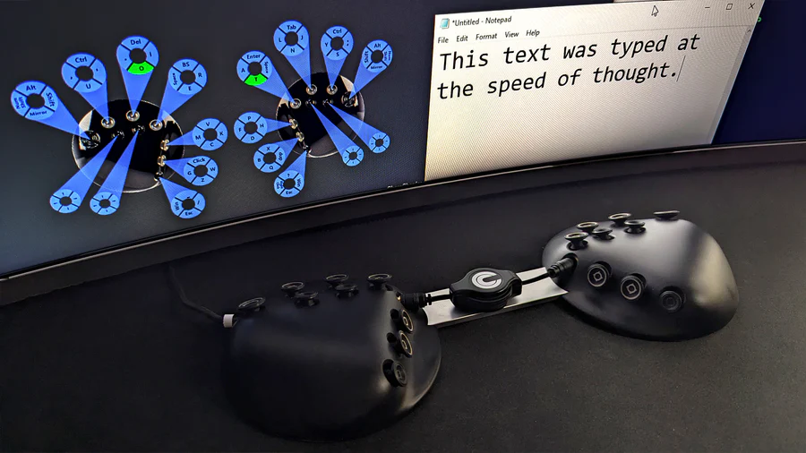
### Tenting
Many people find it more comfortable to have their keyboard slightly raised in the middle, which allows the wrist to maintain a more neutral pronation. The ideal tenting angle is dependent on both the user and the keyboard, where at a given angle, a wider keyboard with more keys will feel different than a smaller keyboard with fewer keys.

Some keyboards come with integrated tenting, but if not, there are many DIY solutions to add it on after. For small angles, foldable laptop stand feet/risers work great.

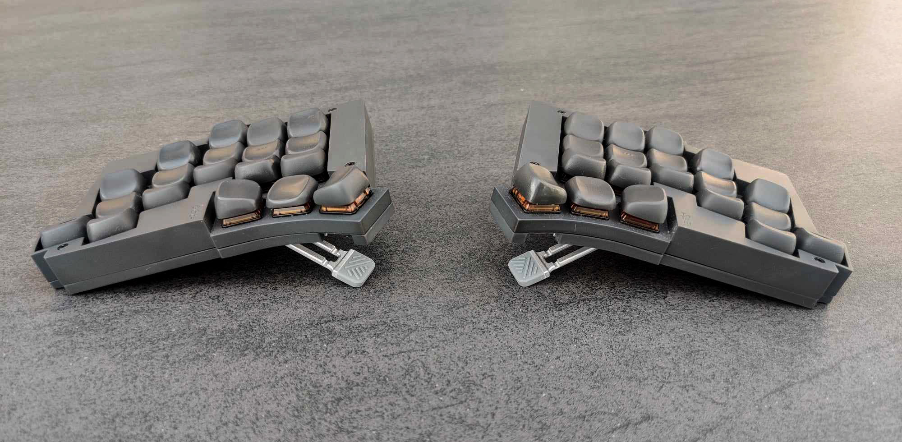

For larger angles, adhesive-backed Magsafe rings and mobile phone stands allow for more adjustability. The stands can be pricey, but there are also [cheaper, 3D printed options](https://kbd.news/Split-keyboard-Magsafe-tenting-stand-2732.html).

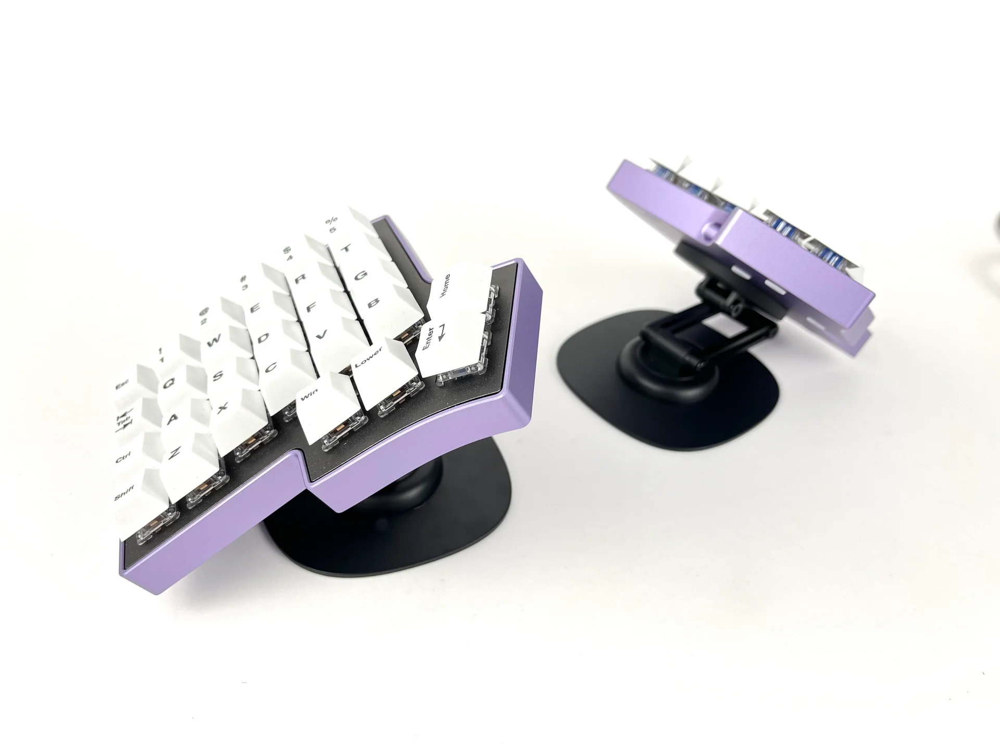

For extreme angles, ball mount clamps (like those for cameras) can be mounted to a desk (or even chairs) 

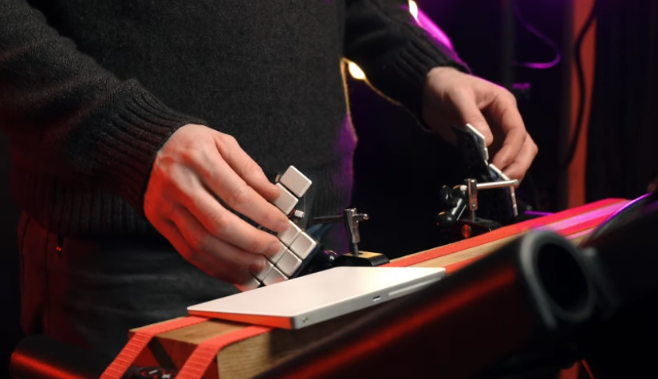

### Pointing Devices and Encoders
With custom keyboards these days, there are many options that include an integrated touchpad, trackball, or even trackpoint to minimize (or remove) the need to move your hand to use the mouse. 

Some keyboards also have encoders for easy access to things like volume control or scrolling, which can be controlled via firmware.

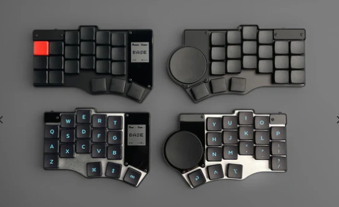

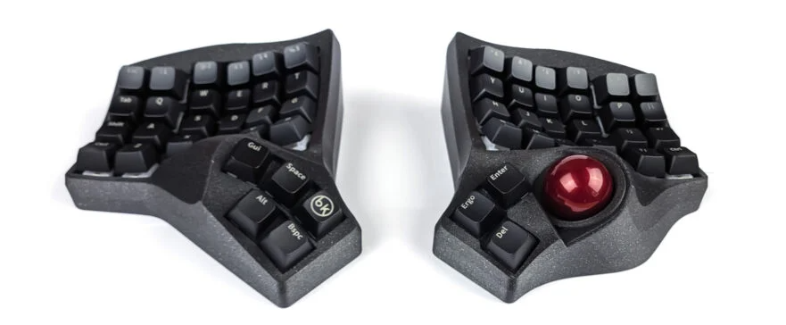

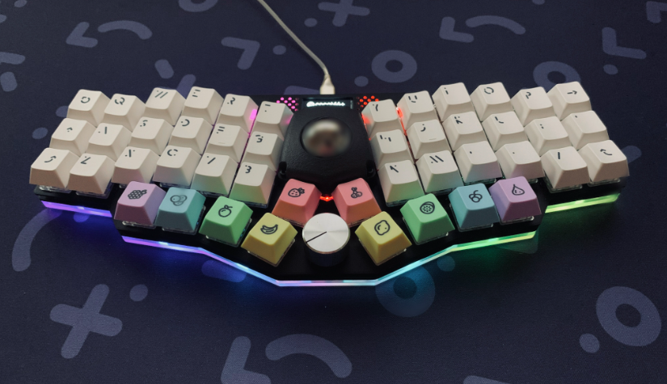

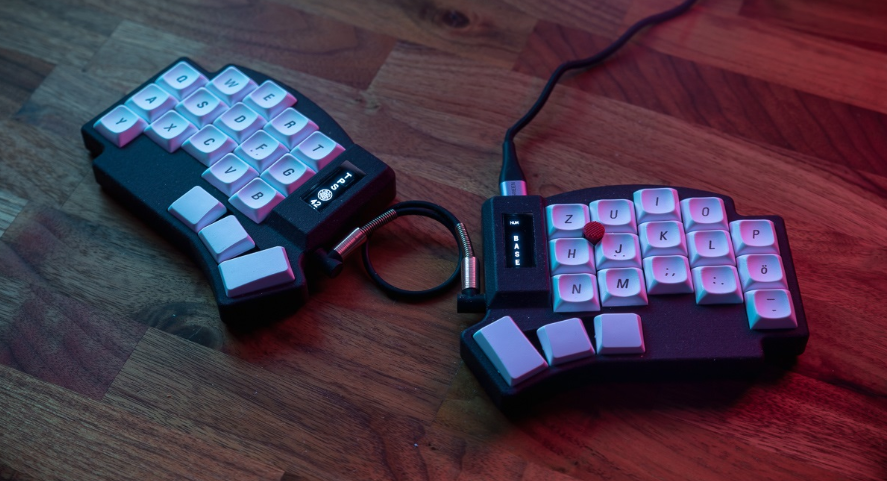

Custom keyboards also supports [mouse keys](https://docs.qmk.fm/features/mouse_keys) to emulate mouse movements with your keyboard. It can feel a bit limiting in functionality, but is better than nothing and can be helpful in a pinch.

### Wired vs Wireless
Historically, split keyboards were only wired due to both [technical and licensing limitations](https://www.reddit.com/r/olkb/comments/s95y98/comment/htkwvkp/?utm_source=share&utm_medium=web3x&utm_name=web3xcss&utm_term=1&utm_content=share_button) with [QMK](https://qmk.fm/), the custom firmware that powers many keyboards. A permissive, wireless, Bluetooth-first alternative called [ZMK](https://zmk.dev/) began development in [2020](https://kbd.news/ZMK-A-History-2222.html), and now many keyboards are offered in both wired and wireless variants. 

One thing to note - battery management has some quirks for fully wireless split keyboards. The central side needs to do double duty since it needs to communicate with both the host computer and the peripheral side, and as a result its battery discharges significantly faster. Additionally, the more features your keyboard has (display, pointing device, etc.), the shorter the battery life will be.

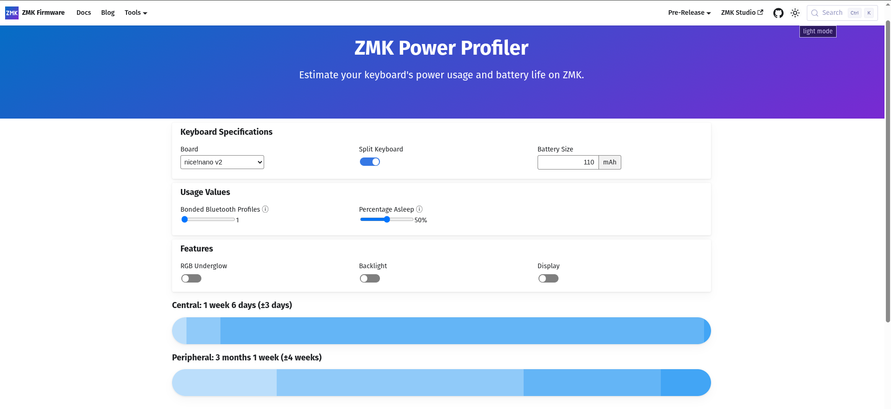

A popular workaround is to use a ZMK dongle, which makes both sides of a wireless keyboard act as peripherals to maximize battery life, although there are still [some limitations](https://docs.slicemk.com/firmware/zmk/wireless/dongle/) to this approach. 

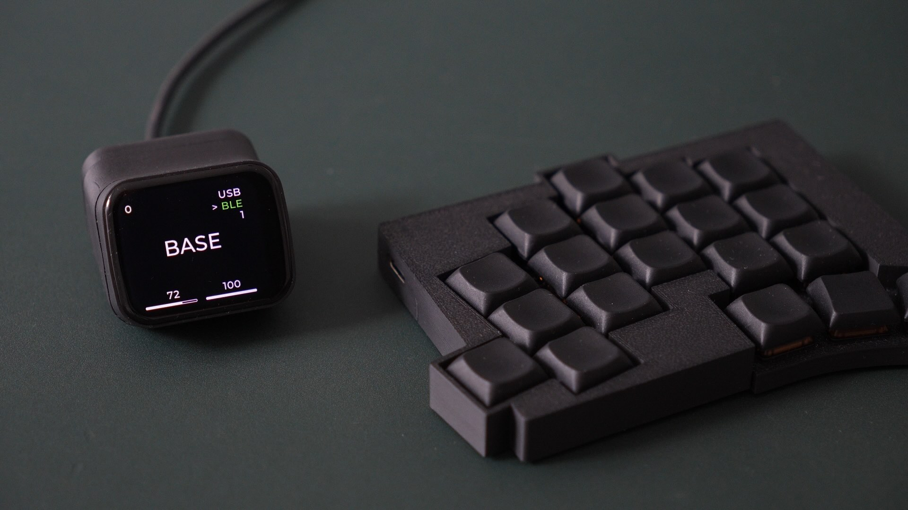

Some companies like ZSA still [prefer wired](https://www.zsa.io/wireless), and if your keyboard is going to stay on your desk, I would tend to agree.

### High vs Low Profile Switches
There are a ton of online resources that already go into the comparison of these, but the short of it is that low profile mechanical switches are relatively new and are becoming more common in keyboard designs. Lower profile means a shorter keyboard height, alleviating the need to use wrist/palm wrests. 

At the time of writing, high profile (MX) switches still have many more options and generally feel and sound better, and finding keycaps for low profile switches (especially Choc v2) can be challenging, but availability is expected to improve over time as they become more widespread.

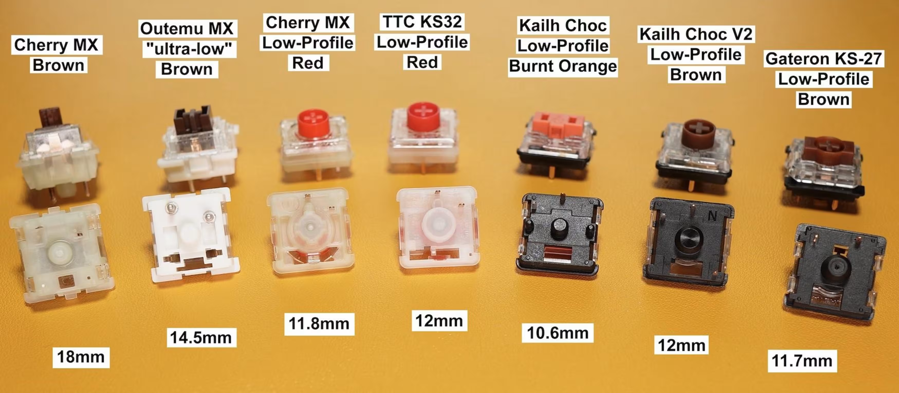

Keyboards often have hotswap sockets to allow installing different switches without needing to solder. Some boards like the [cheapino](https://github.com/tompi/cheapino) have the option to directly solder the switches (instead of using sockets) to keep costs low.

You might notice that many keyboards consist of **blank keycaps** instead of ones with legends. This is common because with the use of layers and keys having multiple functions, legends don't end up being that useful for indicating what a key will actually do. 

For both switches and keycaps, again it comes down to personal preference.
## Keymap Customization 

A core part of split keyboards is customizing the keymap to suit your own needs. Although keymaps are defined in firmware, many popular keyboards will have pre-compiled firmware with VIA/Vial support (for QMK, or ZMK Studio for ZMK) to support editing keymaps through a GUI.

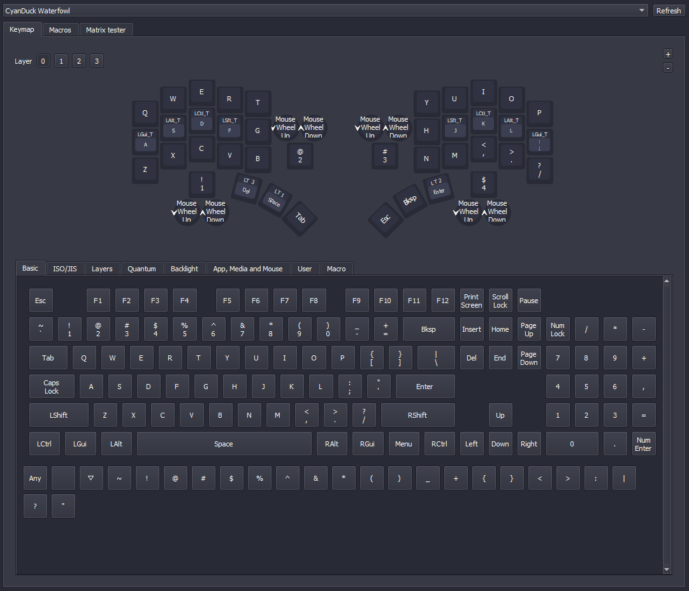

Basic "programmable" features consist of the following:
- [**Mod-Tap**](https://docs.qmk.fm/mod_tap): One key when tapped, another key when held. (E.g. on a traditional keyboard, many programmers remap `CAPSLOCK` to `ESC` when tapped, `CTRL` when held).
- [**Combos**](https://docs.qmk.fm/features/combo) : Press two keys to output another. (E.g. `J+K` to `ESC`, or `F+G` to a symbol like `-`)

At a minimum, you'll need to get used to using mod-taps on the thumb keys for keys like space, backspace, etc. and to activate the different layers. 

Beyond the surface lies more advanced features, where the sky's the limit to what fancy things can be done:
- [**One shot keys**](https://docs.qmk.fm/one_shot_keys): For modifiers only, allows you to use a modifier without needing to hold it down. Tap a modifiers key to activate it, then tap another key send the key code.
- [**Home row mods:**](https://precondition.github.io/home-row-mods) Giving home row keys (`ASDF` + `JKL;`) double duty to also act as modifier keys (`SHIFT`, `CTRL`, `ALT`, `GUI`) when held
- [**Callum style mods**](https://github.com/callum-oakley/qmk_firmware/tree/master/users/callum): Similar to home row mods, but combined with one shot keys to remove the dependency on timing

If you don’t know where to start with creating your own keymap, you can draw inspiration from existing ones on [KeymapDB](https://keymapdb.com/). For 36 key keyboards, the [Miryoku](https://github.com/manna-harbour/miryoku) keymap is a good place to start.
### What About Using a Non-QWERTY Layout?
Some choose to also change to an alternative layout like Dvorak, Colemak or other, since QWERTY is not designed with ergonomics in mind. However, learning a new layout requires even more time, and I personally haven’t gone down this route since the benefits of a column stagger and split keyboard are sufficient enough for me (and I reckon most people as well).

However, if you're curious to learn more, there are many other layouts aside from the popular Dvorak layout, which each have their own advantages depending on the metrics important to you (e.g. [same-finger bigrams (SFBs)](https://getreuer.info/posts/keyboards/glossary/index.html#same-finger-bigram-sfb), [lateral stretch bigrams (LSBs)](https://getreuer.info/posts/keyboards/glossary/index.html#lateral-stretch-bigram-lsb), [scissors](https://getreuer.info/posts/keyboards/glossary/index.html#scissor), [redirects](https://getreuer.info/posts/keyboards/glossary/index.html#redirect), [rolls](https://getreuer.info/posts/keyboards/glossary/index.html#roll), etc.).

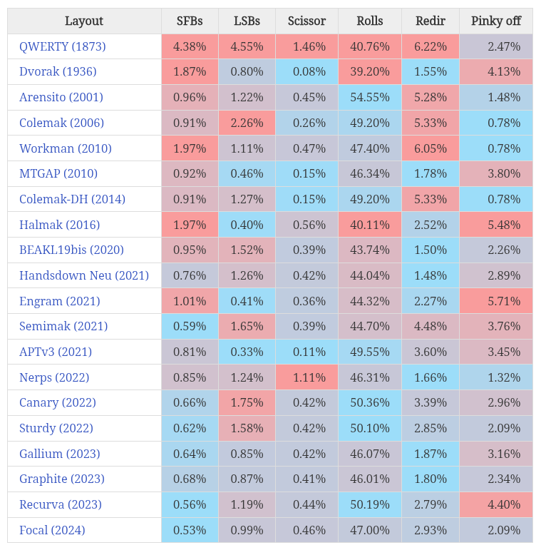
## How Do I Choose?
With the overwhelming number of keyboards one can acquire, how does one choose one for themselves? 

The first question is to ask yourself how many keys you think you need, which starts with whether you need a number row, arrow keys, home/end, etc. Generally, the more keys you have, the faster the learning curve will be.

Once you narrow down to the number of keys, next is the form factor. Aside from watching review videos on YouTube, there are also some great web tools to help since this will also depend on your own hand geometry. 

> Personally, I found the amount of column stagger doesn't make a huge difference (except for maybe the pinky column), whereas the thumb cluster matters a bit more since an overly tucked or stretched thumb is more noticeably uncomfortable.

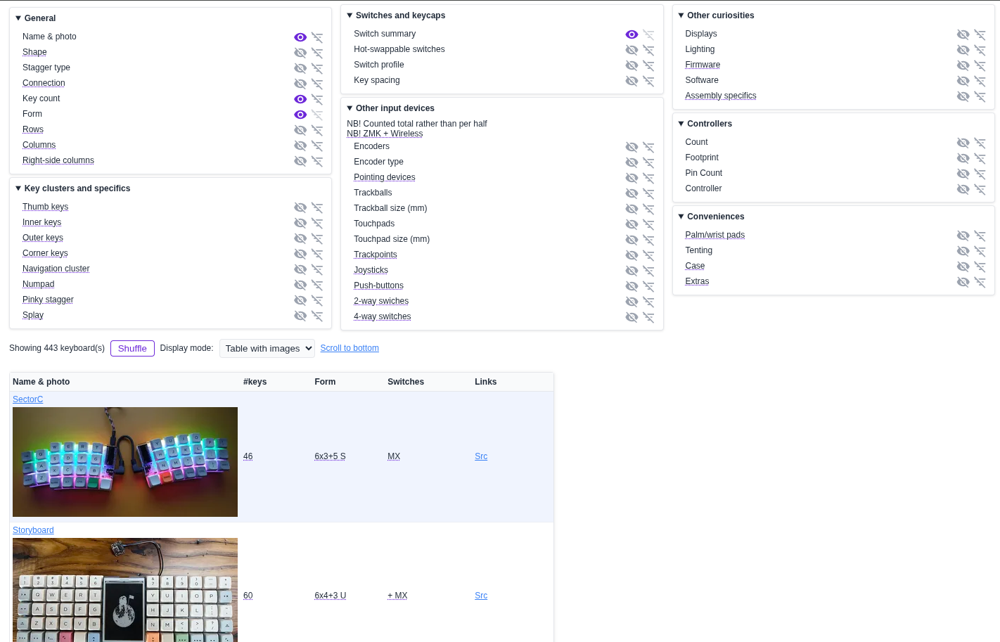

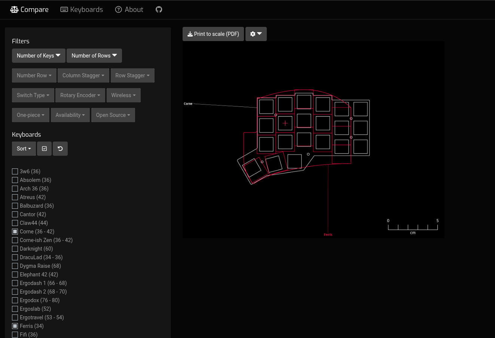

To get a better feel of your potential keyboard(s), you can use some low-fidelity prototypes to test the form factor. Printing it on paper is the easiest way...
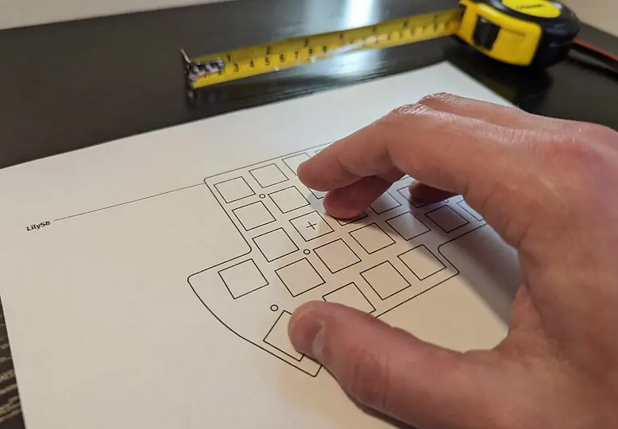

Or you can take it a step further and cut out the template on to cardboard, then install switches. If you want, you could even handwire it to make it a usable, functional keyboard, which may be worth the effort since actually using a keyboard can identify many more things (e.g. discomforts) than just randomly pressing dummy keys.

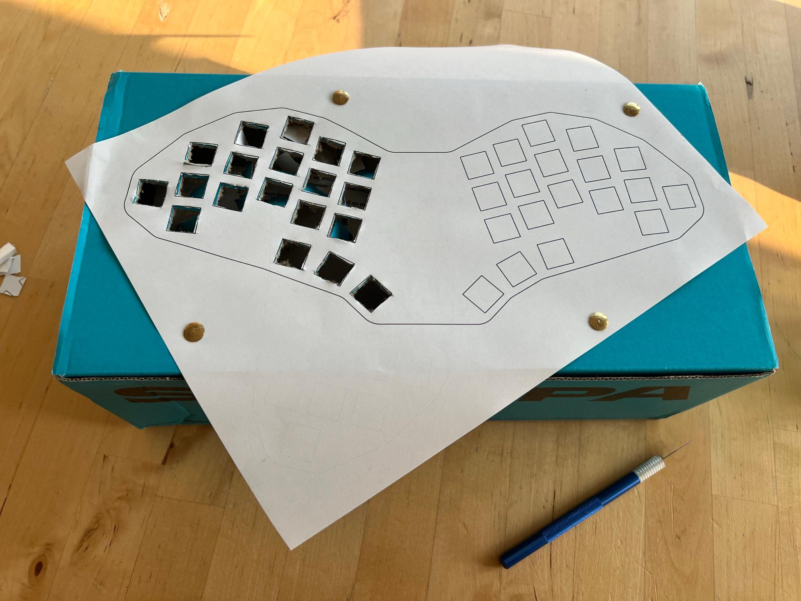

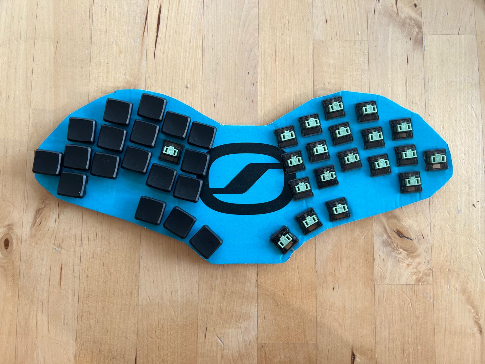

## To Buy or DIY?
### Buy
Gone are the days of needing to spend >$500 on an ergonomic keyboard, and now you can find a keyboard for every budget! Generally, the smaller the keyboard, the cheaper it will be since fewer keys = fewer switches/keycaps + smaller PCB.

In the **upper budget range**, companies like [Kinesis](https://kinesis-ergo.com/), [ZSA](https://www.zsa.io), and [Dygma](https://dygma.com/) make specialized, closed-source keyboards but offer premium devices and support.
There are also more boutique options like [MoErgo](https://www.moergo.com/) and [Bastard Keyboards](https://bastardkb.com/) that offer high quality products. These keyboards will usually have their own custom software to program them, which usually easier to use than the open-source software versions.

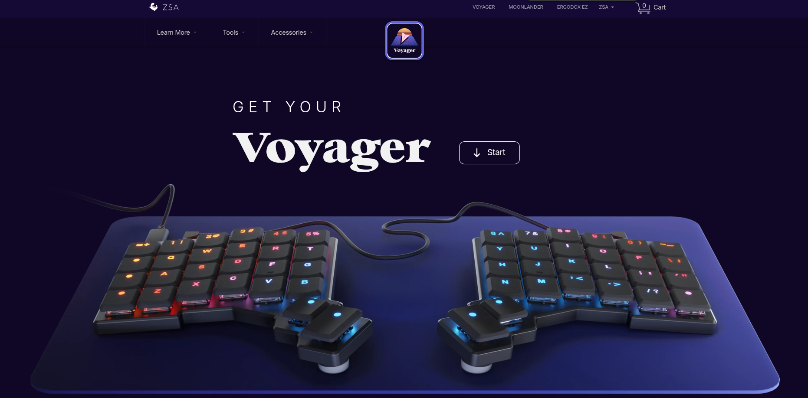

In the **middle range**, you can find many shops like [beekeeb](https://beekeeb.com/), [holykeebs](https://holykeebs.com/), [splitkb](https://splitkb.com/), or any of the other vendors listed on the [r/ErgoMechKeyboards wiki](https://www.reddit.com/r/ErgoMechKeyboards/wiki/resources). They typically sell both pre-assembled boards and kits that require soldering, but are offered at a more affordable price point. Many of the keyboards offered at these vendors are based on or variants of open-sourced designs.

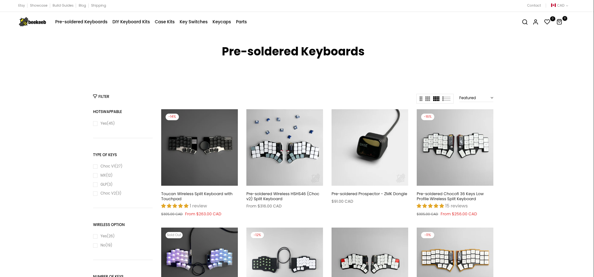

Although you do get a *much* nicer keyboard in the above price ranges, cheaper options exist on sites like Amazon and Aliexpress for those on **low budgets**. The experience or physical product may not be as refined (e.g. 3D printed cases are often used), but it'll still be functional and at least let you try it out without breaking the bank. This is where I started on [my journey with using a Corne keyboard](/posts/2025/05/corne-keyboard/).

> When buying cheap keyboards, there is a [security risk](https://www.reddit.com/r/ErgoMechKeyboards/comments/1idz2rn/why_you_should_always_reflash_new_keyboards_my_50/) to them. If possible, you should reflash the firmware to remove any risk of malicious behaviour.

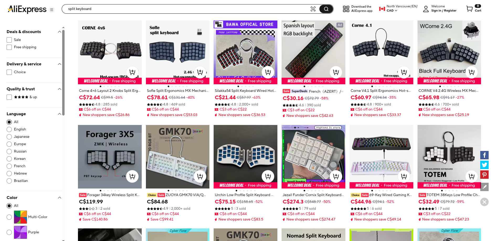

### DIY
Many keyboard designs are open-sourced, which means you can take the design files (usually hosted on Github, packaged as [gerber files](https://en.wikipedia.org/wiki/Gerber_format)) and get them manufactured somewhere like [PCBWay](https://www.pcbway.com/) or [JLCPCB](https://jlcpcb.com/). 

This is a great option if you find a design that isn't available in any of the options above. But in terms of cost, by the time you factor in the PCBs, switches, diodes, microcontrollers, fasteners, etc., not to mention the soldering equipment if you don't already have that, buying something from Amazon or Aliexpress will likely be the cheapest.

However, if you're okay with being even more hands on, and if you already have soldering equipment, [handwiring a keyboard](/posts/2025/08/handwired-skeletyl/) with a 3D printed enclosure will be the cheapest (and most flexible) option. As long as your soldering is solid, there wouldn't be any functional difference between this and a PCB!

## Popular Keyboards

Still have trouble finding which keyboard you should get? Here’s a list of popular* keyboards for each budget (as of Feb 2026):

> \*The keyboards listed below are from my personal perspective, based on what I see mentioned and recommended around Reddit. YMMV and I could have missed some - there are many other keyboards out there, so please do your own research!

| Keyboard                 | Budget | # Keys       | Open Sourced? |
| ------------------------ | ------ | ------------ | ------------- |
| ZSA Moonlander / Voyager | $$$    | 76 / 52      | no            |
| Dygma Defy               | $$$    | 70           | no            |
| Glove80 / Go60           | $$$    | 80 / 60      | no            |
| Dactyl / Charybdis       | $$$    | 58 / 42 / 36 | yes           |
| Keyball                  | $$$    | 61 / 44 / 39 | yes           |
| Elora / Kyria            | $$     | 62 / 50      | no            |
| Sofle / Lily58           | $$     | 58           | yes           |
| Totem                    | $$     | 38           | yes           |
| Silakka54                | $      | 54           | yes           |
| Corne                    | $      | 36 / 42      | yes           |
| Sweep                    | $      | 34           | yes           |

Open sourced means the design files are available for building yourself, as well as there being many variants around (at both reputable vendors and places like Aliexpress). For example, if you bought a Corne on Aliexpress and like the layout but want some premium features like wireless, low profile switches, and/or a sturdier case, you can shop around at different vendors to find boards with these features.

A common starting keyboard is the 42 key Corne if you’re okay with fewer keys, or the Silakka54/Lily58/Sofle if you want more keys. From there, some stay with these to be their daily drivers, and others use them as a stepping stone to move on to other keyboards after learning more about their workflow preferences.

## Design Your Own
If no existing keyboard sparks joy, there are many resources and tools to design your own. Tools like [Ergogen](https://flatfootfox.com/ergogen-introduction/) and [kle-ng](https://github.com/adamws/kle-ng) make it easy to create your own layout, which can be exported to [Kicad](https://www.kicad.org/) to finalize the PCB. Or if you want one fully customized to your hand shape, you can use [Cosmos](https://ryanis.cool/cosmos/) to create a sculpted one to be handwired.

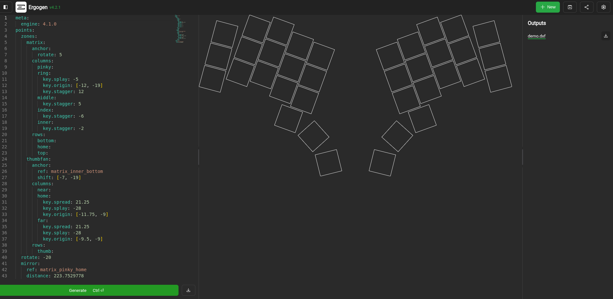

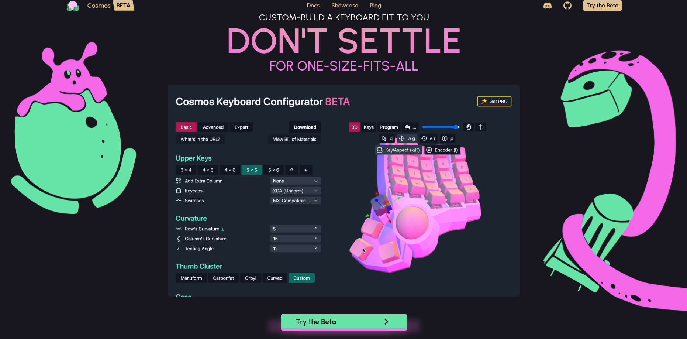
This is a topic in itself, but there are many existing tutorials and guides on YouTube and around the internet. For keyboards on Github, you can also poke around the design files and reference or adapt them to your needs, which is the great thing about open source!

# Closing Thoughts
If you've made it this far, thanks for reading! Hope this was helpful in starting you off in this journey of finding your perfect keyboard. 

Happy typing!
