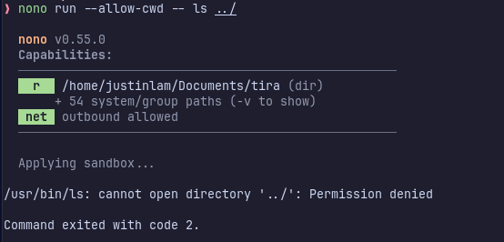
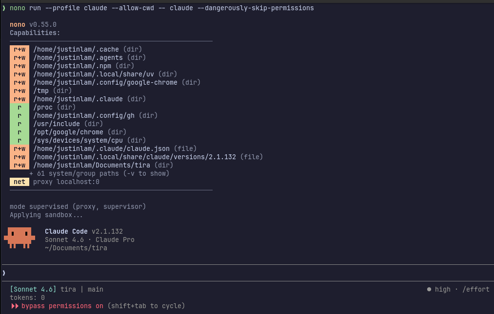

AI is taking over world of software development, but it sure ain't going to take over my computer! 

I've been waist deep in coding with AI, testing out different models, agents, and workflows, but the one constant has been the ability to safely isolate these AI agents in a sandbox to prevent them from going rogue and doing things it shouldn't (like leaking my api keys or taking down a [production database](https://www.techradar.com/pro/it-took-9-seconds-tech-founder-outlines-how-rogue-claude-powered-ai-tool-wiped-entire-company-database-and-backups-but-says-theres-no-such-thing-as-bad-publicity)). This is especially important for me since I typically run agents in `--dangerously-skip-permissions` (aka `--yolo`) mode, as who wants to babysit them and constantly approve commands they want to run?

Although docker now has a dedicated [sandbox tool](https://www.docker.com/products/docker-sandboxes/), I personally find it a bit clunky to use compared to non-containerized tools. I also don’t like how each workspace gets its own image, because it means that the development set up needs to be done repetitively for each project (e.g. even if they're all python-based). In general, I find docker to be great for deployments, but less so for active development where I prefer using more native workflows.

Earlier this year, I came across a kernel-level sandboxing tool (written in Rust!) called [nono](https://github.com/always-further/nono), and have been quite pleased with how it fits into my workflow. It’s lightweight, fast,  configurable, and under active development, providing both file level and network level isolation. Under the hood, it uses [Landlock](https://docs.kernel.org/userspace-api/landlock.html) on Linux and [Seatbelt](https://nono.sh/docs/cli/internals/seatbelt) on macOS, both of which are in-process or same-process restriction primitives.

Usage is very simple, where any normal command can be sandboxed via nono with `nono run -- <command>`.



My toolkit involves using and trying out many different agents. At work, I use GitHub Copilot, but for my personal projects, I rotate between whatever gives me the most value for my dollar, especially now that the open weight models have gotten significantly better in recent months. This is especially true since many of these frontier models are operating with significant subsidies, so might as well get better at using the more sustainably-priced models. 

The agents that I've rotated through this year:

- Claude Code
- Codex
- Qwen (back when they had a generous free tier)
- Kilo Code
- Opencode
- Crush
- Pi

Nono makes it easy to manage permissions for all of these with profiles. My base profile (in `~/.config/nono/profiles/base.json`), which is where I define all the tool paths needed for development (as well as any permissions for skills or MCP servers):

```json
{
  "extends": "default",
  "meta": {
    "name": "base",
    "description": "Shared coding environment: runtime groups and common filesystem access"
  },
  "groups": {
    "include": [
      "node_runtime",
      "python_runtime",
      "go_runtime",
      "git_config"
    ]
  },
  "filesystem": {
    "allow": [
      "$HOME/.cache",
      "$HOME/.agents",
      "$HOME/.config/google-chrome/",
      "/tmp"
    ],
    "read": [
      "/proc",
      "$HOME/.config/gh",
      "/opt/google/chrome/"
    ],
    "read_file": []
  },
  "environment": {
    "allow_vars": ["PATH", "HOME", "TERM", "LANG"]
  },
  "workdir": {
    "access": "readwrite"
  }

}

```

Then each agent has its own profile, e.g. for Claude in `~/.config/nono/profiles/claude.json`:

```json
{
  "extends": "base",
  "meta": {
    "name": "claude",
    "version": "1.0.0",
    "description": "Claude Code with additional project access"
  },
  "groups": {
    "include": [
      "claude_code_linux"
    ]
  },
  "workdir": {
    "access": "readwrite"
  },
  "filesystem": {
    "allow": [
      "$HOME/.claude"
    ],
    "read": [],
    "allow_file": [
      "$HOME/.claude.json",
      "$HOME/.local/bin/claude"
    ]
  },
  "network": {
    "allow_domain": ["claude.ai"]
  },
  "allow_launch_services": true,
  "interactive": true
}

```


Running it is as easy as:

```sh
nono run --profile claude --allow-cwd -- claude --dangerously-skip-permissions
```


I've been using [Crush](https://github.com/charmbracelet/crush) with [OpenCode Go](https://opencode.ai/go) recently, so for completeness, here's what the config looks like for that (in `~/.config/nono/profiles/crush.json`):

```json
{
  "extends": "base",
  "meta": {
    "name": "crush",
    "version": "1.0.0",
    "description": "Profile for crush"
  },
  "workdir": {
    "access": "readwrite"
  },
  "filesystem": {
    "allow": [
      "~/.local/share/crush",
      "~/.config/crush",
      "$HOME/.local/state"
    ],
    "read_file": []
  },
  "environment": {
    "allow_vars": ["OPENCODE_API_KEY"]
  },
  "network": {
    "allow_domain": ["opencode.ai"]
  },
  "allow_gpu": true
}
```

Which I then run with:

```sh
nono run --profile crush --allow-cwd -- crush --yolo
```

**Things I like about nono:**

- **Works with any agent out of the box.** Since it's just a wrapper around whatever command you'd normally run, adding a new agent to my rotation only takes a few minutes of config work.
- **Profile composition keeps things DRY.** The `extends` system lets me define shared runtime paths, environment variables, and filesystem permissions once in a base profile, with each agent profile only adding what's specific to it. Updating a tool path or adding a new MCP server means changing it in one place.
- **Negligible overhead.** No daemon, no image, no build times to manage.
- **Easy to test and validate permissions.** Since it's a wrapper, I can run any single command under a profile and immediately see what gets blocked. Tweaking a path doesn't require rebuilding anything.

**Where Docker containerization is still advantageous:**

- **Stronger isolation.** Nono restricts what a process can *do*, but the agent still shares your kernel. A kernel exploit escapes Landlock/Seatbelt entirely, which is unlikely for the typical "agent accidentally writes somewhere it shouldn't" scenario, but worth knowing. Docker with [seccomp profiles](https://docs.docker.com/engine/security/seccomp/) and user namespaces adds more layers here.
- **Resource limits.** Docker wraps cgroups cleanly for capping CPU and memory. With nono you'd need to layer that on separately.

Running agents in sandboxes can be a bit finicky when integrating with other tools like MCP servers, and it's tempting to just bypass it all to make life easier. But the security it provides, and the long-term productivity gain of letting agents run unsupervised, is worth it, at least in my experience. And nono makes it easy to grant the requisite permissions without too much additional friction.

Even though Docker provides better isolation, the realistic threat vector for running agents in YOLO mode during development is accidental misbehaviour, not untrusted or potentially malicious code susceptible to prompt injections. As with all security, it comes down to your risk tolerance, and for me, nono hits the right balance.

Happy sandboxing!
