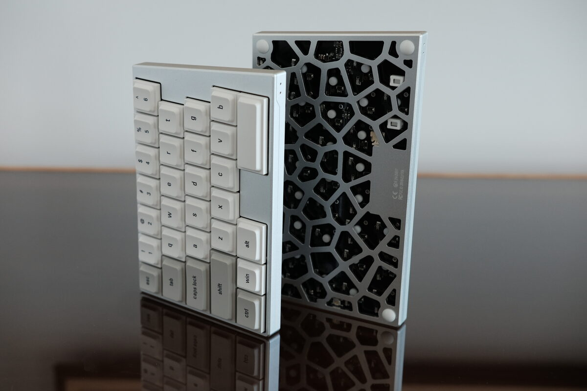
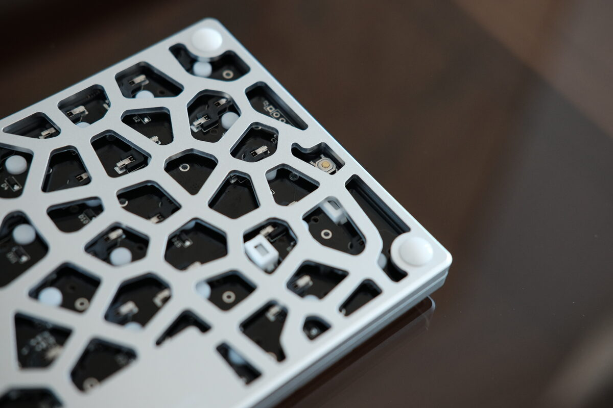
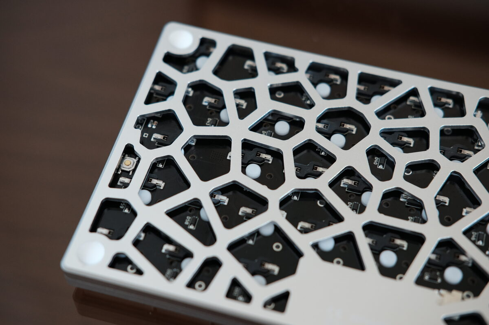
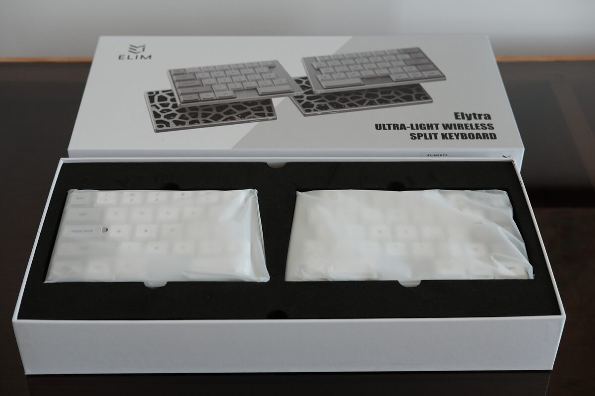
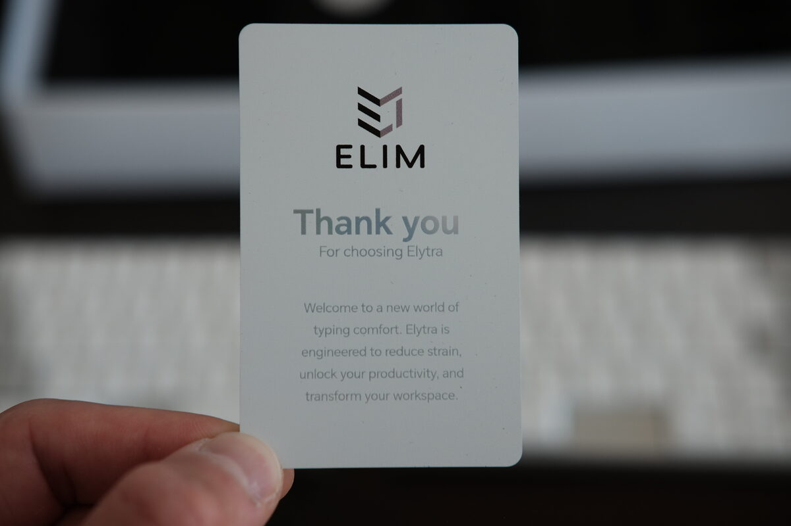

ElmKeys Elytra keyboard review

Disclaimer: Sent for free, but all opinions my own.

<!--more-->

Solid aluminum body, very premium feeling. Keycaps are nice, profile is also nice and comfortable. Very low profile. Zero flex in case. 

Keycaps very nice. Legends clean and crisp. Keycap profile is comfortable. Nicely radiused edges.

Regular row staggered layout, so easy for normal people to get into split keyboards. 

Status LEDs, discrete but nice. On bottom.

Top side shows on/off switch, plus USB C port. The right side (or left in the image) is only for charging though.

The magnetic angle interface in the middle snaps together, very compact. Unibody is nice so that each hand is always aligned relative to the other, since keyboard halves can shift around on a desk over time.

I think it would have looked a bit nicer if the middle wasn’t so large though.

Wrist rests also very nice. Already low profile so some may find it not necessary, but adds a bit of extra comfort. 

Also has a tenting kit, but I prefer flat so I did not opt for it. But the tenting also tents the wrist rests, so that’s quite nice.

Backside shoes a nice pattern. Box includes a separate film to install if additional insulation is desired.

Reset button is on both halves and is accessible without needing to disassemble.

Carrying case is perfectly fit for it, small size is easy to carry around.

Includes accessories. Cable, keycap puller, extra keys, extra switches.

## Internals

