> Disclaimer: ElimKeys sent this keyboard to me for review. As always, all opinions are my own.
> 
> If you decide to purchase one, you can use my [referral link](https://elimkeys.com/?ref=ngemobbm) and coupon code `GLEEFULMOLE` for 3% off.

I've spent the while gradually falling down the ergonomic keyboard rabbit hole. It started with a [Corne](/posts/2025/05/corne-keyboard/), then a [Skeletyl](/posts/2025/08/handwired-skeletyl/), then a Keyball, and somewhere along the way I convinced myself that [36 keys was a perfectly reasonable](/posts/2025/07/36-key-layout/) number of keys for a keyboard.

The funny thing is that none of those keyboards are particularly easy to recommend to someone who's never used an ergonomic keyboard before.

The [Elytra](https://elimkeys.com/products/elytra) is a keyboard for people who want the main ergonomic benefit of a split keyboard without diving into the mental gymnastics of column stagger, layers, and getting strange looks by every person who walks by your desk.

Turns out the majority of people fall into this category!

After using split ergonomic keyboards for a while, it's easy to forget how much weirdness one quietly accepts. The [first time I used a Corne](/posts/2025/05/corne-keyboard/), I faced a steep learning curve: I had to relearn where letters lived, then I had to learn layers, then combos, then I started thinking about whether I really needed a quotation mark on the main layer... which was probably a reasonable moment for self-reflection of how I was spending my limited brainpower.

The Elytra goes in the opposite direction. It keeps the familiar row-staggered layout, splits the keyboard into two halves, adds wireless, uses low-profile switches, and wraps the whole thing in a very nicely machined aluminum case.

Is it the most ergonomic keyboard? No, but it is pretty good at trying to remove as many reasons as possible for not switching to a split keyboard. 

<!--more-->
# What Is It?

The Elytra is a low-profile, row-staggered split keyboard with two independent halves that can either sit apart on your desk or snap together from the internal magnets.

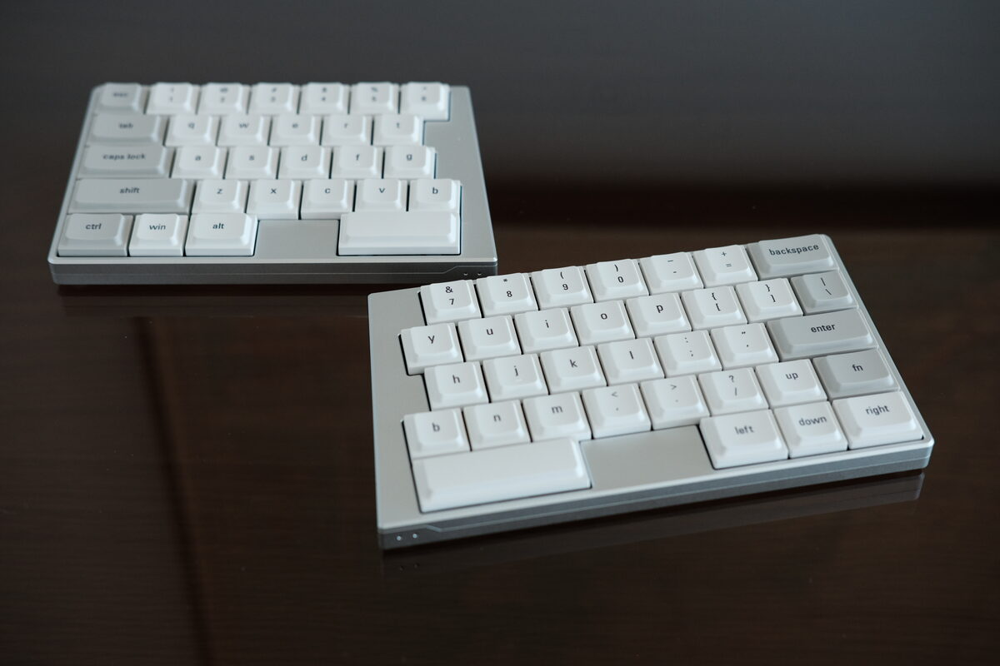

One thing about having a split keyboard is that each half can shift around on your desk over time, which means that each hand needs to reorient itself relative to each other whenever the halves move. Having the option to mate them together is a welcome feature.

The Elytra's magnetic bridge gives the keyboard a default home position. Three hidden magnets pull the halves together with enough force that the whole board feels like one piece when you move it around, while still letting you separate the halves when you want a wider shoulder position.

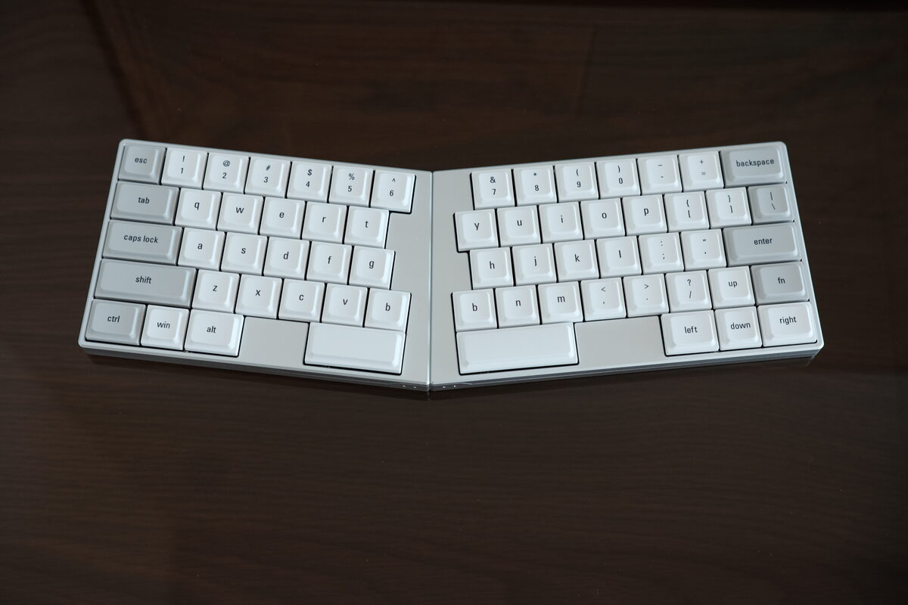

I initially thought the bridge looked larger than it needed to be, and wondered why the spacing was relatively large when everything else was very minimal. Tearing it down revealed this reason, which I'll get into later. 

The spacing is ergonomically useful though. A keyboard that's technically split but keeps your wrists squeezed together is somewhat missing the point, so the design decision/feature works out here.

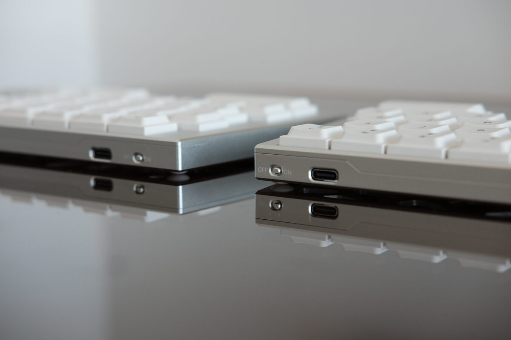

The status LEDs are also tucked into the bridge area, and I appreciate how restrained they are. Many keyboards have blindingly bright RGB lights that can illuminate an entire room, but these are nice and minimal to tell you what you need to know and otherwise stay out of the way.

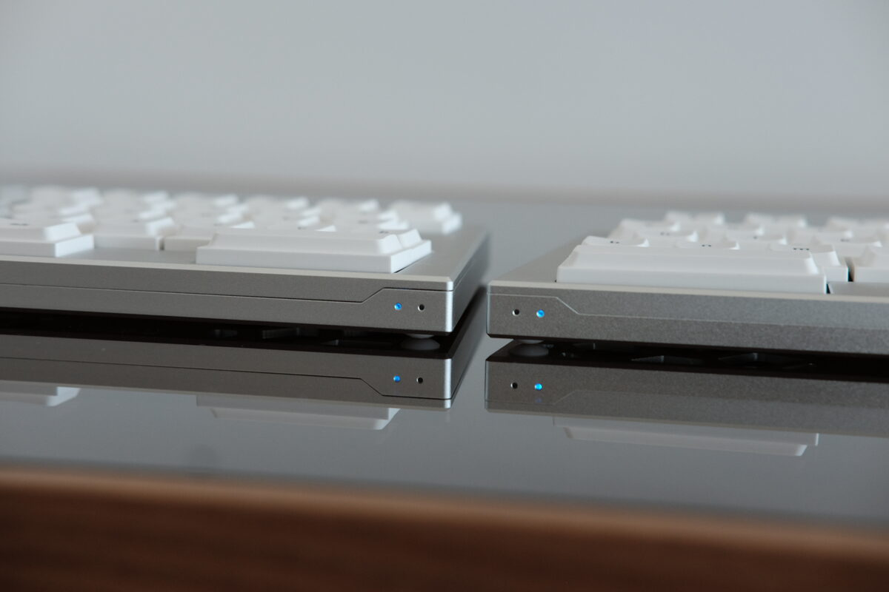

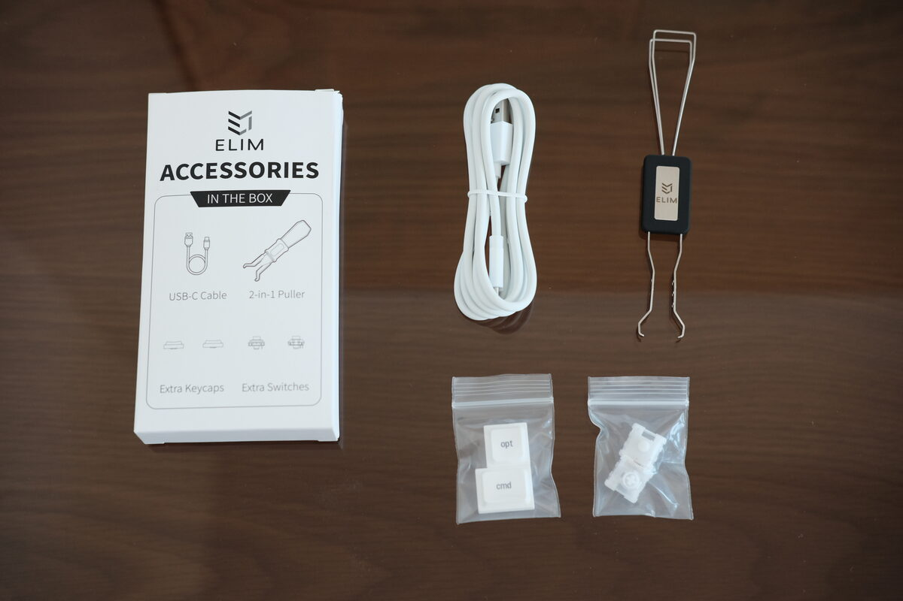

# Build Quality

The biggest surprise was how refined the keyboard felt. Maybe it's because most of the ergonomic keyboards I've used recently have been 3D printed or bare/barely protected PCBs, but regardless it's a nice change to experience what a finished keyboard product feels like!

I expected it to be nice from the product pictures online, but seeing and feeling it in real life was even better. The aluminum case has no meaningful flex, the edges are clean, and even the underside looks like someone cared about the part of the product most people will only see when looking for a reset button.

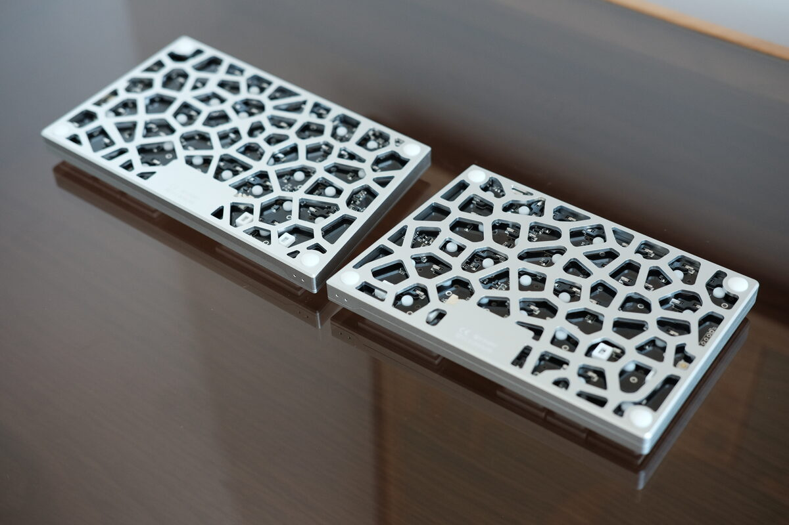

This sounds like a small thing, but hardware quality is often revealed in the boring surfaces. The top side has to look good because it's in every product photo. The underside is where you find out whether the manufacturer was trying to make a nice object or just a nice render.

The included wooden wrist rests are also well made. The keyboard is low enough that I don't think they're mandatory, but I liked using them during longer sessions. They give the palms a little more support without turning the whole setup into a bulky desktop fixture, and the natural (but unknown) wood feels comfortable against the skin.

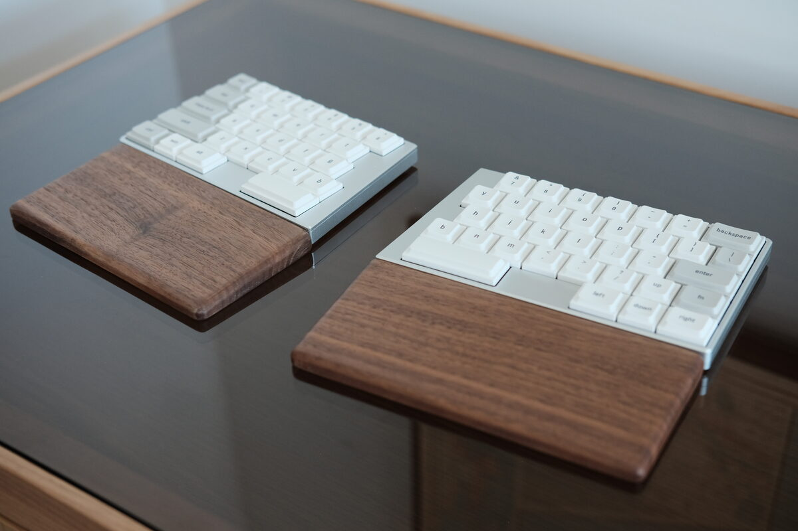

There's also an optional tenting kit. I generally prefer my keyboards flat, so I didn't test it, but it looks like a sturdy system. I'm sure you can 3d print some similar fixtures to save some money though!

# Typing Feel

My review unit came with 40 gf CloudShell White linear switches, and these changed my opinion of silent low-profile switches.

Most silent low-profile switches I've tried make some kind of tradeoff that I notice immediately, where usually they feel mushy and uninspiring. Or they feel crisp, but the sound reduction isn't actually that good. The CloudShell Whites are almost silent while still feeling clean and crisp, so much so that I don't feel the need to hold out for the long-awaited [Ambients Silent Tactile Sunrise switches](https://lowprokb.ca/products/ambients-silent-choc-switches) anymore...

The keycaps have a very pleasing profile to them, no sharp edges that result in discomfort. Legends are crisp, and the font + colour palette are a nice combo for a retro-but-modern look. If these keycaps were available separately, I'd want to buy another set for my custom keyboards!

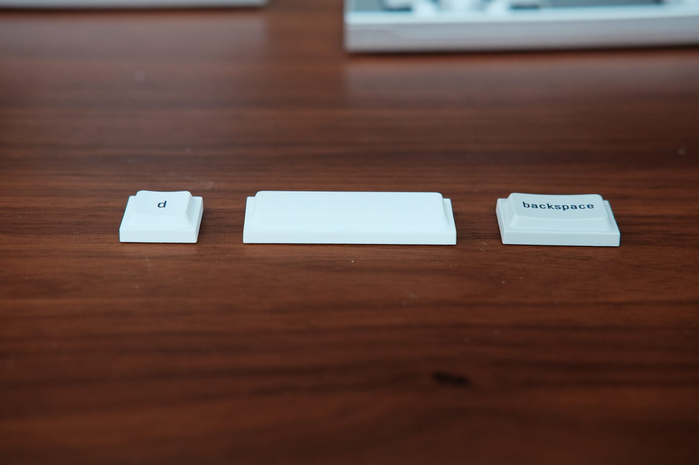

The Elytra will be more than quiet enough for an office, at least with these switches. Rather than being a keyboard designed for the best sound, this feels like it was designed for a solid typing experience.

# Living With The Layout

Most ergonomic split keyboards ask for a lot from the user. A column-staggered board moves the keys into positions that better match finger anatomy, which is great, but it also means years of row-staggered muscle memory become temporarily useless. Then many of those keyboards remove the number row, move common punctuation, and expect you to become comfortable with layers.

I enjoy that stuff, because apparently that's who I am now, but it's not for the faint of heart.

The Elytra keeps the row-staggered layout, so the transition is much gentler. I could separate my hands, keep my wrists straighter, and still type normally within minutes, which is an experience that many people are probably seeking.

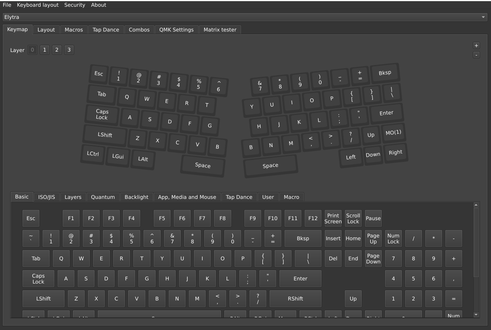

There are still some compromises. The right side is condensed, with no dedicated right shift, control, meta, or alt keys. I think most people will be fine with this, but if you use those keys heavily, you'll need to adapt to it.

There's also no dedicated Page Up or Page Down. I rarely use those directly, but some people do, and this is the kind of omission that can be either irrelevant or constantly annoying depending on your workflow.

The default Fn key sits on the far right above the right arrow. On a regular keyboard, I usually remap Caps Lock as my layer key, but on the Elytra I would use the left spacebar instead (since I use my right thumb for spacing). That's one of the nicest parts of having dual spacebars: one can remain space, and the other can become a layer key without making your pinky do more work.

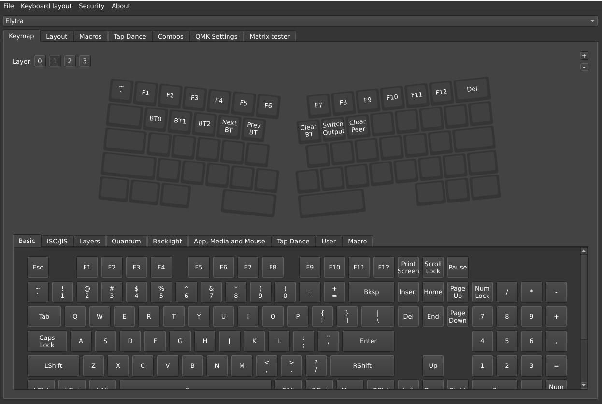

Wireless latency was a complete non-issue in normal use. I even played a few rounds of Clone Hero on it without noticing problems, which is not exactly a scientific benchmark, but is a decent way to find out whether a keyboard's latency makes you angry!

# The Wireless Tradeoff

The right half is always wireless, which for many people, this is probably fine. ElimKeys says battery life is measured in weeks, and since the right half is only the peripheral side, it should use less power than the main half that also communicates with the host computer.

For me, I'd still prefer a fully wired option.

This is partly because my keyboards usually live on a desk. If a keyboard isn't moving around, wireless freedom matters less than never needing to think about battery state. This is also why my daily keyboard is currently a Keyball: I rely heavily on the integrated thumb trackball, and I want that whole setup to behave like a boring wired appliance.

That isn't a criticism of the Elytra as much as it's a mismatch with my personal setup. The Elytra is solving a different problem, and some people prioritize portability and/or a clean desk with no cables over charging logistics, which is totally fine! Different strokes for different folks.

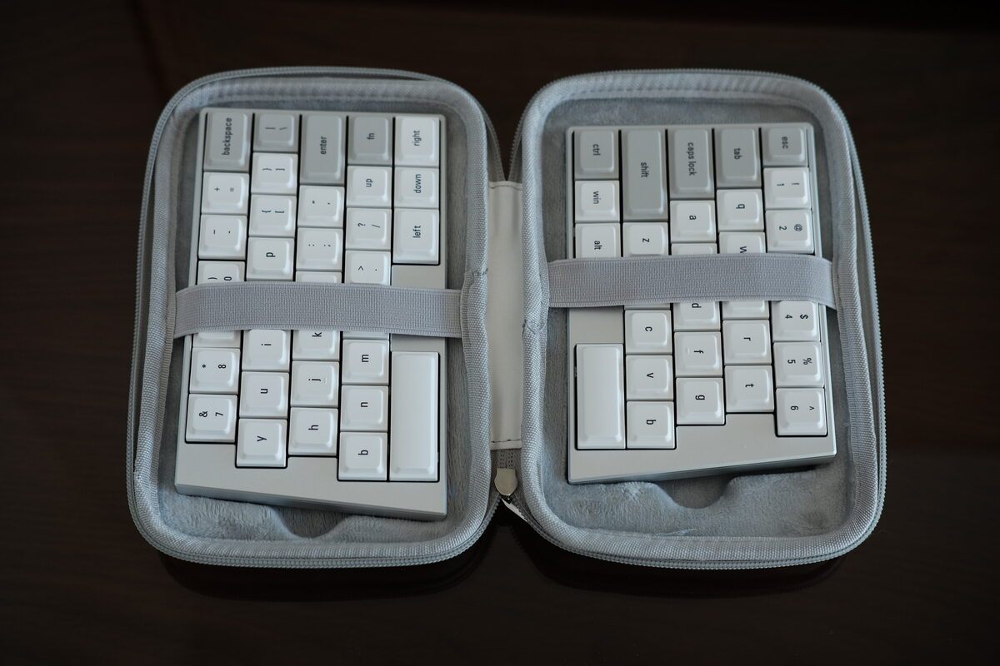

The case is also quite nice, everything fits snugly, including the keyboard halves, wrist rests, and accessories. It's easy to imagine tossing this into a backpack and setting up a proper split keyboard at a coffee shop, office, or coworking space.

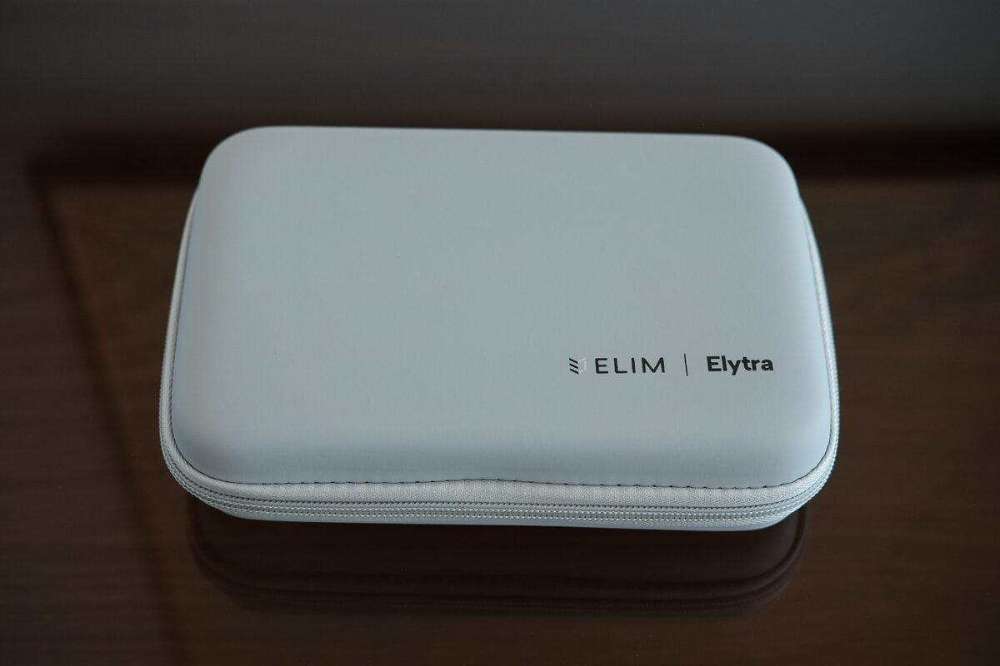

# Taking It Apart

Of course, I had to open it :)

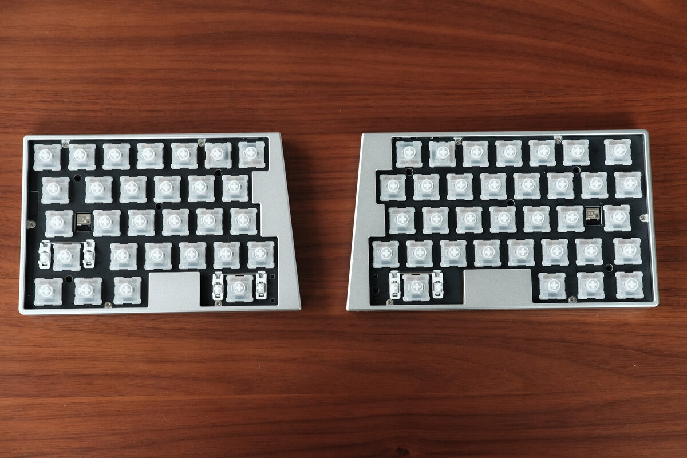

The first impression inside was very good. The assembly quality is excellent, the solder joints are clean, and the PCB routing looks tidy. This is the part of the review that most normal buyers will never care about, but it's also where I become more confident in a product.

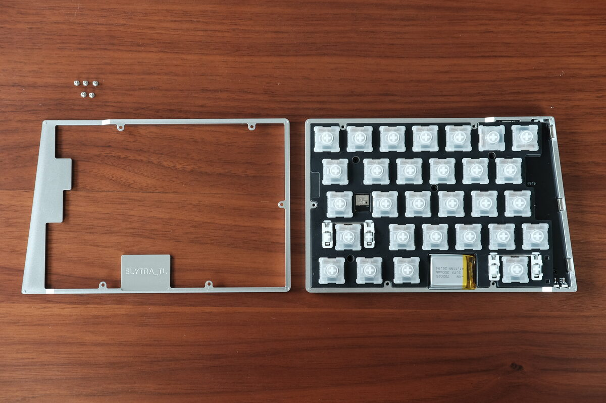

The case comes apart cleanly, but disassembly was more annoying than it needed to be because the battery cable is very short. I had to use precision tweezers to remove the JST plug from the socket, which is not exactly the standard tool sitting in everyone's desk drawer. I do wonder if this was a procurement oversight, since battery cables usually aren't *this* short, and is an easy problem to fix.

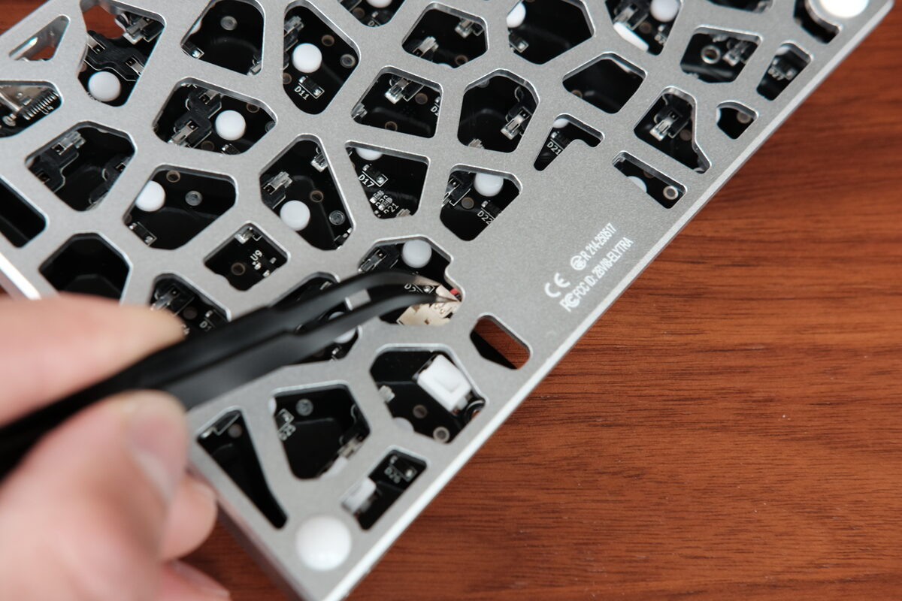

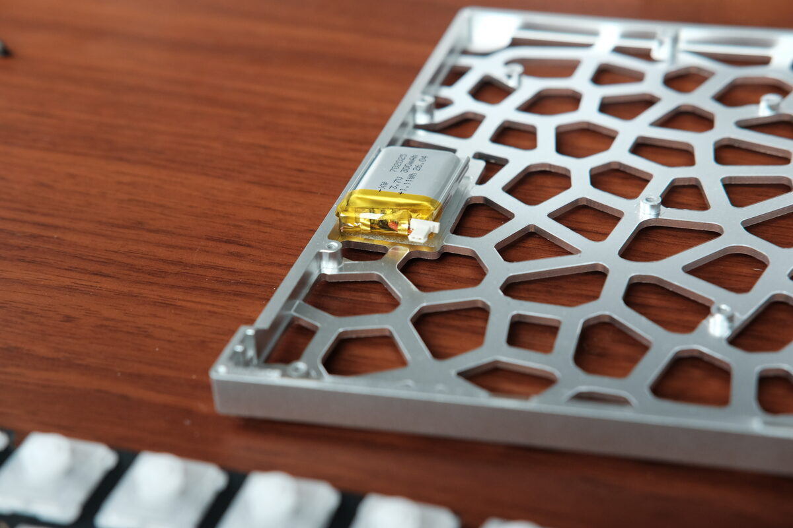

That's my most concrete assembly criticism. A slightly longer cable would make servicing easier without meaningfully changing the product. As it is, the cable works, but it turns disassembly into a delicate little operation.

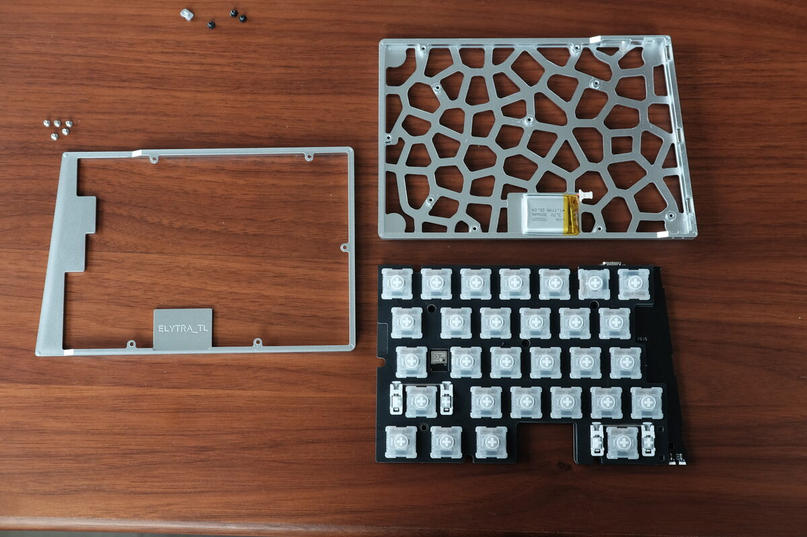

The magnets for the bridge sit inside the case and are neatly integrated into the case

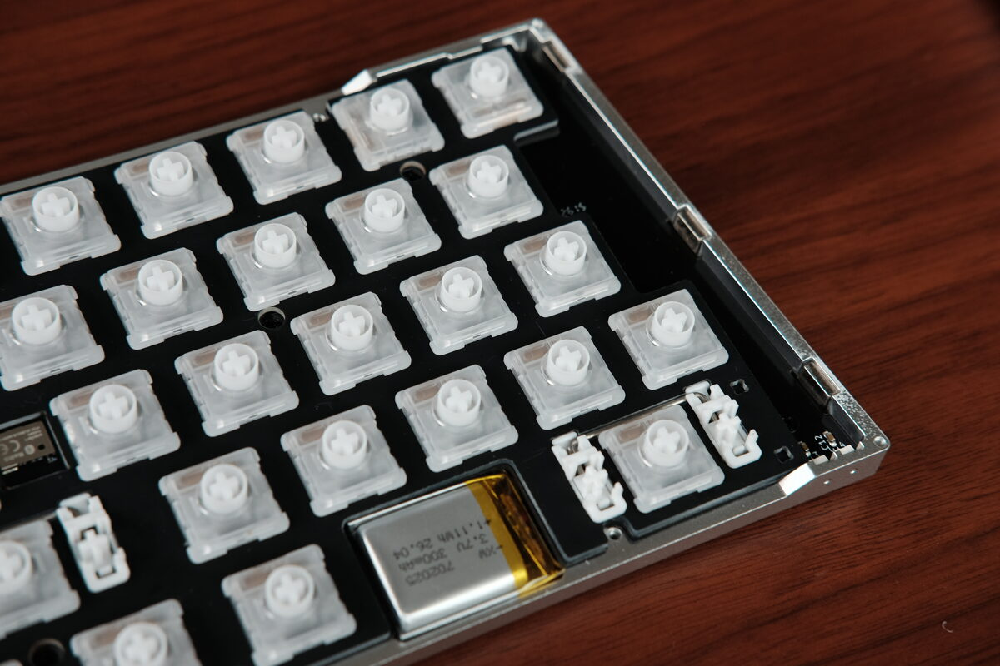

The underside of the PCB is equally clean.

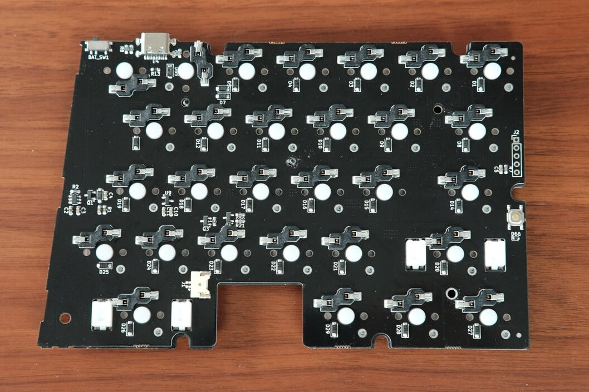

One fun detail is that the hotswap socket for the  `5` key is rotated 180 degrees to make room for the USB-C connector. I had to do a similar thing when designing my [dabao keyboard](https://github.com/justinmklam/dabao) to make room for the integrated trackpoint. 

The Bluetooth module appears to be a [Minewsemi MS51SF1](https://store.minewsemi.com/product/bluetooth-modules-nrf52833-ms51sf1/), which was interesting because I hadn't encountered one in a keyboard before. It's a tiny module based on Nordic's nRF52833, with a 32-bit ARM Cortex-M4F CPU, 512 kB flash, and 128 kB RAM.

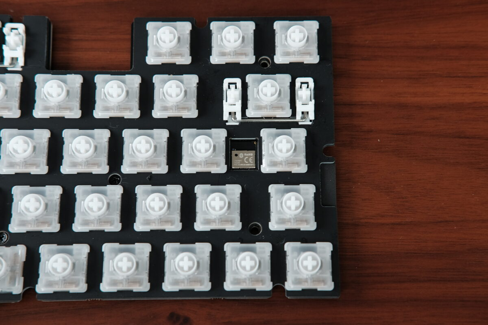

That's plenty of capability for a wireless keyboard, and it's always cool to see what components companies choose for their products, as a reminder that building one-off prototypes as a hobbyist is a different game than designing something for mass manufacturing (where margins really matter). 

One reassembly note: if the power switch falls out of the case, pay attention to its orientation. It has a tiny stepped feature that only fits one way. If you put it in backwards, the case can still close, but the switch will feel jammed.

Spoken from experience, naturally.

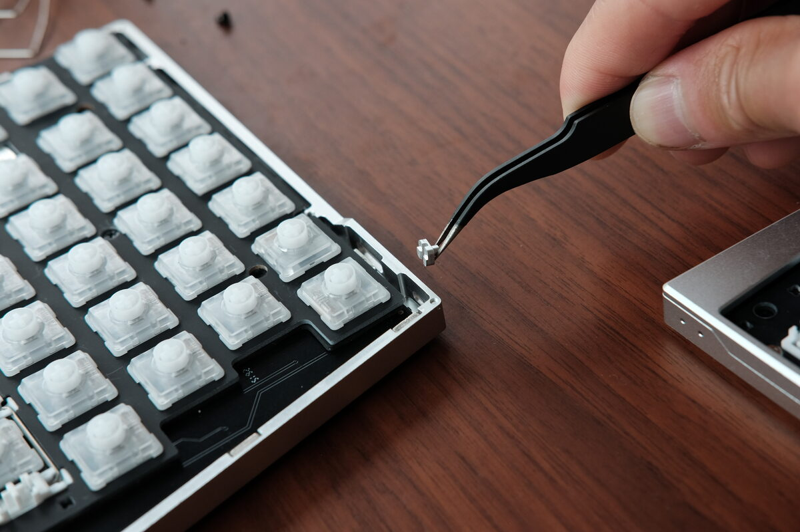

# Firmware

The Elytra uses [RMK](https://rmk.rs/), a Rust-based keyboard firmware, instead of the more common [QMK](https://qmk.fm/) or [ZMK](https://zmk.dev/), which is one of the more interesting technical choices that stood out to me.

QMK is the dominant firmware in the custom keyboard world, but it's historically wired-first. Vial, which is based on QMK, adds a much nicer live-remapping experience. ZMK, on the other hand, was built with wireless and low power in mind, but live keymap editing has been more limited.

RMK is trying to bridge that gap: wireless support with Vial compatibility.

That fits the Elytra's whole design philosophy surprisingly well. The keyboard itself sits between a normal keyboard and a more enthusiast ergonomic split. The firmware choice sits between the programmability expectations of QMK/Vial users and the wireless expectations of ZMK users.

To remap the keyboard, it needs to be plugged in over USB. Once changed, the keymap persists when using it wirelessly over Bluetooth.

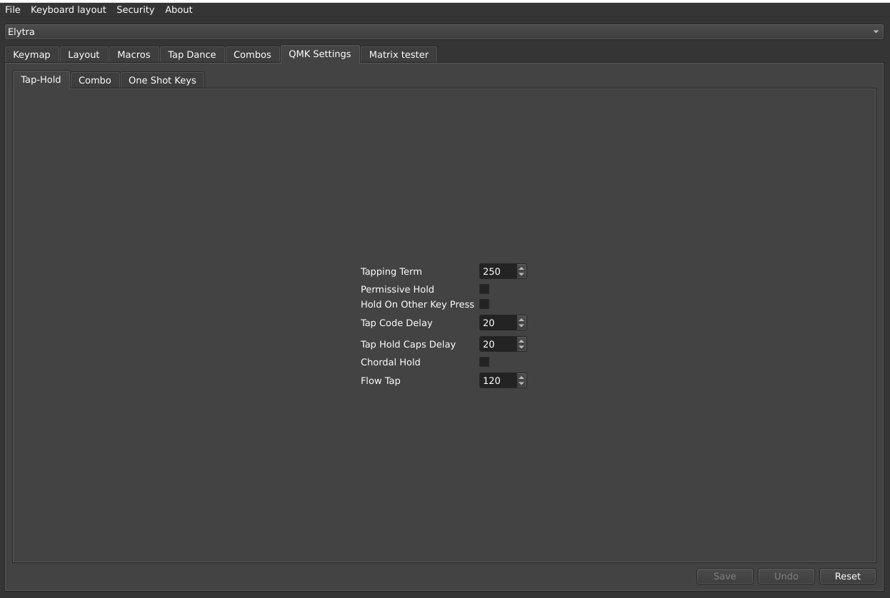

It was also nice to see Vial features like Chordal Hold and Flow Tap available. These were only added to Vial in [0.7.4](https://get.vial.today/changelog/release-0.7.4.html) (released last year in July 2025, which was kind of a big deal) and made tap-hold behaviours much more usable, especially for people experimenting with home row mods or other timing-sensitive layouts.

As a developer, I also appreciate the RMK toolchain. Rust and Cargo are much more familiar to me than setting up QMK or ZMK build environments from scratch. That won't matter to most users, because most users should never need to compile firmware for this keyboard. But as an engineering choice, it's neat, I will likely try using RMK for my next keyboard project!

# Who Is It For?

The Elytra is for someone who wants a premium split keyboard without turning keyboards into a hobby. You get the main benefit of separating your hands but without needing to learn a drastically new keyboard layout. It's also very portable, which is a stark contrast to the many ergonomic-but-bulky keyboards on the market.

It isn't the keyboard I'd use as my daily driver though, I've become too attached to the Keyball's thumb trackball, and it'd be hard to go back to just having a separate mouse for my pointing needs.

BUT if I were still using regular keyboards and wanted to move into split ergonomics, the Elytra would be very high on my list!

# Alternatives

The obvious alternatives are other row-staggered split keyboards, like the Keychron Q11, Kinesis Freestyle, Dygma Raise 2, or Epomaker Split70.

The Elytra feels more premium than the budget-oriented options I've tried, especially in case machining, keycap comfort, and overall refinement. It's also much less of a leap than something like a Corne, Lily58, Voyager, or Glove80.

The Elytra is definitely on the higher cost side to some other cheaper/full-plastic options, but you do get what you pay for in terms of a great design and materials if that's a priority for you.

# Closing Thoughts

The Elytra is an approachable, practical keyboard with a premium typing experience. It isn't trying to push the limits of ergonomic keyboard design. Instead, it removes many of the reasons people never try a split keyboard in the first place.

If you've been curious about ergonomic keyboards but aren't interested in relearning how to type, I think ElimKeys has found a very sensible middle ground.

Happy typing!
